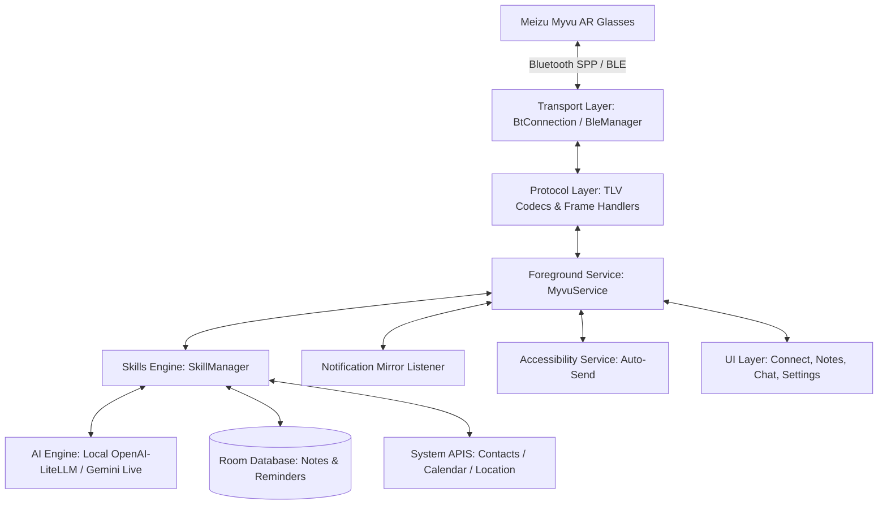

# Meizu Myvu Client — Android Kotlin

[](https://kotlinlang.org/)
[](https://developer.android.com/)
[](https://m3.material.io/)
[](LICENSE)

Cliente complementario nativo en Android (Kotlin) para gafas de realidad aumentada (AR) **Meizu Myvu Smart Glasses**. Permite sincronización bidireccional mediante Bluetooth SPP y BLE, visualización de notificaciones en el HUD, teleprompter de navegación, reporte del clima, grabación de voz, gestión de notas/recordatorios y asistente de inteligencia artificial (local con endpoints compatibles OpenAI/LiteLLM y en la nube con Gemini Live).

---

## 🌟 Características Principales

- **Conectividad Dual Bluetooth**:
  - Enlace de alta velocidad **Bluetooth SPP (RFCOMM)** para transmisión de paquetes binarios de pantalla HUD y audio.
  - Soporte **BLE (Bluetooth Low Energy)** para telemetría de baja energía (batería, estados de conexión).
  - Servicio en primer plano persistente (`MyvuService`) con reconexión automática resiliente.

- **Proyección en el HUD de las Gafas**:
  - **Espejo de Notificaciones**: Notificaciones de Android enviadas en tiempo real mediante `MirrorNotificationListener`.
  - **Teleprompter y Navegación**: Indicaciones paso a paso en pantalla HUD.
  - **Clima y Hora**: Sincronización automática de condiciones meteorológicas locales.

- **Inteligencia Artificial y Capacidad Agéntica**:
  - **Gemini + LiteLLM con Native Tool Calling**: Ejecución autónoma de herramientas del sistema mediante Function Calling directo en `/v1/chat/completions`.
  - **Bucle Agéntico ReAct**: Orquestador multi-paso (`AgenticToolExecutor`) para resolver tareas complejas consultando herramientas y sintetizando la respuesta para las gafas.
  - **Salidas Estructuradas (JSON Mode)**: Análisis 100% estricto de notas y reuniones con `response_format: json_object`.
  - **IA Local / Self-Hosted**: Inferencia local o en red privada mediante endpoints compatibles con OpenAI / LiteLLM (`LocalAiClient`).
  - **IA en la Nube**: Streaming conversacional con **Gemini Live**.
  - **Notas de Voz y Grabación**: Grabador integrado con análisis y transcripción (`VoiceRecorderActivity`).

- **Motor Modular de Habilidades (Skills Engine)**:
  - Sistema extensible de plugins definido por manifiestos `SKILL.md`.
  - 30 habilidades nativas expuestas dinámicamente como herramientas OpenAI/Gemini Schema (`SkillToolConverter`) listas para interactuar con el entorno (llamadas, calendario, WhatsApp, Telegram, calculadora, traducción, OCR, navegación HUD, etc.).

- **Botón Físico y Gestos Táctiles de Patillas ("Patas")**:
  - **Botón Físico de la Montura Inmutable**: Dedicado 100% y de forma fija al flujo de reconocimiento de voz **STT -> Modelo de IA configurado** (`ai().onTrigger(code)`), sin interceptación ni retrasos.
  - **Mapeo Personalizable de Patillas**: Soporte completo para todos los emisores táctiles de hardware (`key_event_sender`: 1, 2 y 4) y keycodes Flyme XR (210 Click/Tap, 211 Doble Tap, 212 Pulsación Larga, 206 Deslizar Adelante, 207 Deslizar Atrás; además de 200, 201, 202, 203, 237).
  - **Doble Toque Confiable y Síntesis Software**: Si el firmware de las gafas reporta dos toques simples rápidos (`210` o `200` en 40-450ms) en lugar de un doble toque de hardware (`211`), el sistema sintetiza y ejecuta automáticamente el doble toque configurado. Incluye síntesis directa dentro de paquetes BLE por hardware timestamps.
  - **Deduplicación de Rebotes y Filtrado Antirruido**: Suprime micro-swipes parásitos simultáneos, consolida la pareja `200`+`203` de la patilla izquierda en un único toque, descarta rebotes eléctricos de contacto `< 40ms` sin alterar el acumulador y evita que acciones no configuradas (`NONE`) bloqueen toques posteriores por debounce.
  - **Activación Manos Libres de Gemini y Estabilidad Continua SPP**: Despierta el teléfono con brillo total, desbloquea la pantalla, conecta el micrófono de las gafas mediante `setCommunicationDevice` sin comandos legacy que desconectaban el servidor SPP de las gafas, y restaura de inmediato el canal multimedia A2DP para que la respuesta de voz de Gemini se escuche de forma continua, estéreo y sin silencios.
  - **Re-bloqueo Automático Inteligente de Pantalla**: Tras finalizar la respuesta de voz de Gemini o tras despachar una llamada/mensaje de WhatsApp iniciado por voz, el servicio de accesibilidad detecta si el teléfono estaba bloqueado y apaga/bloquea de nuevo la pantalla de forma no invasiva (`GLOBAL_ACTION_LOCK_SCREEN`), manteniendo la seguridad en el bolsillo y preservando los datos biométricos.
  - **Lanzador de Apps Instaladas**: Vincula cualquier gesto a cualquier app del teléfono (Spotify, WhatsApp, YouTube, Cámara) encendiendo la pantalla y quitando el bloqueo automáticamente.
  - Acciones del sistema: Asistente del Teléfono, IA Local, Play/Pausa, Siguiente, Anterior, Modo Zen, Sincronización del Clima, Notificaciones y Teleprompter.
  - Sincronización dinámica de `set_music_tp_control_mode` para forzar reenvío de toques desde el launcher de las gafas.


- **Interfaz Moderna**:
  - Construida con **Material Design 3**, ViewBinding y soporte completo Edge-to-Edge (`EdgeToEdgeHelper`).
  - Modo pantalla de bloqueo (`LockScreenHelper`) para interactuar con las gafas sin desbloquear el teléfono.

---

## 🏗️ Arquitectura del Sistema



### Módulos del Código (`app/src/main/java/com/myvu/client/`)

| Paquete | Descripción |
|---|---|
| `transport/` | Gestión de conexiones Bluetooth SPP (RFCOMM) y BLE GATT. |
| `protocol/` | Encoders/decoders TLV (Type-Length-Value), tramas binarias y protocolo de enlace. |
| `service/` | Servicios en segundo plano: `MyvuService`, `MirrorNotificationListener`, `AutoSendAccessibilityService`. |
| `skills/` | Orquestador de habilidades (`SkillManager`, `BaseSkillHandler`) y handlers de negocio en `handlers/`. |
| `ai/` | Motores de IA: `LocalAiClient` (OpenAI/LiteLLM compatible) y `GeminiClient` (remoto). |
| `recorder/` | Grabación de notas de audio y procesamiento de voz. |
| `reminder/` | Planificador de alarmas y recordatorios sincronizados con el HUD. |
| `database/` / `data/` | Entidades y repositorios Room (`NoteRepository`, `ReminderRepository`, `AppDatabase`). |
| `ui/` | Vistas principales (`ConnectActivity`, `ChatActivity`, `NotesActivity`, `SettingsActivity`). |

---

## 🧰 Catálogo de Habilidades (Skills Integradas)

Ubicadas en `app/src/main/assets/skills/built-in/`:

| Skill | Función |
|---|---|
| `ai-voice-recorder` | Graba audio de notas de voz y genera transcripciones/resúmenes. |
| `gemini-live-assistant` | Conversación interactiva con el asistente de Google Gemini en tiempo real. |
| `hud-navigation` | Proyección de direcciones y guiado GPS en el HUD de las gafas. |
| `smart-translate-hud` | Traducción en vivo proyectada en pantalla. |
| `smart-ocr-scanner` | Escaneo y reconocimiento de texto óptico. |
| `create-note` / `create-reminder` | Creación rápida de notas y recordatorios sincronizados. |
| `call-contact` | Marcación rápida de contactos del teléfono mediante comandos de voz. |
| `voip-call` | Llamadas VoIP por WhatsApp, Microsoft Teams o Google Chat/Meet. |
| `send-whatsapp` / `send-telegram` | Redacción y envío asistido de mensajes instantáneos. |
| `health-summary` | Resumen de pasos diarios, nivel de estrés, ritmo cardíaco y actividad física. |
| `unread-notifications` | Resumen de notificaciones pendientes leídas en el HUD. |
| `weather-forecast` | Consulta meteorológica en tiempo real proyectada en el display. |
| `google-search` / `duckduckgo-search` | Respuestas rápidas de motores de búsqueda. |
| `app-media-control` | Control de NewPipe, OpenTune, Spotify, YouTube Music, saltar canciones y qué está sonando. |
| `code-calculator-math` | Resolución de cálculos matemáticos al instante. |
| `daily-briefing` | Resumen ejecutivo matutino ("Mi Día"): clima, agenda, tareas pendientes, avisos VIP y batería de gafas. |
| `routine-macros` | Macros contextuales de una frase: Modo Reunión (Zen + vibración), Conducción (brillo alto), Gimnasio y Noche. |
| `spatial-memory` | Memoria espacial para recordar dónde estacionó el auto ("¿dónde estacioné?") con cálculo de distancia y rumbo. |
| `shopping-checklists` | Gestión manos libres de listas de compras ("agrega pan a las compras", "tacha pan", "ver compras"). |
| `quick-location-dispatch` | Envío instantáneo de coordenadas GPS con enlace de Google Maps a contactos vía WhatsApp o Telegram. |

---

## 🚀 Requisitos y Compilación

### Requisitos del Entorno
- **JDK**: OpenJDK 25 (`/usr/lib/jvm/java-25-openjdk-amd64`) para ejecución de Gradle Daemon y compilación.
- **Bytecode Compatibilidad**: Java 21 (`sourceCompatibility = JavaVersion.VERSION_21`, `jvmTarget = "21"`).
- **Android SDK**: API Level 35 (`compileSdk 35`, `minSdk 26`).
- **Gradle**: 8.14.3+ con wrapper `./gradlew`.

### Comandos de Compilación

```bash
# Compilar APK en modo Debug
./gradlew assembleDebug

# Ubicación del APK resultante:
# app/build/outputs/apk/debug/app-debug.apk

# Ejecutar pruebas unitarias
./gradlew test
```

Para generar versiones firmadas para producción, consultar la [Guía de Construcción y Despliegue](BUILD_INSTRUCTIONS.md).

---

## 📲 Instalación y Configuración en Android

Para instrucciones completas paso a paso, consulta la [Guía de Instalación y Configuración de Permisos](docs/ANDROID_SETUP_GUIDE.md).

### Instalación Rápida
```bash
# Instalar APK en el dispositivo y otorgar permisos estándar
adb install -r -g app/build/outputs/apk/debug/app-debug.apk
```

### ⚙️ Permisos y Ajustes del Sistema Indispensables
1. **Permisos de la Aplicación** (`Ajustes -> Aplicaciones -> MyVU Client -> Permisos`):
   - **Dispositivos cercanos** (`BLUETOOTH_CONNECT`, `BLUETOOTH_SCAN`)
   - **Ubicación** (`ACCESS_FINE_LOCATION`)
   - **Contactos** (`READ_CONTACTS`)
   - **Teléfono y SMS** (`CALL_PHONE`, `SEND_SMS`)
   - **Cámara** (`CAMERA` - para linterna y OCR)
   - **Micrófono** (`RECORD_AUDIO`)
   - **Calendario** (`READ_CALENDAR`, `WRITE_CALENDAR`)
2. **Acceso a Notificaciones** (`Ajustes -> Notificaciones -> Acceso a notificaciones`): Activar **MyVU Client** para proyectar alertas y mensajes en el HUD.
3. **Servicio de Accesibilidad** (`Ajustes -> Accesibilidad -> MYVU Auto-Send Assistant`): Activar para permitir el envío automático de WhatsApp, Telegram y SMS sin pulsar la pantalla.
   - *Watchdog proactivo*: Si actualizas la app y Android apaga el servicio, la app te notificará inmediatamente y mostrará un banner de reactivación en el Dashboard.
   - *Auto-activación permanente vía ADB*: Si ejecutas este comando una única vez en tu PC con el móvil conectado:
     ```bash
     adb shell pm grant com.myvu.client android.permission.WRITE_SECURE_SETTINGS
     ```
     La app se reactivará **100% sola de forma automática e instantánea** cada vez que se actualice o se reinicie el teléfono, sin requerir intervención manual.
4. **Desbloqueo Extendido / Smart Lock** (`Ajustes -> Seguridad -> Desbloqueo extendido -> Dispositivos de confianza`): Añadir las gafas **MYVU** para permitir el envío de WhatsApp/Telegram y control de apps con el teléfono en el bolsillo sin requerir PIN.
5. **Asistente Digital Predeterminado** (`Ajustes -> Aplicaciones -> Aplicaciones predeterminadas -> Aplicación de asistente digital`): Seleccionar **MyVU Client**.
6. **Batería sin Restricciones** (`Ajustes -> Aplicaciones -> MyVU Client -> Batería`): Seleccionar **Sin restricciones** para evitar que Android mate el servicio en reposo.
7. **Escucha y Ahorro de Batería** (`Ajustes -> Escucha y Ahorro de Batería`): La **Escucha activa continua** y la **Activación por voz (Wake word)** vienen desactivadas por defecto para optimizar la batería de las gafas (~16.5% de ahorro estimado por hora). Además, el cliente incluye filtrado de tramas obsoletas en init burst, heartbeat BLE adaptativo con coalescencia a 20s, sensores de salud batched (60s) en reposo profundo y watchdog no-wakeup compatible con Android Doze Mode.

---

## 📖 Documentación Adicional

- [Guía de Instalación y Permisos en Android](docs/ANDROID_SETUP_GUIDE.md): Paso a paso detallado para configuración de permisos estándar y especiales.
- [Arquitectura Técnica y Protocolos](docs/ARCHITECTURE.md): Explicación detallada de frames TLV, enlace Bluetooth y motor de habilidades.
- [Registro de Memoria y Contexto](docs/PROJECT_MEMORY.md): Bitácora de decisiones, historial de ajustes y memoria persistente.
- [Planes de Implementación](docs/superpowers/plans/): Planes arquitectónicos por feature o tarea.
- [Guía de Compilación de APK](BUILD_INSTRUCTIONS.md): Pasos para firmar y desplegar versiones de producción.

---

## 📄 Licencia

Este proyecto está bajo la Licencia Apache 2.0. Consulta el archivo `LICENSE` para más detalles.
