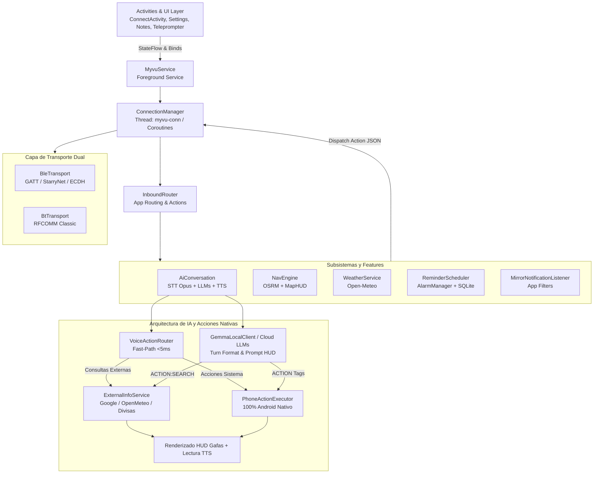
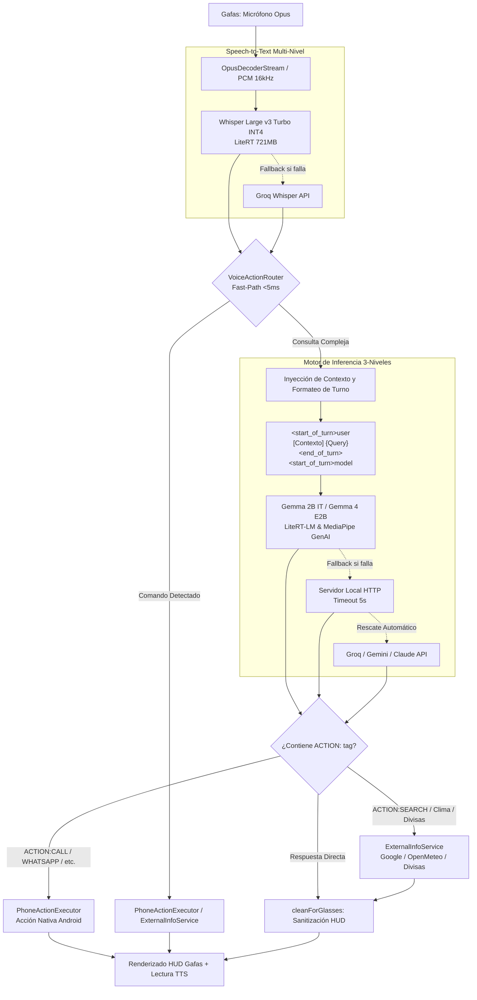

# Meizu Myvu Client (Kotlin Android App)

Cliente Android nativo de alto rendimiento escrito en **Kotlin 2.1+** (JVM 17, `compileSdk 35`, `minSdk 26`) para gafas inteligentes **Meizu Myvu AR**.

---

## 🏛️ Arquitectura del Sistema



---

## 📂 Estructura del Código (`app/src/main/java/com/myvu/client/`)

- [**`core/`**](file:///home/rcastro/Documentos/negex/Meizu-Myvu-Client/android-kotlin/app/src/main/java/com/myvu/client/core): Fundaciones, preferencias seguras (`SecurePrefs`), configuración de gafas (`GlassesConfig`), buffer circular de logs (`LogBus`), gestión de memoria (`BufferPool`) y utilidades edge-to-edge.
- [**`crypto/`**](file:///home/rcastro/Documentos/negex/Meizu-Myvu-Client/android-kotlin/app/src/main/java/com/myvu/client/crypto): Criptografía para enlace StarryNet y negociación de claves ECDH.
- [**`protocol/`**](file:///home/rcastro/Documentos/negex/Meizu-Myvu-Client/android-kotlin/app/src/main/java/com/myvu/client/protocol): Codecs binarios de alto rendimiento (TLV `TlvBox`, Protobuf `Pb`, `Session`, `RelayMessage`, `LinkProtocol`).
- [**`transport/`**](file:///home/rcastro/Documentos/negex/Meizu-Myvu-Client/android-kotlin/app/src/main/java/com/myvu/client/transport): Capa de transporte asíncrona con Kotlin Coroutines y Flow para BLE GATT (`BleTransport`), escáner automático (`GlassesScanner`) y RFCOMM Classic (`BtTransport`).
- [**`service/`**](file:///home/rcastro/Documentos/negex/Meizu-Myvu-Client/android-kotlin/app/src/main/java/com/myvu/client/service): `ConnectionManager` con flujo reactivo `StateFlow<ConnectionState>`, Foreground Service `MyvuService`, supervisor de reconexión `RelaySupervisor` y `MirrorNotificationListener`.
- [**`ai/`**](file:///home/rcastro/Documentos/negex/Meizu-Myvu-Client/android-kotlin/app/src/main/java/com/myvu/client/ai): Asistente de voz inteligente con arquitectura híbrida **Local-First**:
  - **STT**: Whisper Large v3 Turbo INT4 On-Device y fallback transparente a Groq Whisper API configurado por defecto en **Español (`es`)** con prompt contextual de comandos de voz para prevenir transcripciones erróneas (`"Jamar"` -> `"Llamar"`), además de Android Speech Recognizer.
  - **LLM On-Device & Formato de Turnos**: Motor de inferencia nativo on-device **LiteRT-LM & MediaPipe Tasks GenAI** con soporte para:
    - ⭐ **Gemma 4 E2B IT** (`gemma-4-E2B-it.litertlm` ~1.12GB con SentencePiece tokenizer integrado).
    - **Gemma 2B IT GPU / CPU** (`gemma-2b-it-gpu-int4.bin` ~1.35GB oficial de Google AI Edge).
    - **Formato Estructurado de Turnos Gemma**: `<start_of_turn>user\n[Contexto del Sistema...]\n{pregunta}<end_of_turn>\n<start_of_turn>model\n`.
    - **System Prompt Optimizado para HUD**: Reglas estrictas para respuestas en texto plano directo (1-2 oraciones breves), prohibición de markdown/viñetas/emojis y etiquetado estructurado de acciones (`ACTION:...`).
    - Rescate en cascada automático hacia APIs en la nube (Groq, Gemini, Claude, OpenAI).
  - **ExternalInfoService (Búsquedas y Datos en Tiempo Real)**:
    - **Google & Web Search**: Extracción en vivo mediante parser HTML de respuestas rápidas y snippets de Google, con fallback a Wikipedia Summary REST API y DuckDuckGo Instant Answer API.
    - **Clima Geocodificado Mundial**: Integración con Open-Meteo para resolver el pronóstico y temperatura actual de cualquier ciudad del mundo.
    - **Tasas de Cambio de Divisas**: Conversión instantánea de monedas (USD, EUR, COP, MXN, ARS, GBP, etc.) vía `open.er-api.com` y `api.frankfurter.app`.
    - **Filtro HUD (`cleanForGlasses`)**: Sanitización estricta de HTML, emojis, markdown y puntuación para visualización óptima en micro-LED monocromático 640x480 y locución fluida por TTS.
  - **VoiceActionRouter (Fast-Path Determinista <5ms)**: Intercepta comandos directos por patrones gramaticales sin pasar por el LLM para máxima velocidad y cero alucinaciones:
    - **Llamadas Directas**: Búsqueda difusa (Levenshtein + FTS) y marcado instantáneo en segundo plano vía `TelecomManager` / `CALL_PHONE`.
    - **WhatsApp & Telegram**: Extractor semántico natural de destinatario y mensaje con auto-formateo internacional **E.164** para abrir chat directo.
    - **Resumen de Notificaciones**: Lectura de mensajes pendientes agrupados (`InboxStyle` y `MessagingStyle`).
    - **Listas de Tareas (To-Do)**: Crear, completar, listar y eliminar tareas organizadas por listas en SQLite v4.
    - **Consultas Externas Directas**: Clima por ciudad, conversión de divisas y búsquedas web encoladas de forma asíncrona hacia el HUD/TTS.
    - **Control Multimedia y Apps**: Reproducción en YouTube Music, Spotify o YouTube y apertura universal de cualquier app instalada.
    - **Navegación HUD & Teleprompter**: Inicia rutas OSRM paso a paso y proyector de texto en el visor monocromático.
    - **Alarmas y Recordatorios**: Configuración exacta de alarmas y recordatorios programados en segundo plano.
  - **PhoneActionExecutor (100% Android Nativo)**: Ejecución nativa directa en el sistema Android, eliminando dependencias externas o plugins legados de Tasker.
  - **Audio**: Decodificación Opus en tiempo real desde el micrófono de las gafas (`OpusDecoderStream`), streaming de transcripción visual progresiva ("growing captions") y síntesis TTS (`TtsPlayer`).
- [**`nav/`**](file:///home/rcastro/Documentos/negex/Meizu-Myvu-Client/android-kotlin/app/src/main/java/com/myvu/client/nav): Motor de navegación OSRM con renderizado HUD paso a paso en las gafas.
- [**`weather/`**](file:///home/rcastro/Documentos/negex/Meizu-Myvu-Client/android-kotlin/app/src/main/java/com/myvu/client/weather): Sincronización periódica con Open-Meteo para widget meteorológico en visor.
- [**`reminder/`**](file:///home/rcastro/Documentos/negex/Meizu-Myvu-Client/android-kotlin/app/src/main/java/com/myvu/client/reminder): Recordatorios con alarmas exactas vía `AlarmManager` y reenvío al HUD.
- [**`database/`**](file:///home/rcastro/Documentos/negex/Meizu-Myvu-Client/android-kotlin/app/src/main/java/com/myvu/client/database): Almacenamiento local SQLite nativo v4 (`notes`, `reminders`, `todos`) sin sobrecarga de ORMs.
- [**`ui/`**](file:///home/rcastro/Documentos/negex/Meizu-Myvu-Client/android-kotlin/app/src/main/java/com/myvu/client/ui): Actividades con interfaz **Kinetic Obsidian Dark** (`ConnectActivity` con enlace reactivo a `StateFlow`, overlay de conexión con auto-dismiss seguro, control de posición FOV del dashboard en tiempo real, `SettingsActivity`, `TeleprompterActivity`, `NotesActivity`, `TrackpadActivity`, `VoiceRecorderActivity`, `NotificationAppsActivity`).

---

## 🧠 Pipeline de Voz e IA On-Device / Híbrida



### 📋 Especificación del System Prompt y Formato de Turnos

Para garantizar que los modelos de lenguaje locales (especialmente modelos compactos como Gemma 2B) respondan de forma rápida y sin ruido visual en la pantalla micro-LED monocromática (640x480 px), el prompt del sistema (`AiClient.DEFAULT_SYSTEM_PROMPT`) impone las siguientes directrices:

1. **Brevedad y Lenguaje Natural**: Respuestas en el idioma del usuario (español por defecto), en texto plano conversacional directo, con un límite estricto de **1 a 2 oraciones breves**.
2. **Prohibición de Markdown y Emojis**: Sin asteriscos (`*`), encabezados (`#`), viñetas (`-`, `•`) ni emojis que puedan corromper el renderizado en la lente.
3. **Formato de Acción Unificado**:
   - `ACTION:SEARCH={consulta}`: Dispara búsqueda externa en vivo (Google, clima mundial, divisas).
   - `ACTION:CALL={Nombre}`: Marcación telefónica directa vía `TelecomManager`.
   - `ACTION:WHATSAPP={Nombre}: {Mensaje}`: Envío de mensaje WhatsApp con auto-formateo internacional E.164.
   - `ACTION:TELEGRAM={Nombre}: {Mensaje}`: Envío de mensaje Telegram.
   - `ACTION:NOTE={Texto}`: Creación de nota en base de datos SQLite v4.
   - `ACTION:REMINDER={Hora}: {Mensaje}`: Creación de recordatorio con alarma exacta.
   - `ACTION:TODO_ADD={Lista}: {Tarea}`: Creación de tarea clasificada por lista.
   - `ACTION:APP_PLAY={App}: {Canción}`: Reproducción en apps de música (YouTube Music, Spotify, OpenTune).
   - `ACTION:APP_OPEN={App}`: Apertura universal de aplicaciones.
   - `ACTION:TELEPROMPTER={Texto}`: Proyección de texto en el HUD de las gafas.
   - `ACTION:NAVIGATE={Destino}`: Inicio de ruta de navegación paso a paso.

### 🌐 Motor de Información Externa (`ExternalInfoService`)

El servicio `ExternalInfoService` dota al asistente de acceso a información en tiempo real sin requerir APIs comerciales de pago:
- **Google Search**: Parser HTTP de snippets y respuestas destacadas de Google con fallback a Wikipedia Summary API y DuckDuckGo Instant Answers.
- **Meteorología Mundial**: Búsqueda y geocodificación automática de ciudades mediante Open-Meteo API.
- **Tasas de Cambio de Divisas**: Consulta de tipos de cambio en vivo con soporte para USD, EUR, COP, MXN, ARS, CLP, PEN, BRL, GBP, JPY, CNY, CHF, CAD, AUD y BTC.
- **Sanitización HUD (`cleanForGlasses`)**: Limpieza de entidades HTML, remoción de etiquetas, eliminación de emojis y truncado inteligente a oraciones legibles de ~200 caracteres.

### ⚡ Eliminación de Tasker y Ejecución Nativa

Se eliminó por completo la integración con Tasker (plugins Locale, receivers de configuración, actividades de selección) reemplazándola por una arquitectura **100% nativa de Android**:
- Control de llamadas mediante Android `TelecomManager` y `CALL_PHONE`.
- Gestión de tareas y notas en SQLite v4 local (`TodoRepository`, `NoteRepository`).
- Recordatorios y alarmas exactas con `AlarmManager`.
- Notificaciones capturadas mediante `MirrorNotificationListener` y `NotificationListenerService`.

---

## 🔄 Flujo de Conexión y Protocolo

1. **Fase BLE (GATT)**:
   - Descubrimiento de periférico Myvu (manual o vía auto-búsqueda `startAutoSearch`).
   - Handshake ECDH y autenticación StarryNet (`BlePairing`).
   - Negociación del enlace y anuncio del UUID RFCOMM dinámico (`CMD_SPP_SERVER_UUID_SYNC`).
2. **Fase RFCOMM (Classic BT)**:
   - Conexión de socket SPP al UUID provisto por BLE.
   - Apertura de canal `RelaySession` para transporte de paquetes AppLayer.
   - Ráfaga de inicialización desde `assets/captured_init.txt`.
3. **Fase Operativa**:
   - Envío y recepción de acciones JSON empaquetadas en Protobuf / TLV.
   - Sincronización reactiva de estado hacia la UI mediante [`ConnectionManager.stateFlow`](file:///home/rcastro/Documentos/negex/Meizu-Myvu-Client/android-kotlin/app/src/main/java/com/myvu/client/service/ConnectionManager.kt).
   - Streaming de audio Opus del micrófono de las gafas a `AiConversation`.

---

## 🛠️ Comandos de Compilación y Test

Ejecutar desde el directorio `android-kotlin/`:

```bash
# Compilar APK Debug (Con librerías nativas JNI empaquetadas)
./gradlew assembleDebug

# Ejecutar Android Lint
./gradlew lintDebug

# Compilar APK Release (Firma automática si keystore.properties existe)
./gradlew assembleRelease

# Instalar en dispositivo conectado
./gradlew installDebug

# Ejecutar todos los tests unitarios (incluyendo Robolectric tests)
./gradlew test

# Ejecutar test suite específico
./gradlew :app:testDebugUnitTest --tests "com.myvu.client.ai.*"
```

Para configuración de keystore y detalles de release, consultar [BUILD_INSTRUCTIONS.md](file:///home/rcastro/Documentos/negex/Meizu-Myvu-Client/android-kotlin/BUILD_INSTRUCTIONS.md).
