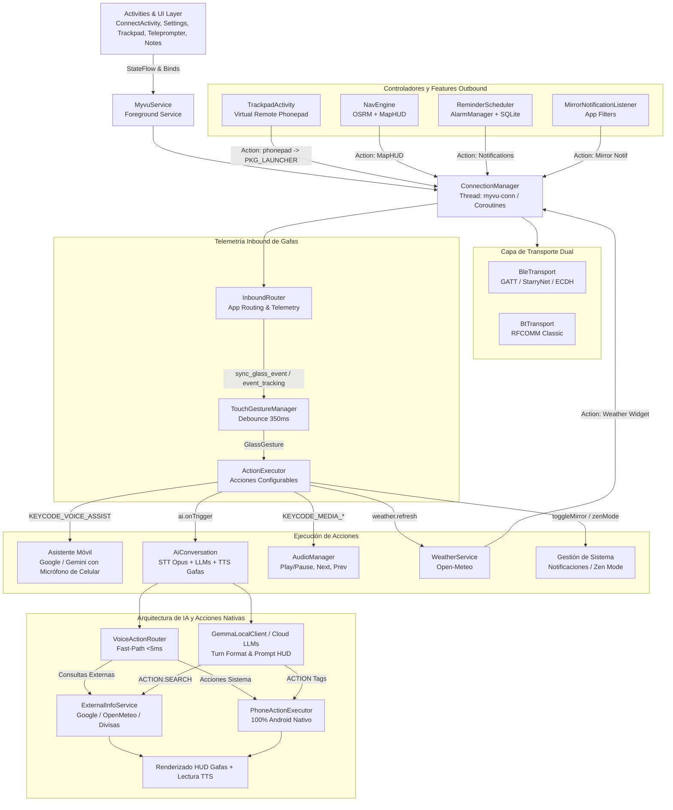
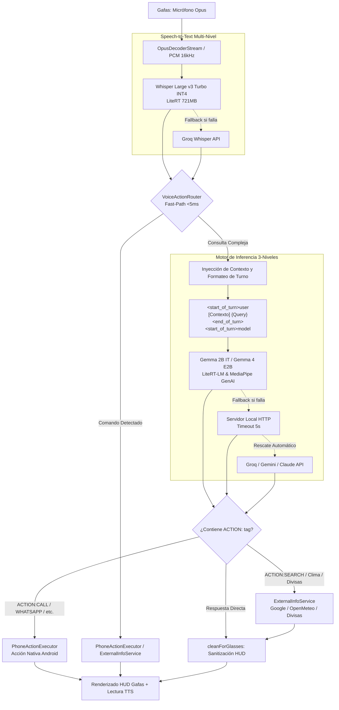

# Meizu Myvu Client (Kotlin Android App)

Cliente Android nativo de alto rendimiento escrito en **Kotlin 2.1+** (JVM 17, `compileSdk 35`, `minSdk 26`) para gafas inteligentes **Meizu Myvu AR**.

---

### 🏛️ Arquitectura del Sistema



---

## 📂 Estructura del Código (`app/src/main/java/com/myvu/client/`)

- [**`core/`**](file:///home/rcastro/Documentos/negex/Meizu-Myvu-Client/android-kotlin/app/src/main/java/com/myvu/client/core): Fundaciones, preferencias seguras (`SecurePrefs`), configuración de gafas (`GlassesConfig`), buffer circular de logs (`LogBus`), gestión de memoria (`BufferPool`), cazador de excepciones e iniciación de rescate en caliente (`CrashReporter`) y utilidades edge-to-edge.
- [**`crypto/`**](file:///home/rcastro/Documentos/negex/Meizu-Myvu-Client/android-kotlin/app/src/main/java/com/myvu/client/crypto): Criptografía para enlace StarryNet y negociación de claves ECDH.
- [**`protocol/`**](file:///home/rcastro/Documentos/negex/Meizu-Myvu-Client/android-kotlin/app/src/main/java/com/myvu/client/protocol): Codecs binarios de alto rendimiento (TLV `TlvBox`, Protobuf `Pb`, `Session`, `RelayMessage`, `LinkProtocol`).
- [**`transport/`**](file:///home/rcastro/Documentos/negex/Meizu-Myvu-Client/android-kotlin/app/src/main/java/com/myvu/client/transport): Capa de transporte asíncrona con Kotlin Coroutines y Flow para BLE GATT (`BleTransport`), escáner automático (`GlassesScanner`) y RFCOMM Classic (`BtTransport`).
- [**`service/`**](file:///home/rcastro/Documentos/negex/Meizu-Myvu-Client/android-kotlin/app/src/main/java/com/myvu/client/service): `ConnectionManager` con flujo reactivo `StateFlow<ConnectionState>`, Foreground Service `MyvuService`, supervisor de reconexión `RelaySupervisor` y `MirrorNotificationListener`.
- [**`app/`** & **`app/feature/`**](file:///home/rcastro/Documentos/negex/Meizu-Myvu-Client/android-kotlin/app/src/main/java/com/myvu/client/app): Enrutador de paquetes de aplicación (`InboundRouter`), constantes de paquetes (`AppLayer`), y subsistemas de características:
  - `GlassGesture`: Enum de gestos táctiles físicos reconocidos en la patilla (Tap, Double Tap, Triple Tap, Long Press, Swipe Forward, Swipe Backward).
  - `GestureAction`: Catálogo de 10 acciones ejecutables (Asistente del Teléfono con Gemini/Google, IA local de gafas, multimedia, clima, teleprompter, modo Zen).
  - `TouchGestureManager`: Motor de filtrado anti-rebote (350ms debounce), mapeo y ejecución de acciones para gestos táctiles.
  - `Trackpad`: Generador de mensajes JSON del protocolo "phonepad" para el lanzador de las gafas (`com.upuphone.star.launcher`).
- [**`ai/`**](file:///home/rcastro/Documentos/negex/Meizu-Myvu-Client/android-kotlin/app/src/main/java/com/myvu/client/ai): Asistente de voz inteligente con arquitectura híbrida **Local-First**:
  - **STT**: Decodificación Opus y re-muestreo PCM lineal 3:1 de **48,000 Hz a 16,000 Hz** (`downsample48kTo16k`) para garantizar coincidencia de velocidad de audio con modelos Whisper (on-device y Groq Whisper API). Whisper Large v3 Turbo INT4 On-Device con fallback transparente a Groq Whisper API configurado por defecto en **Español (`es`)** con prompt contextual de comandos de voz para prevenir transcripciones erróneas (`"Jamar"` -> `"Llamar"`). Manejo robusto de fallas nativas JNI en arquitecturas MediaTek (`mt6878`) y fallback automático en Android Speech Recognizer (`code 12` / `code 5`).
  - **LLM On-Device & Formato de Turnos**: Motor de inferencia nativo on-device **LiteRT-LM & MediaPipe Tasks GenAI** con soporte para:
    - ⭐ **Gemma 4 E2B IT** (`gemma-4-E2B-it.litertlm` ~1.12GB con SentencePiece tokenizer integrado).
    - **Gemma 2B IT GPU / CPU** (`gemma-2b-it-gpu-int4.bin` ~1.35GB oficial de Google AI Edge).
    - **Formato Estructurado de Turnos Gemma**: `<start_of_turn>user\n[Contexto del Sistema...]\n{pregunta}<end_of_turn>\n<start_of_turn>model\n`.
    - **System Prompt Optimizado para HUD**: Reglas estrictas para respuestas en texto plano directo (1-2 oraciones breves), prohibición de markdown/viñetas/emojis y etiquetado estructurado de acciones (`ACTION:...`).
    - Rescate en cascada automático hacia APIs en la nube (Groq, Gemini, Claude, OpenAI).
  - **ExternalInfoService (Búsquedas y Datos en Tiempo Real)**:
    - **Google & Web Search**: Extracción en vivo mediante parser HTML de respuestas rápidas y snippets de Google, con fallback a Wikipedia Summary REST API y DuckDuckGo Instant Answer API.
    - **Clima Geocodificado Mundial**: Integración con Open-Meteo para resolver el pronóstico y temperatura actual de cualquier ciudad del mundo.
    - **Tasas de Cambio de Divisas**: Consulta de tipos de cambio en vivo con soporte para USD, EUR, COP, MXN, ARS, GBP, etc.) vía `open.er-api.com` y `api.frankfurter.app`.
    - **Filtro HUD (`cleanForGlasses`)**: Sanitización estricta de HTML, emojis, markdown y puntuación para visualización óptima en micro-LED monocromático 640x480 y locución fluida por TTS.
  - **VoiceActionRouter (Fast-Path Determinista <5ms)**: Intercepta comandos directos por patrones gramaticales sin pasar por el LLM para máxima velocidad y cero alucinaciones:
    - **Llamadas Directas**: Búsqueda difusa (Levenshtein + FTS) y marcado instantáneo en segundo plano vía `TelecomManager` / `CALL_PHONE`.
    - **WhatsApp & Telegram**: Extractor semántico natural de destinatario y mensaje con auto-formateo internacional **E.164** para abrir chat directo.
    - **Resumen de Notificaciones**: Lectura de mensajes pendientes agrupados (`InboxStyle` y `MessagingStyle`).
    - **Listas de Tareas (To-Do)**: Crear, completar, listar y eliminar tareas organizadas por listas en SQLite v4.
    - **Consultas Externas Directas**: Clima por ciudad, conversión de divisas y búsquedas web encoladas de forma asíncrona hacia el HUD/TTS.
    - **Control Multimedia y Apps**: Reproducción en YouTube Music, Spotify o YouTube y apertura universal de cualquier app instalada.
    - **Navegación HUD & Teleprompter**: Inicia rutas OSRM paso a paso y proyector de texto en el visor monocromático.
    - **Alarmas y Recordatorios**: Configuración exacta de alarmas y recordatorios programados en segundo plano.
  - **PhoneActionExecutor (100% Android Nativo)**: Ejecución nativa directa en el sistema Android, eliminando dependencias externas o plugins legados de Tasker.
  - **Audio**: Decodificación Opus en tiempo real desde el micrófono de las gafas (`OpusDecoderStream`), streaming de transcripción visual progresiva ("growing captions") y síntesis TTS (`TtsPlayer`).
- [**`nav/`**](file:///home/rcastro/Documentos/negex/Meizu-Myvu-Client/android-kotlin/app/src/main/java/com/myvu/client/nav): Motor de navegación OSRM con renderizado HUD paso a paso en las gafas.
- [**`weather/`**](file:///home/rcastro/Documentos/negex/Meizu-Myvu-Client/android-kotlin/app/src/main/java/com/myvu/client/weather): Sincronización periódica con Open-Meteo para widget meteorológico en visor.
- [**`reminder/`**](file:///home/rcastro/Documentos/negex/Meizu-Myvu-Client/android-kotlin/app/src/main/java/com/myvu/client/reminder): Recordatorios con alarmas exactas vía `AlarmManager` y reenvío al HUD.
- [**`database/`**](file:///home/rcastro/Documentos/negex/Meizu-Myvu-Client/android-kotlin/app/src/main/java/com/myvu/client/database): Almacenamiento local SQLite nativo v4 (`notes`, `reminders`, `todos`) y Room Database `AppDatabase` (`myvu_chat.db` para historial de chat y perfil de usuario).
- [**`data/`**](file:///home/rcastro/Documentos/negex/Meizu-Myvu-Client/android-kotlin/app/src/main/java/com/myvu/client/data): Entidades y persistencia de chat (`ChatMessage`, `ChatSession`, `UserProfile`), DAO `ChatDao` y analizador dinámico `UserProfileAnalyzer` que incrementa etiquetas de interés e inyecta el perfil en el prompt del LLM.
- [**`ui/`**](file:///home/rcastro/Documentos/negex/Meizu-Myvu-Client/android-kotlin/app/src/main/java/com/myvu/client/ui) & [**`ui/chat/`**](file:///home/rcastro/Documentos/negex/Meizu-Myvu-Client/android-kotlin/app/src/main/java/com/myvu/client/ui/chat): Actividades e interfaz **Kinetic Obsidian Dark**:
  - `ConnectActivity`: Enlace reactivo a `StateFlow`, overlay de conexión, control de posición FOV y menú de navegación lateral.
  - `ChatActivity`: Interfaz general de chat a **pantalla completa** accesible desde el menú lateral en cualquier momento, con soporte de texto, entrada de voz, adjuntos de cámara/galería, control de acciones nativas del dispositivo e integración Edge-to-Edge para inserciones dinámicas de barras de estado y gestos.
  - `SettingsActivity`: Configuración de proveedores de IA/STT/TTS, gestión de perfiles de usuario (intereses e instrucciones personalizadas), respaldo/restauración local y Google Drive.
  - `TrackpadActivity`: Panel táctil virtual remoto para controlar el lanzador de las gafas con gestos multitáctiles y respuesta háptica.
  - `TeleprompterActivity`, `NotesActivity`, `VoiceRecorderActivity`, `NotificationAppsActivity`.

---

## 🧠 Pipeline de Voz e IA On-Device / Híbrida



### 📋 Especificación del System Prompt y Formato de Turnos

Para garantizar que los modelos de lenguaje locales (especialmente modelos compactos como Gemma 2B) respondan de forma rápida y sin ruido visual en la pantalla micro-LED monocromática (640x480 px), el prompt del sistema (`AiClient.DEFAULT_SYSTEM_PROMPT`) impone las siguientes directrices:

1. **Brevedad y Lenguaje Natural**: Respuestas en el idioma del usuario (español por defecto), en texto plano conversacional directo, con un límite estricto de **1 a 2 oraciones breves**.
2. **Prohibición de Markdown y Emojis**: Sin asteriscos (`*`), encabezados (`#`), viñetas (`-`, `•`) ni emojis que puedan corromper el renderizado en la lente.
3. **Formato de Acción Unificado**:
   - `ACTION:SEARCH={consulta}`: Dispara búsqueda externa en vivo (Google, clima mundial, divisas).
   - `ACTION:CALL={Nombre}`: Marcación telefónica directa vía `TelecomManager`.
   - `ACTION:WHATSAPP={Nombre}: {Mensaje}`: Envío de mensaje WhatsApp con auto-formateo internacional E.164.
   - `ACTION:TELEGRAM={Nombre}: {Mensaje}`: Envío de mensaje Telegram.
   - `ACTION:NOTE={Texto}`: Creación de nota en base de datos SQLite v4.
   - `ACTION:REMINDER={Hora}: {Mensaje}`: Creación de recordatorio con alarma exacta.
   - `ACTION:TODO_ADD={Lista}: {Tarea}`: Creación de tarea clasificada por lista.
   - `ACTION:APP_PLAY={App}: {Canción}`: Reproducción en apps de música (YouTube Music, Spotify, OpenTune).
   - `ACTION:APP_OPEN={App}`: Apertura universal de aplicaciones.
   - `ACTION:TELEPROMPTER={Texto}`: Proyección de texto en el HUD de las gafas.
   - `ACTION:NAVIGATE={Destino}`: Inicio de ruta de navegación paso a paso.

### 🌐 Motor de Información Externa (`ExternalInfoService`)

El servicio `ExternalInfoService` dota al asistente de acceso a información en tiempo real sin requerir APIs comerciales de pago:
- **Google Search**: Parser HTTP de snippets y respuestas destacadas de Google con fallback a Wikipedia Summary API y DuckDuckGo Instant Answers.
- **Meteorología Mundial**: Búsqueda y geocodificación automática de ciudades mediante Open-Meteo API.
- **Tasas de Cambio de Divisas**: Consulta de tipos de cambio en vivo con soporte para USD, EUR, COP, MXN, ARS, CLP, PEN, BRL, GBP, JPY, CNY, CHF, CAD, AUD y BTC.
- **Sanitización HUD (`cleanForGlasses`)**: Limpieza de entidades HTML, remoción de etiquetas, eliminación de emojis y truncado inteligente a oraciones legibles de ~200 caracteres.

### ⚡ Eliminación de Tasker y Ejecución Nativa

Se eliminó por completo la integración con Tasker (plugins Locale, receivers de configuración, actividades de selección) reemplazándola por una arquitectura **100% nativa de Android**:
- Control de llamadas mediante Android `TelecomManager` y `CALL_PHONE`.
- Gestión de tareas y notas en SQLite v4 local (`TodoRepository`, `NoteRepository`).
- Recordatorios y alarmas exactas con `AlarmManager`.
- Notificaciones capturadas mediante `MirrorNotificationListener` y `NotificationListenerService`.

---

## 👆 Control Táctil de Patilla (Temple Gestures) y Acciones Personalizadas

Las gafas Meizu MYVU incorporan un sensor táctil capacitivo continuo a lo largo de la patilla derecha ("temple trackpad") y botones de pulsación física ("deep touch"). El cliente Kotlin decodifica la telemetría de eventos en tiempo real y permite asignar a cada gesto una acción personalizada del sistema, multimedia o inteligencia artificial.

### 📡 Protocolo de Telemetría Inbound (`sync_glass_event`)

Cuando el usuario interactúa con la patilla de las gafas, el firmware transmite paquetes de telemetría a través del canal de retransmisión RFCOMM:

```json
{
  "action": "event_tracking",
  "data": {
    "action": "sync_glass_event",
    "value": [
      {
        "action_name": "touch_double_click",
        "action_value": 2
      }
    ]
  }
}
```

El pipeline de procesamiento se estructura de la siguiente manera:
1. **Detección e Ingesta (`InboundRouter.checkGestureTracking`)**: Analiza variantes de carga útil (arrays JSON, objetos individuales, strings codificados o códigos numéricos planos).
2. **Normalización (`GlassGesture.fromCode`)**: Clasifica el código y/o nombre del evento en una instancia tipada del enum `GlassGesture`.
3. **Filtro Anti-Rebote (Debounce de 350ms en `TouchGestureManager`)**: Previene la ejecución accidental repetida por rebotes capacitivos en la patilla.
4. **Despacho y Ejecución (`ActionExecutor`)**: Consulta la preferencia configurada en `Prefs` y ejecuta la acción correspondiente.

### 🖐️ Gestos Físicos Reconocidos (`GlassGesture`)

| Gesto | Código (`code`) | ID Interno (`id`) | Nombre en UI | Mapeo Predeterminado |
|---|---|---|---|---|
| **Toque Simple** | `1` | `tap` | Toque Simple | `none` (Ninguna) |
| **Doble Toque** | `2` | `double_tap` | Doble Toque | `media_play_pause` (Reproducir / Pausar) |
| **Triple Toque** | `3` | `triple_tap` | Triple Toque | `phone_assistant` (Gemini / Asistente Móvil) |
| **Pulsación Larga** | `4` | `long_press` | Pulsación Larga | `ai_assistant` (Asistente IA de Gafas) |
| **Deslizar Adelante** | `5` | `swipe_forward` | Deslizar Adelante | `media_next` (Siguiente Canción) |
| **Deslizar Atrás** | `6` | `swipe_backward` | Deslizar Atrás | `media_prev` (Canción Anterior) |

### ⚡ Catálogo de Acciones Configurables (`GestureAction`)

1. ⭐ **Asistente del Teléfono (Google Assistant / Gemini)** (`phone_assistant`):
   - **Propósito**: Activar el asistente de voz principal del smartphone (Google Assistant o Google Gemini) utilizando el **micrófono del teléfono móvil**. Es la opción recomendada cuando se desea interactuar con Gemini en el teléfono sin usar el asistente local de las gafas.
   - **Mecanismo Multi-Nivel de Disparo**:
     1. Disparo de eventos de tecla de hardware `KeyEvent.ACTION_DOWN` y `KeyEvent.ACTION_UP` con el código `KeyEvent.KEYCODE_VOICE_ASSIST` a través de `AudioManager.dispatchMediaKeyEvent`.
     2. Fallback explícito mediante `Intent(Intent.ACTION_VOICE_COMMAND)` dirigido al paquete `com.google.android.googlequicksearchbox` con `FLAG_ACTIVITY_NEW_TASK`.
     3. Fallback universal con `Intent(Intent.ACTION_VOICE_COMMAND)`.
   - **Feedback en HUD**: Notificación emergente efímera en la lente `"MYVU: Asistente activado"`.
2. **Asistente IA de Gafas** (`ai_assistant`):
   - Inicia la sesión conversacional on-device / híbrida del cliente (`AiConversation`), capturando audio desde el micrófono Opus de las gafas.
3. **Reproducir / Pausar Música** (`media_play_pause`):
   - Inyecta `KeyEvent.KEYCODE_MEDIA_PLAY_PAUSE` al `AudioManager` del sistema (Spotify, YouTube Music, OpenTune, podcasts). Notificación HUD: `"MYVU: Música: Play / Pausa"`.
4. **Siguiente Canción** (`media_next`):
   - Inyecta `KeyEvent.KEYCODE_MEDIA_NEXT`. Notificación HUD: `"MYVU: Música: Siguiente"`.
5. **Canción Anterior** (`media_prev`):
   - Inyecta `KeyEvent.KEYCODE_MEDIA_PREVIOUS`. Notificación HUD: `"MYVU: Música: Anterior"`.
6. **Sincronizar Clima** (`weather_sync`):
   - Fuerza la recarga inmediata de datos de Open-Meteo y transmite las condiciones meteorológicas actualizadas al visor monocromático (`"MYVU: Actualizando clima..."`).
7. **Alternar Notificaciones** (`toggle_mirror`):
   - Activa o desactiva la réplica de notificaciones del teléfono en el HUD (`"MYVU: Espejo notificaciones: Activado / Desactivado"`).
8. **Abrir Teleprompter** (`open_teleprompter`):
   - Envía el comando de apertura del visor de teleprompter para proyecciones de discursos o guiones.
9. **Modo Zen / No Molestar** (`zen_mode`):
   - Alterna el modo silencioso de las gafas con retroalimentación instantánea (`"MYVU: Modo Zen: Activado / Desactivado"`).
10. **Ninguna** (`none`):
    - Inhabilita la respuesta al gesto físico seleccionado.

### ⚙️ Configuración en la Interfaz de Usuario (`SettingsActivity`)

En la sección **"Control Táctil de Patilla (Gafas)"** de `SettingsActivity`, la aplicación expone 6 menús desplegables Material 3 (`MaterialAutoCompleteTextView` con `TextInputLayout.EXPOSED_DROPDOWN_MENU`):
- Los cambios se persisten de forma instantánea en `Prefs` (`SecurePrefs`).
- Permite mapear de forma independiente cada uno de los 6 gestos físicos a cualquiera de las 10 acciones disponibles.

---

## 🛡️ Resiliencia de Conexión y Estabilidad Anticaídas

- **Procesamiento de Audio STT de Alta Fidelidad**: En `AiConversation.kt`, el remuestreo de audio 48kHz -> 16kHz integra un **filtro Pasa-Altos (High-Pass Filter a 80Hz)** que elimina el retumbo de baja frecuencia y ruido de fricción de las gafas, y un **Control de Ganancia por Picos (Peak AGC)** que escala discursos suaves al 75% del rango dinámico máximo, optimizando la precisión de transcripción en Whisper.
- **Motor de Búsquedas e Información Externa (`ExternalInfoService.kt`)**: Extracción geográfica mejorada para consultas de clima (ej. *"Qué temperatura para mañana en Barranquilla"* -> `"Barranquilla"` en Open-Meteo), integrando además **Google Noticias RSS** (`https://news.google.com/rss/search`) para titulares de actualidad, conversor de divisas y raspado inteligente de Google Search HTML.
- **Agente Multiacción**: El prompt de sistema en `AiClient.kt` e instrucciones en `PhoneActionExecutor.kt` permiten al agente interpretar y ejecutar múltiples acciones por turno de manera secuencial (ej. consultar clima, crear nota y enviar WhatsApp simultáneamente).

---

## 📱 Trackpad Virtual Remoto (Phone-to-Glasses)

`TrackpadActivity` transforma la pantalla táctil del smartphone en un controlador táctil remoto de baja latencia para navegar por el lanzador nativo de las gafas (`com.upuphone.star.launcher`).

### 📦 Protocolo y Enrutamiento Outbound

Todos los eventos del panel virtual se envían empaquetados en JSON con enrutamiento explícito a `AppLayer.PKG_LAUNCHER`:

```json
{
  "action": "phonepad",
  "data": {
    "action": "gestureMode",
    "actionType": 22,
    "startX": 120.0,
    "startY": 450.0,
    "endX": 680.0,
    "endY": 450.0,
    "speedX": 1.25,
    "speedY": 0.0,
    "time": 1740000000000
  }
}
```

- **Acciones Disponibles**:
  - `start` / `stop`: Inicialización y cierre de la sesión de control remoto.
  - `click`: Selección / Clic simple (`onTap`).
  - `doubleClick`: Doble clic rápido (`onDoubleTap`).
  - `longPress`: Pulsación sostenida / Menú contextual (`onLongPress`).
  - `gestureMode`: Desplazamiento gestual con parámetros de trayectoria y velocidad:
    - `19` = `SWIPE_UP` (Deslizar arriba)
    - `20` = `SWIPE_DOWN` (Deslizar abajo)
    - `21` = `SWIPE_LEFT` (Deslizar izquierda)
    - `22` = `SWIPE_RIGHT` (Deslizar derecha)

### 🎨 Experiencia de Usuario y Feedback Reactivo

- **Observación Reactiva de Conexión**: La actividad se sincroniza con el ciclo de vida Android (`repeatOnLifecycle(Lifecycle.State.STARTED)`) observando `ConnectionManager.stateFlow`. Si las gafas se desconectan o reconectan, la interfaz responde en tiempo real.
- **Indicador de Estado Kinetic Obsidian**:
  - **Verde / Cyan Teal** (`READY`): Conectado, con animación de pulso infinito suave (alpha `1.0` a `0.45`).
  - **Teal Tenue** (`CONNECTING` / `PAIRING` / `SESSION`): En proceso de enlace.
  - **Rojo Neón** (`FAILED` / `IDLE`): Desconectado, advirtiendo que se requiere conexión activa.
- **Respuesta Háptica y Visual**:
  - Ticks hápticos ultra-cortos de 18ms al registrar gestos válidos.
  - Pulso háptico de advertencia de 45ms al intentar interactuar sin enlace activo.
  - Etiquetas efímeras de confirmación en pantalla (ej. `⚡ Tap (Select)`, `⚡ Double Tap`, `⚡ Swipe Right ›`).
- **Despertar Automático del Relé**: Al iniciar el trackpad, invoca `ConnectionManager.wakeRelay()` para asegurar que el socket RFCOMM y el servicio SPP estén listos sin latencia.

---

## 🔄 Flujo de Conexión y Protocolo

1. **Fase BLE (GATT)**:
   - Descubrimiento de periférico Myvu (manual o vía auto-búsqueda `startAutoSearch`).
   - Handshake ECDH y autenticación StarryNet (`BlePairing`).
   - Negociación del enlace y anuncio del UUID RFCOMM dinámico (`CMD_SPP_SERVER_UUID_SYNC`).
2. **Fase RFCOMM (Classic BT)**:
   - Conexión de socket SPP al UUID provisto por BLE.
   - Apertura de canal `RelaySession` para transporte de paquetes AppLayer.
   - Ráfaga de inicialización desde `assets/captured_init.txt`.
3. **Fase Operativa**:
   - Envío y recepción de acciones JSON empaquetadas en Protobuf / TLV.
   - Sincronización reactiva de estado hacia la UI mediante [`ConnectionManager.stateFlow`](file:///home/rcastro/Documentos/negex/Meizu-Myvu-Client/android-kotlin/app/src/main/java/com/myvu/client/service/ConnectionManager.kt).
   - Streaming de audio Opus del micrófono de las gafas a `AiConversation`.

---

## 🛠️ Comandos de Compilación y Test

Ejecutar desde el directorio `android-kotlin/`:

```bash
# Compilar APK Debug (Con librerías nativas JNI empaquetadas)
./gradlew assembleDebug

# Ejecutar Android Lint
./gradlew lintDebug

# Compilar APK Release (Firma automática si keystore.properties existe)
./gradlew assembleRelease

# Instalar en dispositivo conectado
./gradlew installDebug

# Ejecutar todos los tests unitarios (incluyendo Robolectric tests)
./gradlew test

# Ejecutar test suite específico
./gradlew :app:testDebugUnitTest --tests "com.myvu.client.ai.*"
```

Para configuración de keystore y detalles de release, consultar [BUILD_INSTRUCTIONS.md](file:///home/rcastro/Documentos/negex/Meizu-Myvu-Client/android-kotlin/BUILD_INSTRUCTIONS.md).
