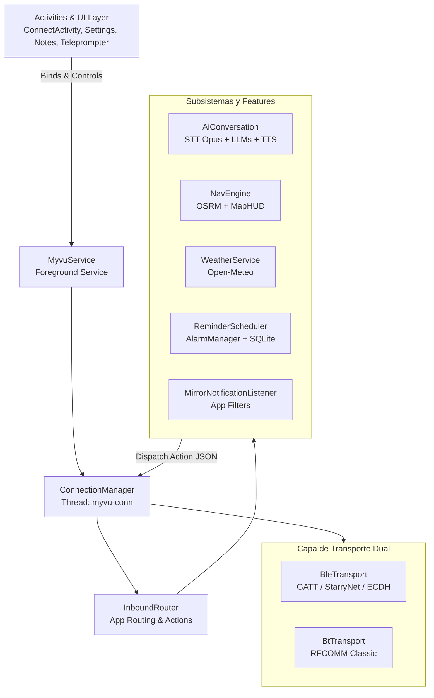
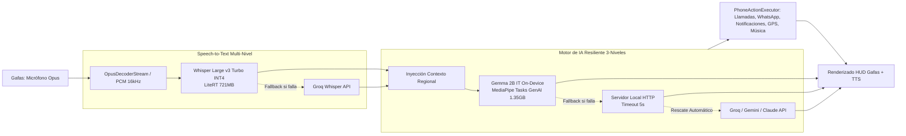

# Meizu Myvu Client (Kotlin Android App)

Cliente Android nativo de alto rendimiento escrito en **Kotlin 2.1+** (JVM 17, `compileSdk 35`, `minSdk 26`) para gafas inteligentes **Meizu Myvu AR**.

---

## 🏛️ Arquitectura del Sistema



---

## 📂 Estructura del Código (`app/src/main/java/com/myvu/client/`)

- [**`core/`**](file:///home/rcastro/Documentos/negex/Meizu-Myvu-Client/android-kotlin/app/src/main/java/com/myvu/client/core): Fundaciones, preferencias seguras (`SecurePrefs`), buffer circular de logs (`LogBus`), gestión de memoria (`BufferPool`) y caché HTTP.
- [**`crypto/`**](file:///home/rcastro/Documentos/negex/Meizu-Myvu-Client/android-kotlin/app/src/main/java/com/myvu/client/crypto): Criptografía para enlace StarryNet y negociación de claves ECDH.
- [**`protocol/`**](file:///home/rcastro/Documentos/negex/Meizu-Myvu-Client/android-kotlin/app/src/main/java/com/myvu/client/protocol): Codecs binarios de alto rendimiento (TLV `TlvBox`, Protobuf `Pb`, `Session`, `RelayMessage`).
- [**`transport/`**](file:///home/rcastro/Documentos/negex/Meizu-Myvu-Client/android-kotlin/app/src/main/java/com/myvu/client/transport): Capa de transporte asíncrona con Kotlin Coroutines y Flow para BLE GATT (`BleTransport`) y RFCOMM Classic (`BtTransport`).
- [**`service/`**](file:///home/rcastro/Documentos/negex/Meizu-Myvu-Client/android-kotlin/app/src/main/java/com/myvu/client/service): `ConnectionManager` (HandlerThread dedicada `myvu-conn`), Foreground Service `MyvuService`, `RelaySupervisor` y `MirrorNotificationListener`.
- [**`ai/`**](file:///home/rcastro/Documentos/negex/Meizu-Myvu-Client/android-kotlin/app/src/main/java/com/myvu/client/ai): Asistente de voz inteligente con arquitectura híbrida **Local-First**:
  - **STT**: Whisper Large v3 Turbo INT4 On-Device y fallback transparente a Groq Whisper API configurado por defecto en **Español (`es`)** con prompt contextual de comandos de voz para prevenir transcripciones erróneas (`"Jamar"` -> `"Llamar"`), además de Android Speech Recognizer.
  - **LLM**: Motor de inferencia nativo on-device **LiteRT-LM & MediaPipe Tasks GenAI** ejecutando:
    - ⭐ **Gemma 4 E2B IT** (`gemma-4-E2B-it.litertlm` ~1.12GB de Google AI Edge Gallery con Tokenizer SentencePiece integrado).
    - **Gemma 2B IT GPU / CPU** (`gemma-2b-it-gpu-int4.bin` ~1.35GB oficial de Google).
    - **Gemini Nano** (AICore nativo) y rescate automático en cascada hacia APIs en la nube (Groq, Gemini, Claude, OpenAI).
  - **VoiceActionRouter (Fast-Path Determinista <5ms)**: Intercepta comandos directos por palabras clave sin pasar por el LLM para máxima velocidad y cero alucinaciones:
    - **Llamadas Directas**: Búsqueda difusa (Levenshtein + FTS) y marcado instantáneo en segundo plano vía `TelecomManager` / `CALL_PHONE` con tolerancia fonética (ej: *"Jamar a..."*, *"Llama a..."*).
    - **WhatsApp & Telegram**: Extractor semántico natural de destinatario y mensaje (soporta delimitadores por coma ej: *"Enviar whatsapp a Matías Castro, hola cómo vas"*, *"que diga"*, *"y dile"*, o búsqueda heurística por agenda) con auto-formateo internacional **E.164** (ej: `+57` para números colombianos) para abrir inmediatamente el chat directo en `com.whatsapp`.
    - **Resumen de Notificaciones**: Lectura de mensajes pendientes agrupados (`InboxStyle` y `MessagingStyle` para WhatsApp, Gmail, Outlook, Telegram).
    - **Listas de Tareas (To-Do)**: Crear, completar, listar y eliminar tareas organizadas por listas en SQLite v4.
    - **Control Multimedia y Apps**: Reproducción en YouTube Music, Spotify o YouTube y apertura universal de cualquier app instalada.
    - **Navegación HUD & Teleprompter**: Inicia rutas OSRM paso a paso y proyector de texto en el visor monocromático.
    - **Alarmas y Recordatorios**: Configuración exacta de alarmas y recordatorios programados en segundo plano.
  - **Audio**: Decodificación Opus en tiempo real desde el micrófono de las gafas (`OpusDecoderStream`) y síntesis TTS (`TtsPlayer`).
- [**`nav/`**](file:///home/rcastro/Documentos/negex/Meizu-Myvu-Client/android-kotlin/app/src/main/java/com/myvu/client/nav): Motor de navegación OSRM con renderizado HUD paso a paso en las gafas.
- [**`weather/`**](file:///home/rcastro/Documentos/negex/Meizu-Myvu-Client/android-kotlin/app/src/main/java/com/myvu/client/weather): Sincronización periódica con Open-Meteo para widget meteorológico en visor.
- [**`reminder/`**](file:///home/rcastro/Documentos/negex/Meizu-Myvu-Client/android-kotlin/app/src/main/java/com/myvu/client/reminder): Recordatorios con alarmas exactas vía `AlarmManager` y reenvío al HUD.
- [**`database/`**](file:///home/rcastro/Documentos/negex/Meizu-Myvu-Client/android-kotlin/app/src/main/java/com/myvu/client/database): Almacenamiento local SQLite nativo v4 (`notes`, `reminders`, `todos`) sin sobrecarga de ORMs.
- [**`ui/`**](file:///home/rcastro/Documentos/negex/Meizu-Myvu-Client/android-kotlin/app/src/main/java/com/myvu/client/ui): Actividades (`ConnectActivity` con selector de posición de dashboard FOV y FileProvider para compartir log completo de 2000 líneas sin truncamiento, `SettingsActivity`, `TeleprompterActivity`, `NotesActivity`, `TouchpadActivity`).

---

## 🧠 Pipeline de Voz e IA On-Device / Híbrida



---

## 🔄 Flujo de Conexión y Protocolo

1. **Fase BLE (GATT)**:
   - Descubrimiento de periférico Myvu.
   - Handshake ECDH y autenticación StarryNet.
   - Negociación del enlace y anuncio del UUID RFCOMM dinámico.
2. **Fase RFCOMM (Classic BT)**:
   - Conexión de socket SPP al UUID provisto por BLE.
   - Apertura de canal `RelaySession` para transporte de paquetes AppLayer.
   - Ráfaga de inicialización desde `assets/captured_init.txt`.
3. **Fase Operativa**:
   - Envío y recepción de acciones JSON empaquetadas en Protobuf / TLV.
   - Streaming de audio Opus del micrófono de las gafas a `AiConversation`.

---

## 🛠️ Comandos de Compilación y Test

Ejecutar desde el directorio `android-kotlin/`:

```bash
# Compilar APK Debug (Con librerías nativas JNI empaquetadas)
./gradlew assembleDebug

# Ejecutar Android Lint
./gradlew lintDebug

# Compilar APK Release (Firma automática si keystore.properties existe)
./gradlew assembleRelease

# Instalar en dispositivo conectado
./gradlew installDebug

# Ejecutar todos los tests unitarios
./gradlew test

# Ejecutar test unitario específico
./gradlew :app:testDebugUnitTest --tests "com.myvu.client.protocol.*"
```

Para configuración de keystore y detalles de release, consultar [BUILD_INSTRUCTIONS.md](file:///home/rcastro/Documentos/negex/Meizu-Myvu-Client/android-kotlin/BUILD_INSTRUCTIONS.md).
