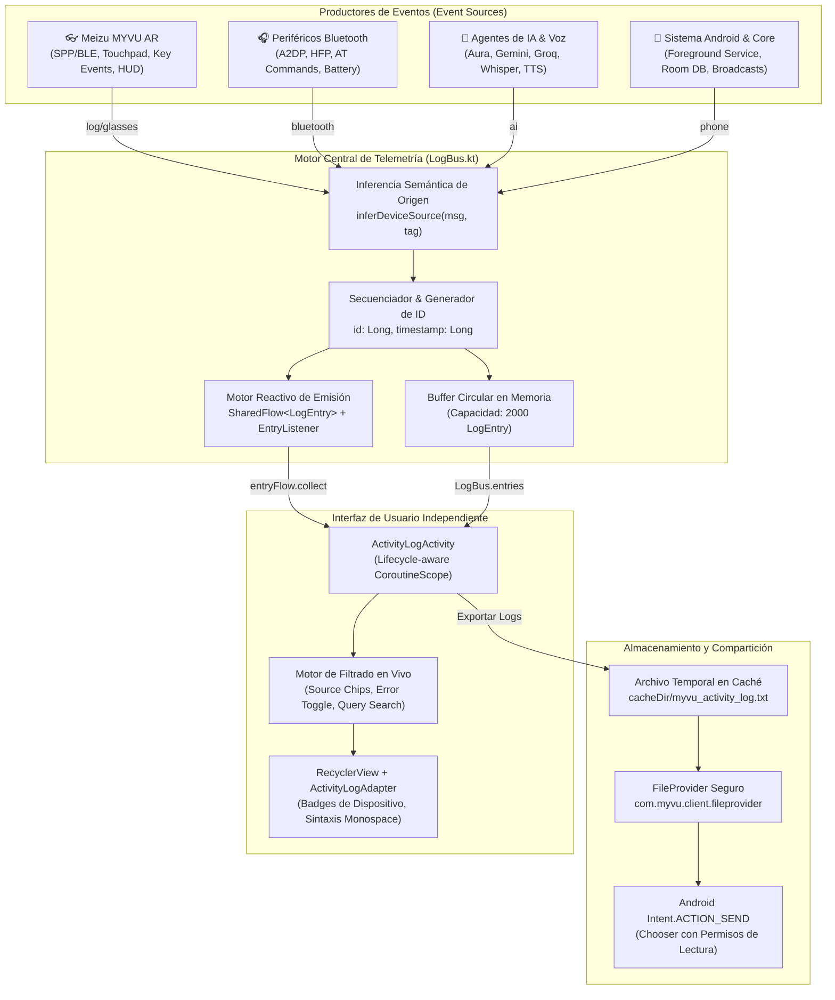
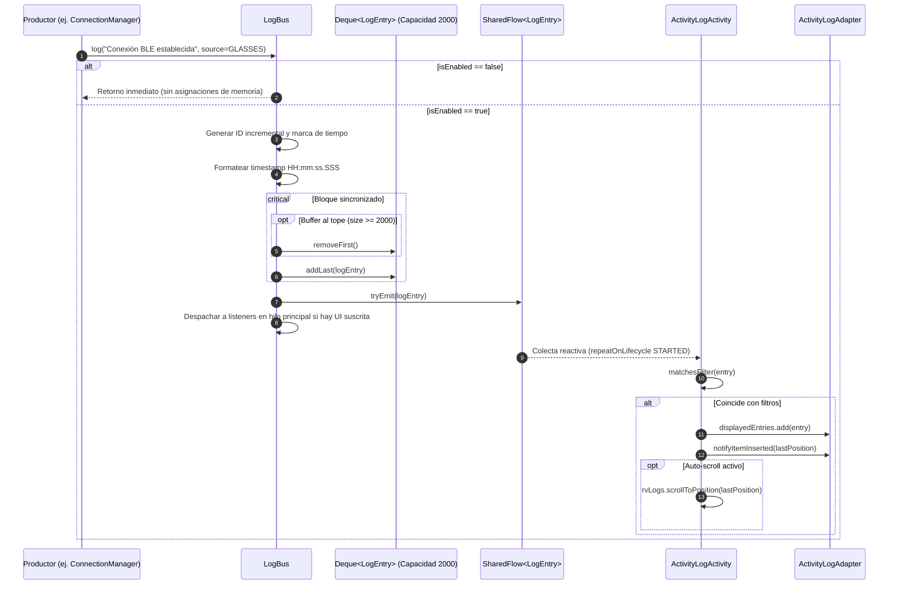

# Especificación de Arquitectura Técnica — Meizu Myvu Client

Este documento describe la arquitectura interna, diseño de capas, flujo de datos, codecs binarios y ciclo de vida de los servicios del cliente Android para las gafas inteligentes **Meizu Myvu AR**.

---

## 1. Visión General y Topología

La aplicación actúa como puente bidireccional entre el sistema operativo Android y el hardware de las gafas Meizu Myvu (pantalla micro-LED monocromática/verde, micrófonos duales, sensores IMU y trackpad táctil).

```
   ┌─────────────────────────────┐
   │    Meizu Myvu AR Glasses    │
   │  (HUD Micro-LED / Sensors)  │
   └──────────────┬──────────────┘
                  │  Bluetooth RFCOMM (SPP) / BLE GATT
                  ▼
   ┌─────────────────────────────┐
   │       Transport Layer       │
   │   - BtTransport (SPP)       │
   │   - BleTransport (GATT)     │
   │   - FrameReassembler        │
   └──────────────┬──────────────┘
                  │  Raw Frames / Stream
                  ▼
   ┌─────────────────────────────┐
   │       Protocol Layer        │
   │   - LinkProtocol            │
   │   - TlvBox / TlvTags        │
   │   - Pb (Protobuf Codecs)    │
   │   - Relay / RelaySequencer  │
   └──────────────┬──────────────┘
                  │  Decoded Events / Commands
                  ▼
   ┌─────────────────────────────┐
   │     Core Service Layer      │
   │   - MyvuService (Foreground)│
   │   - MirrorNotification      │
   │   - AutoSendAccessibility   │
   └──────────────┬──────────────┘
                  │  Event Bus / Flow
                  ▼
   ┌─────────────────────────────┬─────────────────────────────┐
   │        Skills Engine        │        UI & Storage         │
   │ - SkillManager              │ - Room Database (Notes/Rem) │
   │ - AI Engine (Local/Cloud)   │ - Material 3 Activities     │
   │ - Built-in Skills Handlers  │ - Live StateFlow Observers  │
   └─────────────────────────────┴─────────────────────────────┘
```

---

## 2. Capa de Transporte (`com.myvu.client.transport`)

### 2.1 Bluetooth SPP (`com.myvu.client.transport.bt`)
- **`BtTransport`**: Administra la conexión mediante sockets RFCOMM estándar de Android utilizando el UUID SPP (`00001101-0000-1000-8000-00805F9B34FB`).
- **`RfcommFraming`**: Aplica delimitación de tramas con encabezados de longitud y números de secuencia para evitar corrupción en flujos continuos.
- **`FrameReassembler`**: Ensambla paquetes fragmentados debido a los límites MTU del buffer de transmisión Bluetooth.

### 2.2 Bluetooth Low Energy (`com.myvu.client.transport.ble`)
- **`BleTransport`**: Gestiona el canal GATT para dispositivos emparejados o modo bajo consumo. Mapea diagnósticos detallados de desconexión como `147` (`GATT_CONNECTION_TIMEOUT`).
- **`GlassesScanner`**: Escáner BLE que detecta anuncios de gafas Myvu por coincidencia de nombre ("MYVU") y UUIDs de servicio (`0x0bd3`, `0x0bd1`), permitiendo auto-descubrimiento sin requerir entrada manual de la dirección MAC.
- **`GattQueue`**: Cola secuencial de operaciones GATT (lecturas, escrituras, habilitación de descriptores de notificación) para evitar colisiones nativas en la pila Bluetooth de Android.
- **`BleHeartbeat`**: Envío periódico de paquetes ping/pong para monitorizar el enlace activo y detectar desconexiones silenciosas.
- **`BleReassembler` / `BleMessageChannel`**: Manejo de fragmentación y reensamblado en características BLE con MTU variable (23 a 517 bytes).

---

## 3. Capa de Protocolo y Serialización (`com.myvu.client.protocol`)

El hardware Meizu Myvu utiliza un protocolo híbrido compuesto por:

### 3.1 Link Protocol (`com.myvu.client.protocol.link`)
- **`LinkProtocol`**: Capa base de intercambio de información del dispositivo (`DeviceInfo`, `DeviceId`).
- Negocia capacidades al conectar: versión de firmware, soporte de audio, resolución de HUD y estado de carga.
- **`LinkCommands`**: Comandos de control para encendido de pantalla, apagado, ajuste de brillo y reseteo de display.

### 3.2 Formato TLV (`TlvBox`, `TlvTags`)
Los metadatos y configuraciones se empaquetan en estructuras **Type-Length-Value (TLV)**:
- **Tag (16-bit / 8-bit)**: Identificador del atributo o acción.
- **Length (16-bit)**: Longitud exacta del payload en bytes.
- **Value**: Bytes de datos (cadenas UTF-8, enteros little-endian, o sub-cajas TLV anidadas).

### 3.3 Protocol Buffers y Mensajería Relay (`Pb`, `Relay`, `RelayMessage`)
- Para el contenido visual rico (tarjetas del HUD, teleprompter, previsión del clima, notificaciones complejas), se serializan estructuras compactas estilo Protobuf binario (`Pb`, `PbValue`).
- **`RelaySequencer`**: Asigna identificadores de secuencia únicos a cada mensaje saliente, gestionando acuses de recibo (ACK) y reintentos.

---

## 4. Servicios de Segundo Plano (`com.myvu.client.service`)

### 4.1 `MyvuService` (Foreground Service)
- Configurado con tipo de servicio en primer plano `connectedDevice` (requerido por Android 14+).
- Mantiene el socket de transporte siempre vivo en una Coroutine ligada al ciclo del servicio.
- Punto único de despacho: recibe eventos de las gafas (toques en el touchpad, comandos de voz) y los canaliza al motor de habilidades o a la interfaz de usuario.
- Notificación persistente con estado de batería y reconexión manual/automática.

### 4.2 `MirrorNotificationListener` y Enrutamiento Multi-Dispositivo
- Implementa `NotificationListenerService`.
- Filtra notificaciones según la configuración de aplicaciones habilitadas por el usuario (`NotificationAppsActivity`).
- **Enrutamiento Granular por Dispositivo (`DeviceNotificationMode`)**:
  - Cada dispositivo Bluetooth registrado en Room (`BluetoothDeviceEntity`) define su propio modo de notificación:
    1. **`BOTH`**: Envío visual al HUD/visor de las gafas y lectura simultánea por voz mediante `TextToSpeechHelper`.
    2. **`VISUAL_ONLY`**: Envío exclusivo al visor microLED/HUD de las gafas, suprimiendo la síntesis de voz (ideal para entornos silenciosos o de oficina).
    3. **`AUDIO_ONLY`**: Lectura por síntesis de voz (TTS) hacia los altavoces o auriculares, sin proyectar texto en la pantalla HUD.
    4. **`NONE`**: Silencia completamente las notificaciones para ese dispositivo.
  - **Canal de Audio TTS**: Al recibir una notificación, el servicio consulta los dispositivos activos conectados (`dao.getConnectedDevices()`); si alguno tiene activada la lectura sonora (`isAudioNotificationEnabled()`), reproduce *"De [App]: [Título]. [Texto]"*.
  - **Canal Visual HUD**: Verifica las preferencias de las gafas conectadas (`isVisualNotificationEnabled()`); si las gafas tienen desactivado el canal visual, omite el empaquetado TLV/JSON hacia el hardware.
- Extrae título, texto, icono de la app remitente y las formatea como tarjetas de HUD para ser proyectadas en las gafas con auto-dismiss configurable (`GlassesConfig.getNotificationDuration`).

### 4.3 `AutoSendAccessibilityService` y Watchdog de Persistencia
- Permite acciones de accesibilidad para automatizar el envío de mensajes de texto en aplicaciones como WhatsApp, Telegram y SMS sin requerir manipulación manual del dispositivo.
- **Watchdog de Persistencia y Auto-Activación**:
  - Al actualizar el APK (`ACTION_MY_PACKAGE_REPLACED`), Android apaga con frecuencia los servicios de accesibilidad de apps externas.
  - `autoEnableIfPermitted(context)`: Reactiva el servicio de forma programática escribiendo en `Settings.Secure.ENABLED_ACCESSIBILITY_SERVICES` si la app posee permiso `android.permission.WRITE_SECURE_SETTINGS` (concedido una sola vez mediante `adb shell pm grant com.myvu.client android.permission.WRITE_SECURE_SETTINGS`).
  - `notifyAccessibilityDisabled(context)`: Si no tiene permiso ADB, despacha una notificación de alta prioridad (Heads-Up) con canal propio (`myvu_accessibility_alert`) que conduce directamente a la pantalla de Ajustes de Accesibilidad con un solo toque.
  - Se ejecuta proactivamente en `BootReceiver` (`MY_PACKAGE_REPLACED`, `BOOT_COMPLETED`), `MyvuService` (`onCreate`) y en la UI (`ConnectActivity` y `SettingsActivity` en `onResume`), con banner de alerta y utilidad para copiar el comando ADB al portapapeles.

### 4.4 Gestión de Audio Bluetooth Clásico (`AudioProfiles` & `ConnectionManager`)
- **Doble Enlace (BLE + Classic Bluetooth)**: Las gafas Myvu utilizan BLE para el canal de telemetría/control y Bluetooth clásico (BR/EDR) para audio (HFP para llamadas/micrófono y A2DP para salida estéreo).
- **Auto-conexión Proactiva**: Al pulsar "Connect" y afianzarse el enlace BLE (`onReady` y `onSessionReady`), `ConnectionManager` invoca `AudioProfiles.connect()`.
- **Resolución de MAC Dual**: Mediante `resolveTargetDevice`, busca el dispositivo clásico emparejado en Android con nombre conteniendo `"MYVU"` o coincidencia de dirección MAC.
- **Enlace de Proxies y Políticas**: Realiza binding asíncrono con `BluetoothProfile.HEADSET` y `BluetoothProfile.A2DP`, encola la conexión pendiente si los proxies aún no están vinculados, y aplica por reflexión `setConnectionPolicy(device, 100)` y `setPriority(device, 1000)` para forzar la reconexión de audio en el subsistema Bluetooth del sistema operativo.

### 4.5 Subsistema de Gestos Táctiles y Botón Físico (`TouchGestureManager`, `InboundRouter`, `GlassGesture`, `MediaSession`)
- **Separación Estricta: Botón Físico de Montura vs. Sensores Táctiles de Patillas ("Patas")**:
  - **Botón Físico de la Montura (`GlassGesture.ACTION_BUTTON`, codes 202, 230, 231)**:
    - **Toque Simple / Pulsación Corta (`code 202, 230` / `ACTION_BUTTON`)**: Muestra y consulta el Dashboard / HUD nativo de las gafas (`executeHudDashboard()`). Restablece inmediatamente el acumulador de toques de software (`accumulatedTapCount = 0`, `lastTapTime = 0L`), evitando por completo que se sintetice un falso doble toque en las patillas o se abra Google Assistant.
    - **Pulsación Larga / Mantener Presionado (`code 231` / `KEYCODE_VOICE_ASSIST` y trigger `code: 3`)**: Invoca directamente al asistente configurado para el botón físico (`Prefs.glassesActionButtonAction(context)`, ej. Gemini, Gemini Live, Asistente de teléfono o Aura). Se procesa de forma totalmente independiente de los mapeos de la patilla táctil (`touchpadLongPressAction`).
    - **Ventana de Supresión Temporal de Patilla (`PHYSICAL_BUTTON_SUPPRESSION_MS = 1200L`)**: Cada vez que se detecta una pulsación del botón físico (vía trigger de IA o evento de tecla), `TouchGestureManager` activa una ventana de supresión de 1200ms. Cualquier toque de patilla capacitiva detectado durante esta ventana (generado por la mano al sujetar las gafas para presionar el botón) es ignorado automáticamente, impidiendo la ejecución consecutiva de dos acciones.
    - **Deduplicación Bidireccional de Disparos Firmware**: Si el paquete de trigger de IA (`code: 3`) y el evento de tecla de telemetría (`key_code: 231/230/202`) llegan casi simultáneamente por canales distintos, el primer canal recibido despacha la acción y el segundo es descartado como duplicado (`lastPhysicalKeyEventTime` dentro de 500ms), garantizando una única acción por pulsación.
  - **Sensores Táctiles de las Patillas (`sync_glass_event` -> `key_event`)**: Captura las interacciones táctiles en las varillas de las gafas a través de todos los emisores de hardware:
    - `sender: 1`: Sensor táctil capacitivo de la patilla principal/derecha.
    - `sender: 2`: Sensor de montura / patilla izquierda (`key_code: 202` para pulsación corta de botón).
    - `sender: 4`: Controlador virtual / phonepad del launcher Flyme XR.
- **Enrutamiento Dual de Toques (Protocolo RFCOMM + Bluetooth AVRCP)**:
  - **Capa de Protocolo StarryNet (`InboundRouter`)**: Analiza eventos entrantes desde `event_tracking`, `sync_glass_event`, `phonepad`, `trackpad`. Extrae `key_code` de `_event_attr_value_` e ignora liberaciones (`down_or_up: 0`) para evitar dobles disparos, procesando todos los emisores táctiles (1, 2, 4). Filtra telemetría no táctil (`suspend_stats`, `iot_screen_status_change`, `iot_voice_wakeup`, `iot_voice_quit`).
    - **Consolidación de Contacto Mecánico (Down/Tap/Up)**: Si en un lote concurre una pulsación confirmada (`210`, `230` o `202`), descarta automáticamente los eventos de transición `200` (down) y `203` (up) del mismo emisor/toque, evitando que un único toque físico sea interpretado como dos toques sucesivos.
    - **Filtrado Antirruido de Micro-Swipes Parásitos**: Al apoyar el dedo sobre la patilla capacitiva, el hardware frecuentemente genera micro-desplazamientos de fricción reportando un swipe (`206` o `207`) junto con un toque (`210`) en el mismo milisegundo (`key_event_time`). `InboundRouter.dispatchGestureBatch` detecta y suprime automáticamente los micro-swipes que ocurran a `<= 50ms` de un toque intencional del mismo sensor.
    - **Deduplicación de Rebotes en Lote**: Elimina rebotes de contacto capacitivo idénticos consecutivos con el mismo timestamp de hardware.
    - **Síntesis Directa de `DOUBLE_TAP` Calibrada**: Si el buffer de telemetría de las gafas agrupa dos toques `TAP` con diferencia de hardware timestamp entre 180ms y 500ms (ventana motora humana intencional), promueve los eventos inmediatamente a `DOUBLE_TAP`, descartando ráfagas de rebote menores a 180ms.
    - **Ordenamiento por Prioridad en Lotes Simultáneos**: Si un lote contiene múltiples gestos en la misma ventana temporal, se procesan respetando la jerarquía de intención: `ACTION_BUTTON` (prioridad 0) > `DOUBLE_TAP` > `TRIPLE_TAP` > `TAP` > `LONG_PRESS` > `SWIPE`.
  - **Capa Bluetooth AVRCP (`MyvuService.MediaSession`)**: Alberga una `MediaSession` activa que intercepta eventos de hardware transmitidos por el perfil de audio clásico (`BluetoothHeadset` / AVRCP) de las gafas (`KEYCODE_HEADSETHOOK`, `KEYCODE_MEDIA_PLAY_PAUSE`, `KEYCODE_MEDIA_NEXT`, `KEYCODE_MEDIA_PREVIOUS`, `KEYCODE_MEDIA_FAST_FORWARD`, `KEYCODE_MEDIA_REWIND`, `KEYCODE_VOICE_ASSIST`), distinguiendo pulsaciones simples y dobles para enrutarlas a `TouchGestureManager`.
  - **Mapeo Unificado (`GlassGesture.fromCode`)**: Asocia keycodes estándar y nativos Flyme XR:
    - `202, 230, 231` (Flyme Action Button Short / Long Press) -> `ACTION_BUTTON`.
    - `1, 23` (DPAD_CENTER), `66` (ENTER), `79` (HEADSETHOOK), `85` (PLAY_PAUSE), `96` (BUTTON_A), `200, 203, 210` (Flyme Temple Tap) -> `TAP`.
    - `2, 211` (Flyme Temple Double Tap) -> `DOUBLE_TAP`.
    - `3` (con nombre "triple") -> `TRIPLE_TAP`.
    - `4, 212` (Flyme Temple Long Press), `219` -> `LONG_PRESS`.
    - `5, 19` (DPAD_UP), `22` (DPAD_RIGHT), `87` (NEXT), `90` (FAST_FORWARD), `92` (PAGE_UP), `201, 206` (Flyme Temple Swipe Forward) -> `SWIPE_FORWARD`.
    - `6, 20` (DPAD_DOWN), `21` (DPAD_LEFT), `88` (PREV), `89` (REWIND), `93` (PAGE_DOWN), `207, 237` (Flyme Temple Swipe Backward) -> `SWIPE_BACKWARD`.
- **Despacho Personalizable, Debounce Inteligente y Sintetizador de Gestos (`TouchGestureManager`)**:
  - `ConnectionManager` y `GlassesEventHandler` enrutan los toques de patilla detectados a través de `TouchGestureManager.handleGesture()`, pasando el timestamp de hardware (`eventTime`) extraído de la telemetría Flyme XR (`_event_time_`, `key_event_time`).
  - **Sincronización con Reloj de Hardware de las Gafas**: Si los toques sufren retrasos de transmisión por reconexión o buffer Bluetooth tras desuspensión, `TouchGestureManager` calcula el intervalo real usando los timestamps físicos de las gafas (`Math.abs(eventTime - lastTapEventTime)`), eliminando falsos negativos por jitter de red.
  - **Inmunidad de Debounce para Acciones Nulas y HUD (`NONE`, `HUD_DASHBOARD`)**: Los toques orientados a HUD o sin acción configurada no activan debounce parasitario, permitiendo consultas fluidas del estado en la montura.
  - **Debounce Optimizado (200ms)**: Previene ejecuciones múltiples no deseadas.
  - **Protección contra Rebotes Eléctricos (< 180ms)**: Si llega un `TAP` dentro de un intervalo menor a 180ms respecto al anterior, se descarta como rebote eléctrico sin sobreescribir `lastTapTime`, manteniendo intacta la ventana de detección para el segundo toque real.
  - **Sintetizador Software Multi-Toque Calibrado (Doble y Triple Toque entre Paquetes)**:
    - **Doble Toque (180ms a 500ms)**: Acumula toques deliberados y promueve a `DOUBLE_TAP`, eliminando el falso doble toque al pulsar una sola vez el botón de acción o la patilla.
    - **Triple Toque (hasta 900ms)**: Soporte completo para sintetizar `TRIPLE_TAP` a partir de 3 toques consecutivos.
  - Respeta las preferencias del usuario para cada gesto: `TAP`, `DOUBLE_TAP`, `TRIPLE_TAP`, `SWIPE_FORWARD`, `SWIPE_BACKWARD`, `LONG_PRESS`.
  - **Lanzamiento Universal de Apps (`app:<package_name>`)**: Permite vincular cualquier gesto con aplicaciones instaladas en el teléfono móvil (ej. Spotify, WhatsApp, Cámara, YouTube). Al detectarse el gesto, `LockScreenHelper.wakeUpScreen()` enciende la pantalla, `SendTrampolineActivity` descarta el keyguard y lanza la app al frente, notificando en el HUD de las gafas (*"Abriendo [App]..."*).
  - **Integración con App Gemini y Desbloqueo (`LAUNCH_GEMINI`)**: Al ejecutarse mediante gesto de patilla (doble toque por defecto), enciende la pantalla con brillo completo (`PowerManager.WakeLock`), descarta el bloqueo/keyguard mediante `SendTrampolineActivity.launchWithKeyguardDismiss` y lanza de forma directa y explícita la app oficial de Gemini (`com.google.android.apps.bard`), eliminando interferencias de `googlequicksearchbox` (Google App) o colisiones de `KEYCODE_VOICE_ASSIST`.
  - **Enrutamiento Forzado de Micrófono Bluetooth SCO de Gafas**: Activado por defecto (`Prefs.isGeminiForceScoEnabled = true`). Configura el dispositivo de comunicación a Bluetooth SCO (`setCommunicationDevice` / `startBluetoothSco`) para capturar la voz del usuario directamente a través de los micrófonos de la montura MYVU.
  - **Activación de Micrófono Robusta y Aislamiento de Widgets en Accesibilidad**: `AutoSendAccessibilityService` orquesta la pulsación del micrófono mediante `findAndClickGeminiMicButton`, aceptando ventanas reales de la app de Gemini (`com.google.android.apps.bard` y el renderer `com.google.android.googlequicksearchbox` con `isGeminiAppWindow`) pero descartando de forma estricta launchers y widgets de búsqueda del escritorio (`search_widget`, `ghost_voice`, etc.). Cuenta con el permiso nativo `android:canPerformGestures="true"` en `accessibility_service_config.xml` para permitir gestos de inyección táctil. El algoritmo de búsqueda BFS encola todos los nodos hijos antes de cualquier filtro de exclusión de contenedores, evitando podas erróneas del subárbol de Compose. Cuando se detecta el botón de micrófono o Live, se ejecuta un **doble despacho (Dual-Action Click)**: `performAction(ACTION_CLICK)` y de forma complementaria `dispatchGesture` simulando un toque físico en el centro geométrico del botón con callback y log de confirmación. Libera el canal SCO tras 8.5s para restaurar A2DP estéreo y oír la respuesta en las gafas.
  - **Modo Conversación Continua para Gemini Live (`LAUNCH_GEMINI_LIVE`)**: Acción configurable en Ajustes (`gemini_live`). Invoca el **Asistente del Teléfono** de forma inmediata mediante `KEYCODE_VOICE_ASSIST` y `ACTION_VOICE_COMMAND` (levantando el overlay con micrófono activo), manteniendo la pantalla despierta con wakelock de 60s. En paralelo, `AutoSendAccessibilityService` orquesta la detección y pulsación del botón de onda / conversación de Gemini Live (*waveform / "open gemini live"*) en la ventana activa o en el overlay (`googlequicksearchbox` / `bard`) con BFS sin podas, doble despacho (Compose Action + DispatchGesture) e inmunidad frente a widgets del launcher. **Mantiene el canal Bluetooth SCO permanentemente abierto** durante toda la conversación interactiva sin cortes prematuros.
  - **Asistente del Teléfono Separado (`LAUNCH_PHONE_ASSISTANT`)**: Acción independiente que sí emite `KEYCODE_VOICE_ASSIST` y `ACTION_VOICE_COMMAND` para invocar al asistente predeterminado del sistema operativo (Google Assistant / Bixby).
  - **Temporizador Parametrizable de Auto-Bloqueo de Pantalla (`LockScreenHelper.scheduleReLock`)**: Cada vez que una interacción desde las gafas enciende la pantalla (`wakeUpScreen`), se programa un temporizador automático con el valor configurado por el usuario en Ajustes (`Prefs.screenReLockTimeoutSeconds`, 15s a 300s, **60s / 1 min por defecto**). Al expirar, apaga y bloquea el dispositivo de inmediato vía `AutoSendAccessibilityService.performGlobalAction(GLOBAL_ACTION_LOCK_SCREEN)`, protegiendo el terminal y evitando consumos en el bolsillo.
  - Acciones nativas adicionales: `LAUNCH_LOCAL_AI`, `LAUNCH_PHONE_ASSISTANT`, `MEDIA_PLAY_PAUSE`, `MEDIA_NEXT`, `MEDIA_PREV`, `WEATHER_SYNC`, `ZEN_MODE`, `TOGGLE_MIRROR`, `OPEN_TELEPROMPTER` o `NONE`.
- **Control de Reenvío del Launcher**:
  - Al cambiar cualquier preferencia en `SettingsActivity`, se envía de inmediato `SystemSettings.setMusicTpControl(true)` a las gafas para garantizar que el launcher FlymeAR reenvíe todos los eventos táctiles en lugar de consumirlos localmente.
- **Selector de Apps en Ajustes**:
  - `SettingsActivity.showAppPickerDialog()` permite seleccionar interactivamente cualquier app del dispositivo y mapearla al gesto táctil deseado.

### 4.6 Gestión Inteligente de Enlace RFCOMM SPP, Supresión de Bucles y Despacho de Notificaciones
- **Protocolo de Reposo Profundo de Flyme XR**:
  - Las gafas Meizu MYVU cierran activamente su servidor Bluetooth SPP (`CMD_SPP_SERVER_REQUEST_STATE_CLOSE`) para permitir que la radio y el microprocesador entren en modo de reposo profundo (deep sleep / suspend) cuando no hay funciones de alto ancho de banda activas (como navegación HUD o streaming de pantalla).
  - **Supresión de Bucle en `ConnectionManager`**: Al recibir `CMD_SPP_SERVER_REQUEST_STATE_CLOSE`, la aplicación marca `sppServerOpen = false` e instruye a `RelaySupervisor.onSppServerClosed()`. La app **no intenta reconectar** hasta que las gafas soliciten explícitamente el relay (`CMD_SPP_SERVER_REQUEST_CONNECT`, `CMD_SPP_SERVER_REQUEST_STATE_OPEN`, nuevo `UUID_SYNC`) o el usuario abra una función dependiente del relay (`wakeRelay()`), erradicando el drenaje severo de batería (~48%/h).
- **Umbral de Estabilidad en `RelaySupervisor` (`STABLE_RELAY_THRESHOLD_MS = 30000L`)**:
  - Requiere que el relay permanezca conectado y estable durante al menos 30 segundos continuos antes de resetear el contador de reintentos (`attempt = 0`).
  - Desconexiones tempranas no resetean el contador a 0, preservando el backoff exponencial estricto (2s -> 4s -> 8s -> 16s -> 32s -> 60s) en lugar de martillar el socket cada 2 segundos.
- **Despacho Inmediato de Notificaciones (Zero-Latency Delivery)**:
  - Las notificaciones son tramas JSON livianas (<500 bytes) compatibles con el canal de datos BLE.
  - Si el enlace RFCOMM no está activo (`transport == null`), `sendActionNow()` despacha la notificación inmediatamente sobre el canal BLE autenticado (`bleSession`), reduciendo la latencia de entrega de 9 segundos a <50ms.

---

## 5. Motor Modular de Habilidades (Skills Engine) y Tool Calling

El subsistema en `com.myvu.client.skills` permite añadir funcionalidades al dispositivo y gafas de forma modular:

1. **Definición de Skill**: Cada habilidad se declara en `app/src/main/assets/skills/built-in/<skill-name>/SKILL.md` con parámetros tipados.
2. **`SkillToolConverter`**: Transforma dinámicamente las habilidades registradas en esquemas JSON Schema de herramientas (**OpenAI / LiteLLM Tool Definitions**) con sus propiedades y tipos requeridos.
3. **`SkillManager` & `SkillRegistry`**: Mapea identificadores normalizados (`call_contact` <-> `call-contact`) y expone los ejecutores nativos (`SkillHandler`).
4. **`BaseSkillHandler`**: Expone métodos para interactuar con el HUD (`renderCard()`, `showToast()`, `streamText()`).

### Categorías de Habilidades
- **Voz y Asistencia**: `ai-voice-recorder`, `gemini-live-assistant`, `smart-translate-hud`.
- **Productividad**: `create-note`, `create-reminder`, `calendar-events`, `smart-agenda-planner`.
- **Comunicación**: `call-contact`, `send-whatsapp`, `send-telegram`, `unread-notifications`.
- **Información Rápida**: `weather-forecast`, `hud-navigation`, `google-search`, `currency-convert`.

### 5.1 Control de Medios y Aplicaciones Externas (`com.myvu.client.media.MediaPlaybackHelper`)
- **Doble Capa de Control de Transporte**:
  - **`MediaSessionManager` + `MediaController`**: Aprovecha el permiso de escucha de notificaciones de `MirrorNotificationListener` para interactuar directamente con la sesión activa de reproducción. Soporta comandos directos (`play`, `pause`, `skipToNext`, `skipToPrevious`, `stop`) y lectura de metadatos (`METADATA_KEY_TITLE`, `METADATA_KEY_ARTIST`) para responder en HUD y voz a *"¿Qué canción está sonando?"*.
  - **`AudioManager.dispatchMediaKeyEvent`**: Fallback seguro mediante keycodes multimedia del sistema (`KEYCODE_MEDIA_PLAY`, `KEYCODE_MEDIA_PAUSE`, etc.).
- **Soporte de Aplicaciones Libres y Comerciales**:
  - **NewPipe y forks (Tubular, BraveNewPipe)**: Búsqueda mediante `ACTION_SEARCH` y reproducción por deep link interceptable de YouTube.
  - **OpenTune y clientes YouTube Music (InnerTune, RiMusic, ViMusic)**: Búsqueda y reproducción mediante `INTENT_ACTION_MEDIA_PLAY_FROM_SEARCH` y MediaSession.
  - **Spotify, YouTube Music, YouTube, VLC, Deezer**: Integración nativa con URIs de búsqueda y paquetes declarados en `<queries>`.
- **Ejecución con Pantalla Bloqueada en Bolsillo**:
  - Uso de `SendTrampolineActivity` y `LockScreenHelper` para despachar intents multimedia sin ser bloqueados por las restricciones en segundo plano de Android.
- **Fast-Paths en `VoiceActionRouter` y Skill Agéntica**:
  - Respuestas en <5ms para órdenes de voz frecuentes (*"reproduce [canción] en NewPipe"*, *"busca [video] en OpenTune"*, *"salta la canción"*, *"qué canción suena"*).
  - Habilidad `app-media-control` expuesta a Gemini/LiteLLM con esquemas JSON de OpenAPI para invocación agéntica autónoma.

---

## 6. Integración de Inteligencia Artificial (Gemini + LiteLLM & On-Device)

- **Gemini vía LiteLLM Proxy con Native Tool Calling**:
  - `LocalAiClient` se comunica con el proxy LiteLLM (`/v1/chat/completions`) soportando Function Calling nativo de Gemini.
  - **`AgenticToolExecutor`**: Orquesta el bucle autónomo **ReAct**:
    1. Envía el mensaje del usuario junto con las definiciones de herramientas (`tools: [...]`).
    2. Si Gemini solicita invocar una o varias herramientas (`tool_calls`), la aplicación ejecuta los handlers correspondientes en segundo plano.
    3. Retorna las observaciones a Gemini con el rol `tool` (`tool_call_id`).
    4. Gemini sintetiza la respuesta informada final optimizada para el display HUD de las gafas AR (1-2 oraciones claras).
  - **Structured Outputs**: Salida JSON garantizada (`response_format: {"type": "json_object"}`) en `NoteAiProcessor` y `MeetingAiProcessor` para extracción sin fallos de regex.
- **Motor Local / Privado (`LocalAiClient`)**:
  - Inferencia mediante servidor local u OpenAI-compatible endpoint (LiteLLM, Ollama, vLLM) en la red local o dispositivo con soporte completo de Function Calling.
- **Motor Nube Conversacional (Gemini Live / GeminiClient)**:
  - Streaming conversacional de baja latencia con Gemini Live o API REST de Gemini.

### 6.1 Detección de Actividad de Voz (VAD) Adaptativa y Control de Latencia (`AiConversation`)
- **Umbral Dinámico Post-Habla**:
  - Mientras el usuario habla, `AiConversation` monitorea la energía RMS pico (`peakEnergy`).
  - Una vez activada la detección de voz (`speechStarted == true`), el umbral se calcula dinámicamente como `dynamicSpeechThreshold = max(speechThreshold, peakEnergy * 0.22)`.
  - Cuando el usuario finaliza su pregunta o comando, el nivel de audio desciende al piso de ruido ambiente del micrófono (~75-95 RMS), el cual queda estrictamente por debajo del umbral dinámico, clasificándolo de inmediato como silencio.
- **Watchdog Periódico de Silencio**:
  - Un ejecutor en el hilo principal (`silenceWatchdog`) inspecciona el flujo cada 200ms. Si transcurren `SILENCE_HOLD_MS = 1200ms` sin energía que supere el umbral dinámico, detiene la captura y transfiere el audio al motor STT.
  - Previene que las consultas cortas alcancen el límite forzado de 20 segundos (`utteranceCap`), reduciendo la latencia de respuesta de 20s a ~2.5s y ahorrando ciclos de CPU y decodificación Opus.

---

## 7. Persistencia y Almacenamiento

- **Room Database (`AppDatabase`)**:
  - `NoteEntity` y `ReminderEntity` con soporte para índices de texto y timestamps de activación.
  - `BluetoothDeviceEntity`: tabla de dispositivos emparejados y conectados con columnas dedicadas para tipo (`BluetoothDeviceType`), gestos de toques (`tap1Action`, `tap2Action`, `tap3Action`, `longPressAction`), gestos táctiles de patillas AR (`swipeForwardAction`, `swipeBackwardAction`), botón físico de montura (`actionButtonAction`), brillo HUD (`hudBrightness`), TTS y autolectura.
  - `NoteRepository` y `ReminderRepository` como fuentes de verdad para la UI y el motor de sincronización.
  - `BluetoothDeviceDao` / `BluetoothDeviceManager` para reactividad con `Flow` en toda la aplicación.
- **AlarmManager**:
  - Alarmas exactas (`SCHEDULE_EXACT_ALARM`) para activar recordatorios que se proyectan directamente en el HUD cuando expira el temporizador.

---

## 7.1 Catálogo Unificado de Acciones y Configuración por Dispositivo

Para garantizar desacoplamiento entre las capacidades físicas de cada periférico y la lógica de ejecución del agente inteligente:
- **`CommonDeviceActions` (`com.myvu.client.data.CommonDeviceActions`)**:
  - Catálogo centralizado de 13 acciones transversales (`MEDIA_PLAY_PAUSE`, `MEDIA_NEXT`, `MEDIA_PREV`, `LAUNCH_GEMINI`, `LAUNCH_GEMINI_LIVE`, `LAUNCH_PHONE_ASSISTANT`, `CREATE_AI_NOTE`, `READ_UNREAD_NOTIFICATIONS`, `DAILY_BRIEFING`, `SYNC_WEATHER`, `OPEN_TELEPROMPTER`, `QUICK_RECORD_MEETING`, `NONE`).
  - Utilidades integradas para Spinners y selectores de interfaz (`getLabels()`, `getActionId()`, `getIndexForAction()`).
- **Interfaces Propias por Dispositivo**:
  - **Gafas AR (`GlassesSettingsActivity`)**: Control total y granular del hardware de las gafas inteligentes con persistencia dual en Room (`BluetoothDeviceEntity`) y `GlassesConfig`/`Prefs`:
    - Carga bidireccional y robusta: enlace reactivo con la entidad de base de datos (`currentDevice = dev`) y fallback seguro por MAC o tipo `GLASSES`.
    - Normalización de acciones en `CommonDeviceActions`: resolución de sinónimos y alias heredados (`"phone_assistant"`, `"ai_assistant"`, `"gemini_live"`) a enums tipados, garantizando fidelidad de spinners.
    - Sincronización en vivo de brillo HUD (niveles de hardware 1 a 5 con emisión directa de `SystemSettings.setBrightness(level)` y persistencia en `GlassesConfig` y Room DB).
    - Volumen de altavoces (0..15), Posición Standby de la pantalla (Centro, Superior, Inferior, Lateral 0..3), Tiempo de pantalla activa (3..60s), y Duración de notificaciones en el HUD (1..30s).
    - Modo de respuesta de IA propio (Solo voz, Solo pantalla HUD, Voz y HUD).
    - Gestión de escucha continua (`swContinuousDialogue`), palabra de activación / Wake word (`swVoiceWakeup`) y enrutamiento SCO para Gemini (`swForceGeminiSco`).
    - Despacho inmediato en caliente a `MyvuService.activeConnection()` de brillo, volumen, standby, screen timeout, música/toques y configuración del asistente de IA.
    - Personalización de patillas táctiles ("patas": tap, double tap, triple tap, swipe forward, swipe backward, long press), botón de acción de montura y acceso directo a Trackpad virtual.
  - **Auriculares Bluetooth (`HeadphoneSettingsActivity`)**: Personalización de 1, 2 y 3 toques, pulsación larga, selección de agente de voz Aura vs asistentes externos, síntesis de voz (TTS) y lectura automática de notificaciones. Aislamiento estricto de Room: nunca consume ni sobrescribe entidades de gafas inteligentes (`SMART_GLASSES`), soporta fallback inteligente a dispositivos de audio emparejados en el sistema y asegura persistencia directa con `dao.insertOrUpdate`.
  - **Ajustes Generales Centralizados (`SettingsActivity`)**: Los modelos de IA, STT, TTS, clima, perfiles de usuario, registros de log y copias de seguridad en la nube se conservan centralizados en `SettingsActivity`, habiéndose eliminado de ella todos los parámetros que pertenecen al hardware exclusivo de las gafas.

## 7.2 Manejo de Insets, Ciclo de Vida de Temas y Robustez de UI

- **Ciclo de Vida Dinámico DayNight (`values` / `values-night`)**:
  - Las actividades no declaran `uiMode` en `android:configChanges`. Esto permite que el sistema Android gestione nativamente la recreación de contextos y la reinflación limpia de recursos semánticos ante llamadas a `AppCompatDelegate.setDefaultNightMode()`.
  - Transición inmediata forzada con `recreate()` en selectores de usuario para feedback sin latencia.
- **Controlador Adaptativo Edge-to-Edge (`EdgeToEdgeHelper`)**:
  - Aplica insets del sistema (`WindowInsetsCompat.Type.systemBars() or WindowInsetsCompat.Type.displayCutout()`) de forma diferenciada:
    - Inset superior (`insets.top`) como padding en cabeceras para librar la barra de estado y cámaras perforadas/notches sin aplastar títulos ni controles (`minHeight="56dp"` con `layout_height="wrap_content"`).
    - Inset inferior (`insets.bottom`) aplicado dinámicamente como margen a elementos flotantes (`bottomBar`, como el cluster FAB en `NotesActivity`), garantizando separación segura sobre la píldora o barra de navegación de Android.
    - Padding inferior seguro para listas de desplazamiento (`scrollContent` o colecciones `scrollContents`), permitiendo que `rvActivityLogs`, `rvNotes` y `rvReminders` hagan scroll completo sin que los últimos elementos queden ocultos tras los controles del sistema.
    - Inset inferior (`insets.bottom`) como padding a la barra de navegación activa más inferior (`navTabBar` / `cupertinoTabBar`), elevando los elementos interactivos por encima de la barra de gestos de Android.
    - Sincronización del contraste de iconos del sistema (`isAppearanceLightStatusBars` e `isAppearanceLightNavigationBars`) según `Prefs.themeMode()`.
- **Blindaje contra Recortes en MaterialButton y Componentes M3**:
  - Erradicación del desplazamiento por padding interno default de Material 3 mediante `android:insetTop="0dp"`, `android:insetBottom="0dp"`, `android:minHeight="0dp"` y `android:gravity="center"` en botones tipo píldora, asegurando textos e iconos nítidos e intactos.

---

## 8. Gestión del Ciclo de Vida, Desconexión y Ahorro de Batería

- **Desconexión Total Unificada (`TotalDisconnectHelper`)**:
  - Al presionar **Desconexión Total** en el Dashboard, Drawer o BottomSheet de Dispositivos, se activa `TotalDisconnectHelper.performTotalDisconnect()`:
    - Se fija `Prefs.setAutoReconnectEnabled(context, false)`, evitando cualquier reintento automático.
    - Se invoca `ServiceWatchdogReceiver.cancelWatchdog(context)` para cancelar la alarma periódica de 15 minutos en `AlarmManager`.
    - Se libera de inmediato cualquier canal de audio Bluetooth SCO (`TouchGestureManager.releaseBluetoothSco(context)`).
    - Se inactivan los sensores de hardware (`HealthService.getInstance(context).unregisterHardwareSensor()`).
    - Se marcan todos los periféricos en Room DB como desconectados (`BluetoothDeviceDao.markAllDisconnected()`, `BluetoothDeviceManager.markAllDevicesDisconnected()`).
    - Se envía `ACTION_STOP` a `MyvuService`, liberando `MediaSession`, retirando la notificación persistente de primer plano y finalizando el servicio (`stopSelf()`).
    - `ConnectionManager.stop()` desactiva todos los temporizadores de reintento (`cancelReconnect()`), libera GATT (`ble.close()`), RFCOMM, sincronización de clima y navegación, fijando el estado en `IDLE`.
- **Prevención de Bucle de Conexión/Desconexión en Gafas**:
  - `ConnectionManager` suprime el reenvío de los 27 paquetes de `InitBurst` en el relay RFCOMM si la sesión BLE ya los ejecutó (`bleSession.ready`), evitando que el launcher de Flyme XR se reinicie, encienda la pantalla innecesariamente y cause desconexiones cíclicas en reposo.
  - Sincronización única de perfiles de audio clásico (`HFP + A2DP`), impidiendo renegociaciones cíclicas de Bluetooth.
- **Protección contra Reactivaciones Fantasma**:
  - `ServiceKeepAliveHelper.ensureServiceRunning`: aborta de inmediato si `autoReconnectEnabled` es false.
  - `ServiceWatchdogReceiver.onReceive`: cancela la alarma y omite cualquier acción si `autoReconnectEnabled` es false.
  - `BootReceiver`: omite reactivar el servicio tras eventos del sistema (`ACTION_USER_PRESENT`, `POWER_CONNECTED`) si el usuario se desconectó voluntariamente.
  - `ConnectionManager`: en `onDisconnected()` y `fail()`, comprueba `userStopped` para no cambiar a `FAILED` ni programar reintentos en bucle cuando el usuario detuvo la conexión.
- **Optimización Integral de Batería y Recursos (Gafas y Teléfono)**:
  - **Diálogo Continuo / Escucha Activa Per-Dispositivo (`activeListeningEnabled` / `isContinuousDialogueEnable`)**: Deshabilitado por defecto (`activeListeningEnabled = false`) para todos los dispositivos en `BluetoothDeviceEntity`. En el firmware FlymeAR de las gafas y en auriculares Bluetooth, este flag mantenía el DSP de audio y el circuito de micrófono en escucha continua, causando drenajes acelerados de ~16.5% por hora. Ahora cada dispositivo (gafas en `GlassesSettingsActivity` y auriculares en `HeadphoneSettingsActivity`) cuenta con un interruptor individual e independiente, evaluado dinámicamente por `BluetoothDeviceManager.isActiveListeningEnabled()` antes de enviarse al hardware o activarse en el motor de conversación.
  - **Activación por Voz / Wake Word (`isLowPowerWakeupEnable`)**: Deshabilitado por defecto (`voice_wakeup_enabled = false`).
  - **Filtro Estricto en `InitBurst`**: `InitBurst.load()` descarta tramas con `com.upuphone.ai.assistant` e `isContinuousDialogueEnable` de `captured_init.txt`, impidiendo que reconexiones del relay RFCOMM sobreescriban los ajustes de bajo consumo.
  - **Caché Inteligente de Batería**: Las gafas reportan telemetría espontánea vía `sync_glass_battery_info`. `ConnectionManager.queryBatteryInfo()` evita emitir `get_device_info` si la batería ya es conocida y tiene menos de 15 minutos, suprimiendo despertares del procesador de las gafas.
  - **Heartbeat BLE Adaptativo con Coalescencia**: `BleHeartbeat` opera a 20s en reposo (en lugar de 10s ciegos) y pospone el pulso ante tráfico real en los canales internos/externos de `BleTransport`.
  - **Sensores de Salud de Bajo Consumo (`HealthService`)**: Uso de `SENSOR_DELAY_NORMAL` con batching de hardware de 60 segundos (`maxReportLatencyUs = 60_000_000`) y supresión de `STEP_DETECTOR` redundante cuando `STEP_COUNTER` está disponible, permitiendo al SoC del celular entrar en reposo profundo (*deep sleep*).
  - **Watchdog Compatible con Android Doze Mode**: `ServiceWatchdogReceiver` utiliza `AlarmManager.ELAPSED_REALTIME` (sin WAKEUP), evitando despertar al dispositivo en reposo prolongado cuando el servicio en primer plano ya está corriendo saludablemente.
  - **Backoff Exponencial en Reconexión RFCOMM (`RelaySupervisor`)**: Evita tormentas de reintentos consecutivos tras desconexiones de socket SPP, permitiendo a la pila Bluetooth de las gafas reciclarse limpiamente.
  - **Sincronización Dinámica en Caliente**: Modificaciones en `GlassesSettingsActivity` despachan en tiempo real `AiProtocol.assistantConfig()` a las gafas sin reiniciar el enlace Bluetooth.
  - **Temporizador de Seguridad de Audio Bluetooth SCO (Gemini Live)**: `TouchGestureManager` impone un watchdog estricto de 5 minutos a los canales continuos de audio SCO, previniendo drenaje permanente de batería en auriculares, gafas y SoC si el usuario olvida la sesión activa.
  - **Liberación Inmediata de SCO en Eventos del Sistema**: Audio SCO se desconecta limpiamente en `ConnectionManager.teardown()`, `ConnectionManager.stop()` y `LockScreenHelper.lockDevice()`.
  - **Receptor de Pantalla Apagada (`Intent.ACTION_SCREEN_OFF`)**: `MyvuService` escucha el bloqueo o apagado de la pantalla del celular para abortar escaneos de búsqueda Bluetooth y forzar la liberación de audio SCO, permitiendo a los procesadores Bluetooth entrar en reposo profundo.
  - **Auto-Cancelación de Búsqueda Bluetooth (`BluetoothDeviceManager`)**: `startScanning()` cuenta con un temporizador automático de seguridad de 12 segundos (`SCAN_TIMEOUT_MS = 12000L`) y `DeviceManagementBottomSheet` detiene activamente la búsqueda en `onDestroyView()` y `onDismiss()`.
  - **Apagado Limpio de Hilos en Segundo Plano**: `WeatherSync.stop()` invoca `net.shutdownNow()`, asegurando que no queden ejecutores huérfanos consumiendo memoria o ciclos de CPU.

---

## 9. Entorno de Compilación y Toolchain

- **JDK del Host / Gradle Daemon**: OpenJDK 25 (`/usr/lib/jvm/java-25-openjdk-amd64`), configurado en `gradle.properties` (`org.gradle.java.home`).
- **Gradle**: 8.14.3 (con wrapper oficial `./gradlew`).
- **Kotlin Gradle Plugin**: 2.1.10 con soporte de bytecode Java 21 (`jvmTarget = "21"`).
- **Compatibilidad Android (D8 / Desugar)**: `JavaVersion.VERSION_21` para `compileOptions`.

---

## 10. Asistente Cotidiano, Automatizaciones y Segundo Cerebro (`com.myvu.client.ai`)

Para delegación y automatización cotidiana con mínima fricción cognitiva:

### 10.1 Daily Briefing Ejecutivo (`DailyBriefingService`)
- Síntesis verbal (TTS) y proyección visual HUD en <5ms sin invocar modelos LLM:
  - Saludo adaptado según la hora del día.
  - Clima meteorológico local inmediato (`WeatherSync.lastSummary`).
  - Próximos compromisos y reuniones del día (`CalendarService.getEvents`).
  - Conteo y detalles prioritarios de tareas pendientes (`TodoRepository`).
  - Avisos y mensajes VIP no leídos (`MirrorNotificationListener`).
  - Nivel de batería actual de las gafas AR.

### 10.2 Modos Contextuales y Macros de Rutina (`RoutineManager`)
- Conmutación orquestada del estado del sistema con una sola orden vocal:
  - **Modo Reunión**: `SystemSettings.setZenMode(true)` en gafas, celular en `RINGER_MODE_VIBRATE`. Desactivación restaura `ZenMode(false)` y `RINGER_MODE_NORMAL`.
  - **Modo Conducción**: Brillo de display al máximo (`setBrightness(3)`), audio manos libres preparado.
  - **Modo Gimnasio**: Conteo de pasos y métricas de salud (`HealthService`), feedback en audio/HUD.
  - **Modo Noche**: Brillo mínimo de pantalla (`setBrightness(1)`), celular en silencio absoluto (`RINGER_MODE_SILENT`), reporte preventivo de carga de batería.

### 10.3 Memoria Espacial y Parking (`SpatialMemoryManager`)
- Registro de coordenadas de estacionamiento con timestamp y nota en `Prefs`.
- Consulta con cálculo síncrono de distancia (metros/kilómetros) y rumbo cardinal de navegación (`bearingToCardinal`: Norte, Noreste, etc.) utilizando `LocationManager` y `FusedLocationProviderClient`.

### 10.4 Listas de Compras y Checklists Manos Libres
- Fast-paths en `VoiceActionRouter` para agregar productos (`createTodo(title, listName = "Compras")`), consultar pendientes y tachar ítems comprados (`markCompletedByTitle`) en Room SQLite sin interacción visual.

### 10.5 Despacho Rápido de Ubicación GPS
- Obtención inmediata de coordenadas del usuario y generación de URL de Google Maps despachada por WhatsApp o Telegram mediante `PhoneActionExecutor.sendLocationToContact(contact, app)` con encendido de pantalla asistido (`LockScreenHelper.wakeUpScreen`).

### 10.6 Resolución Priorizada de Contactos y Fallback Semántico (`ContactHelper`)
- **Regla Crítica de Seguridad para Consultas Compuestas (Protección Nombre de Pila)**:
  - En consultas de voz de múltiples palabras (ej: `"Matias Castro"`), el primer token ($Q_0$) representa el nombre de pila.
  - Si ningún token del contacto coincide con el primer token solicitado (mediante coincidencia exacta, prefijo, alias semántico o distancia Levenshtein $\le 1$), el candidato recibe un puntaje estricto de **0** y queda descartado de inmediato.
  - Esto evita de raíz que contactos no solicitados que únicamente comparten el apellido (ej: `"Denis Castro"`) sean seleccionados indebidamente para enviar mensajes o realizar llamadas.
- **Jerarquía de Búsqueda Secuencial (Fase 1 - Prioridad Máxima)**:
  - **Tier 1 (Exacto - 3000 pts)**: Coincidencia textual idéntica tras normalización diacrítica y remoción de signos de puntuación.
  - **Tier 2 (Prefijo Continuo - 2000+ pts)**: Contactos que inician exactamente con la frase buscada (ej: `"Matias Castro Hijo"`).
  - **Tier 3 (Alineación Secuencial Estricta - 1200 a 1600 pts)**: Todos los tokens pedidos coinciden en orden secuencial estrictamente ascendente ($Q_0 \rightarrow Q_1 \rightarrow \dots$) dentro de los tokens del contacto.
- **Fallback Semántico y Desordenado (Fase 2 - Solo si Fase 1 no halla coincidencia)**:
  - **Alias y Diminutivos en Español (`SPANISH_NICKNAMES`)**: Mapeo semántico bidireccional (`"mati"` $\leftrightarrow$ `"matias"`, `"dani"` $\leftrightarrow$ `"daniel"/"daniela"`, `"sebas"` $\leftrightarrow$ `"sebastian"`, `"santi"` $\leftrightarrow$ `"santiago"`, `"juanca"` $\leftrightarrow$ `"juan carlos"`, `"pipe"` $\leftrightarrow$ `"felipe"`, `"pacho"` $\leftrightarrow$ `"francisco"`, etc.).
  - **Parentescos y Relaciones Familiares (`KINSHIP_ALIASES`)**: Mapeo semántico (`"papa"` $\leftrightarrow$ `"padre"`, `"mama"` $\leftrightarrow$ `"madre"`, `"hijo"`, `"esposa"`, etc.).
  - **Tokens Desordenados con Cobertura Total (850+ pts)**: Consultas con orden invertido (ej: `"Castro Matias"` para `"Matias Castro"`).
  - **Consultas Monotoken**: Permite la búsqueda legítima por apellido exclusivo (ej: `"Castro"`) con puntajes $\ge 400$.
- **Umbral de Calificación Seguro**:
  - Calificación mínima fijada en $\ge 150$ puntos para evitar emparejamientos por ruido fonético en `findBestContactMatch`, `extractRecipientAndMessage`, `resolveWhatsAppChatDataId` y `resolveWhatsAppVoipDataId`.

---

## 11. Plataforma Universal de Agente IA para Dispositivos Bluetooth (`com.myvu.client.service` / `data` / `ui`)

La plataforma desacopla la inteligencia agéntica del hardware específico de las gafas AR, convirtiendo la aplicación en un Agente IA Universal para cualquier dispositivo Bluetooth:

### 11.1 Clasificación y Gestión de Dispositivos (`BluetoothDeviceManager`)
- **Heurística de Clasificación Dinámica**:
  - `SMART_GLASSES`: Reconoce gafas por nombre de dispositivo (`myvu`, `starry`, `smart glasses`, `ray-ban meta`, `inmo`, `rokid`, `xreal`) o coincidencia con la MAC configurada en `Prefs.targetMac`.
  - `HEADPHONES`: Reconoce audífonos TWS, de diadema o in-ear por nombre (`airpods`, `buds`, `freebuds`, `earbuds`, `headphone`, `headset`, `wh-1000xm`, `wf-1000xm`, `bose`, `jbl`, `sony`, etc.) o por la clase Bluetooth del dispositivo (`AudioVideoWearableHeadset`, `AudioVideoHeadphones`, `AudioVideoHandsfree`).
  - `GENERIC`: Dispositivos periféricos o wearables genéricos.
- **Sincronización y Escaneo**:
  - Sincroniza automáticamente los dispositivos emparejados en el sistema Android y escucha eventos de conexión (`ACTION_ACL_CONNECTED` / `ACTION_ACL_DISCONNECTED`) y descubrimiento (`ACTION_FOUND`).
  - Almacena el estado en Room (`BluetoothDeviceEntity`) manteniendo el flag del dispositivo actualmente activo (`isActiveDevice`).

### 11.2 Gestos de Auriculares y Retroalimentación por Voz (`HeadphoneGestureManager` & `TextToSpeechHelper`)
- **Evaluador de Gestos en Botones Multimedia**:
  - Intercepta eventos de teclas multimedia (`KEYCODE_HEADSETHOOK`, `KEYCODE_MEDIA_PLAY_PAUSE`, etc.) canalizados a través de `MediaSession` en `MyvuService` cuando las gafas AR no están conectadas en estado `READY`.
  - Diferencia de forma precisa entre:
    - **1 Toque**: Acción configurable (por defecto Reproducir/Pausar música).
    - **2 Toques**: Acción configurable (por defecto Lanzar Asistente Gemini).
    - **3 Toques**: Acción configurable (por defecto Lanzar Gemini Live o Siguiente pista).
    - **Pulsación Larga**: Acción configurable (por defecto Crear nota de voz con IA o Resumen del día).
- **Acciones Disponibles**:
  - `LAUNCH_GEMINI`: Activa la ventana/overlay de Gemini.
  - `LAUNCH_GEMINI_LIVE`: Inicia conversación continua en vivo con Gemini.
  - `LAUNCH_PHONE_ASSISTANT`: Abre el asistente nativo del sistema (Google Assistant / Bixby).
  - `CREATE_AI_NOTE`: Lanza la grabadora de voz con IA para toma inmediata de notas y tareas.
  - `READ_UNREAD_NOTIFICATIONS`: Sintetiza y lee en voz alta por los audífonos las notificaciones pendientes mediante `TextToSpeechHelper`.
  - `DAILY_BRIEFING`: Genera y reproduce el resumen ejecutivo de la jornada (clima, hora, agenda, tareas y notificaciones).
  - Controles multimedia estándar (`MEDIA_PLAY_PAUSE`, `MEDIA_NEXT`, `MEDIA_PREV`).
- **Retroalimentación Auditiva (TTS)**:
  - `TextToSpeechHelper`: Motor nativo TTS con localización en español (`es-CO`/`es-ES`) que habla confirmaciones y respuestas sintetizadas hacia el canal de audio del auricular.

### 11.3 UI Centralizada en Chat y Panel de Dispositivos (`ChatActivity` & `DeviceManagementBottomSheet`)
- **Chat como Pantalla Principal (`MAIN`/`LAUNCHER`)**:
  - La actividad principal de la aplicación es `ChatActivity`, garantizando interacción directa con el agente de IA, comandos rápidos y herramientas en texto o voz.
- **Gestión Multi-Dispositivo**:
  - `DeviceManagementBottomSheet`: Permite al usuario conmutar entre dispositivos, iniciar escaneo Bluetooth y acceder a las configuraciones dedicadas según el tipo:
    - Para gafas AR: Abre `ConnectActivity` / `SettingsActivity` (HUD, teleprompter, navegación, brillo).
    - Para auriculares: Abre `HeadphoneSettingsActivity` (gestos de 1/2/3 toques, interruptores de TTS y lectura de notificaciones).
    - Muestra en tiempo real el porcentaje real de batería y el distintivo del modo de notificación para cada equipo (`HUD + TTS`, `HUD`, `TTS`, `Mudo`).

### 11.4 Telemetría y Monitoreo de Batería en Tiempo Real (`BluetoothDeviceManager`, `InboundRouter`, Room DB)
- **Captura Multi-Canal de Nivel de Batería**:
  1. **Telemetría de Gafas Inteligentes (`InboundRouter` + `ConnectionManager`)**:
     - `InboundRouter.checkBatteryUpdate`: Captura telemetría de batería en tramas JSON de las gafas (`get_device_info`, `device_info`, `sync_glass_battery_info`, `get_air_glass_info`) extrayendo campos de nivel (`battery`, `capacity`) en rango `0..100%`.
     - `ConnectionManager.updateGlassesBattery`: Propaga el nivel en vivo a `BluetoothDeviceManager.updateGlassesBatteryLevel(target, battery)`, persistiendo el dato en la entidad Room de las gafas y actualizando el `activeDevice` Flow.
  2. **Subsistema Bluetooth del Sistema Operativo Android (`BluetoothDeviceManager`)**:
     - **Receptor de Broadcasts OS**: Escucha `android.bluetooth.device.action.BATTERY_LEVEL_CHANGED` y extrae el entero `EXTRA_BATTERY_LEVEL`.
     - **Comandos AT Manos Libres HFP (`+IPHONEACCEV`)**: Escucha `android.bluetooth.headset.action.VENDOR_SPECIFIC_HEADSET_EVENT` y procesa los argumentos de batería estándar de Apple HFP (`parseAppleBatteryArgs`) en escala 0-9 para auriculares Bluetooth convencionales y TWS.
     - **Reflexión de API Oculta Android**: Invoca `device.getBatteryLevel()` al emparejar, conectar o refrescar (`refreshAllDeviceBatteries()`), sincronizando inmediatamente con la base de datos Room.
  3. **Visualización Reactiva en la UI**:
     - Los widgets de `ChatActivity`, la cabecera de `GlassesSettingsActivity`, la cabecera de `HeadphoneSettingsActivity` y los ítems de `DeviceManagementBottomSheet` observan directamente los datos de Room / StateFlow, eliminando por completo porcentajes simulados o valores ficticios hardcodeados.

### 11.5 Menú de Navegación Lateral y Barra de Acceso Rápido de IA (`ChatActivity`)
- **Menú de la Barra Lateral (Sidebar Navigation Drawer)**:
  - Implementado mediante `DrawerLayout` y `NavigationView` (`@menu/menu_navigation_drawer`).
  - Accesible desde el botón de hamburguesa (`@drawable/ic_menu_hamburger`) en el top bar de `ChatActivity`.
  - Permite acceso rápido a: Chat IA (Principal), Notas de IA y Tareas, Grabadora de Voz y Reuniones, Dispositivos Bluetooth, Dashboard de Gafas AR, Ajustes de IA y Perfil, Control Trackpad, Notificaciones y Logs.
  - La cabecera (`@layout/nav_header_drawer`) refleja en vivo el estado y nombre del dispositivo Bluetooth activo.
  - Integrado con `OnBackPressedCallback` para cerrar el drawer con el gesto de retroceso del sistema operativo.
- **Barra de Acceso Rápido a Funcionalidades de IA (`scrollAiQuickBar`)**:
  - Barra horizontal de botones táctiles Material 3 situada directamente en la parte superior del chat:
    - 📝 **Notas IA**: Apertura instantánea del repositorio de notas y recordatorios (`NotesActivity`).
    - 🎙️ **Grabar Reunión**: Disparo autónomo de grabación de reuniones con análisis de minutos, acuerdos y mapa mental (`VoiceRecorderActivity` con flag `CATEGORY_MEETING` y `AUTO_START_RECORDING`).
    - ☀️ **Mi Día (Briefing)**: Ejecución y lectura vocal inmediata de la jornada (clima, hora, reuniones, tareas, avisos) con registro formateado en el chat.

### 11.6 Desconexión Total, Control Maestro de Servicios y Garantía de IA Standalone
- **Interruptor Maestro de Servicios (`swMasterService` / `swSettingsMasterService`)**:
  - Controla globalmente la activación de servicios en segundo plano (`MyvuService`, escaneos continuos, watchdogs de alarma y reconexión automática).
  - Al desactivarse, ejecuta `TotalDisconnectHelper.performTotalDisconnect()` garantizando que la aplicación libere el 100% de la radio Bluetooth, canales SCO de audio y sensores de hardware para evitar cualquier drenaje innecesario de batería del móvil o los dispositivos.
  - Al activarse, reanuda la conectividad (`Prefs.setAutoReconnectEnabled(context, true)`) y reconecta los dispositivos activos.
- **Desconexión Total (`TotalDisconnectHelper`)**:
  - Desactiva de inmediato la reconexión automática (`Prefs.setAutoReconnectEnabled(context, false)`).
  - Cancela las alarmas de guardia (`ServiceWatchdogReceiver.cancelWatchdog()`).
  - Libera canales de audio Bluetooth SCO (`TouchGestureManager.releaseBluetoothSco()`).
  - Desregistra sensores de podómetro y salud del hardware (`HealthService.unregisterHardwareSensor()`).
  - Marca todos los dispositivos como desconectados en Room DB y detiene escaneos en curso (`BluetoothDeviceManager.markAllDevicesDisconnected()`).
  - Detiene el servicio en primer plano (`MyvuService` `ACTION_STOP`).
  - Accesible desde el Dashboard de Gafas (`ConnectActivity`), Ajustes Generales (`SettingsActivity`), el menú lateral de navegación (`ChatActivity`) y la hoja de gestión de dispositivos (`DeviceManagementBottomSheet`).
- **Garantía de IA 100% Standalone (Sin Dependencia de Hardware Bluetooth)**:
  - Todas las funcionalidades centrales de IA operan de forma autónoma directamente en el teléfono sin requerir gafas o audífonos conectados:
    - **Chat IA Aura (`ChatActivity`)**: Comunicación directa vía endpoints HTTP (OpenAI, Claude, Groq, NVIDIA NIM, Local/Ollama). Accesible con botón directo en el Dashboard (`btnOpenAiChat`) y desde el menú lateral.
    - **Notas y Recordatorios IA (`NotesActivity`)**: Persistencia local en base de datos Room, procesamiento de texto y resúmenes sin hardware externo.
    - **Grabadora de Reuniones y Notas de Voz (`VoiceRecorderActivity`)**: Captura audio mediante el micrófono integrado del móvil y transcribe vía STT (Groq / Whisper / Local).
    - **Resumen del Día / Mi Día (`DailyBriefingService`)**: Recopila clima, agenda del calendario, tareas y notificaciones del sistema con omisión elegante de telemetría de gafas si no están presentes, y síntesis vocal mediante el TTS del teléfono (`TextToSpeechHelper`).

---

## 12. Sistema de Diseño iOS Cupertino Pro Native y Motor de Temas

### 12.1 Principios de Diseño Visual (Apple HIG & Cupertino Pro Native)
- **Superficies Semánticas y Squircles Continuos**:
  - Implementación de curvaturas squircle continuas de 16dp (`bg_ios_card.xml`) con bordes de 0.5dp a 1dp (`ios_border`) y separación clara entre lienzo base (`ios_system_bg`) y tarjetas agrupadas (`ios_card_bg`).
  - Separadores hairline de 0.5dp (`ios_separator`) para listas y agrupaciones.
- **Identidad Gráfica y Launcher Adaptativo (`ic_launcher_hub`)**:
  - Icono vectorial adaptativo que sintetiza el ecosistema de agente inteligente universal: marco de visor holográfico AR, ondas de sonido de auriculares, punto neural de asistencia de 4 puntas y sensor de telemetría sobre fondo gradiente Cupertino (`#007AFF` a `#5856D6`).

### 12.2 Motor de Temas Dual Dinámico (Modo Claro / Modo Oscuro)
- **Paleta Semántica (`res/values/colors.xml` y `res/values-night/colors.xml`)**:
  - Modo Claro: Lienzo `#F2F2F7`, tarjetas `#FFFFFF`, texto principal `#1C1C1E`, acento azul `#007AFF`, acento índigo `#5856D6`, verde `#34C759`, naranja `#FF9500`.
  - Modo Oscuro: Lienzo `#000000`, tarjetas `#1C1C1E`, contenedores secundarios `#2C2C2E`, texto `#FFFFFF`, azul `#0A84FF`, verde `#30D158`.
  - Mapeo de tokens heredados (`obsidian_bg`, `obsidian_container`, etc.) para garantizar retrocompatibilidad total sin romper layouts o actividades secundarias.
- **Control y Persistencia del Modo Visual (`Prefs.kt` & `EdgeToEdgeHelper.kt`)**:
  - Opciones de tema: Automático (sigue sistema), Claro forzado (`AppCompatDelegate.MODE_NIGHT_NO`) y Oscuro forzado (`AppCompatDelegate.MODE_NIGHT_YES`).
  - Alternancia dinámica disponible mediante botón rápido de encabezado en `ChatActivity` (`btnThemeToggle`) y selector de botones agrupados en `SettingsActivity` (`btnThemeSystem`, `btnThemeLight`, `btnThemeDark`).
  - `EdgeToEdgeHelper.kt`: Actualiza dinámicamente `isAppearanceLightStatusBars` e `isAppearanceLightNavigationBars` para mantener alto contraste en los iconos de la barra de estado y gestos de Android.

### 12.3 Pantalla Principal: Companion Hub (`ChatActivity`)
- **Carrusel de Widgets de Dispositivos Conectados**:
  - Widgets horizontales con monitoreo en tiempo real del estado de conexión y nivel de batería para Gafas AR (MYVU) y Auriculares Bluetooth.
  - Botón de acceso rápido para emparejar nuevos dispositivos.
- **Stream de Mensajes Estilo iMessage**:
  - Burbujas asimétricas con radios diferenciados (`bg_ios_bubble_user` en azul y `bg_ios_bubble_ai` en gris suave con avatar de IA).
  - Barra de entrada flotante con botones redondos para adjuntos, dictado directo y envío.
- **Barra de Navegación Inferior Cupertino (5 Pestañas)**:
  - Pestañas fijas ergonómicas: Hub, Dispositivos/Equipos, AR Studio / HUD, Traducir en vivo y Notas de IA.

### 12.4 Patrón Inset Grouped Table Views y Componentes Cupertino HIG
- **Tarjetas Agrupadas con Esquinas Continuas (`bg_ios_card.xml` & `Card.Myvu`)**:
  - Todas las interfaces secundarias (`GlassesSettingsActivity`, `HeadphoneSettingsActivity`, `SettingsActivity`) implementan el diseño estándar de iOS Inset Grouped Tables con bordes redondeados de 14dp a 16dp, fondo `ios_card_bg` y líneas divisorias hairline de `0.5dp` (`ios_separator`).
  - Cabeceras de sección estandarizadas: mayúsculas pequeñas (11sp a 13sp), color secundario `ios_secondary_label`, espaciado de caracteres `letterSpacing="0.04"`.
- **Selectores Cupertino (`bg_ios_spinner.xml` y `bg_spinner_container.xml`)**:
  - Layer-list compuesto por un fondo redondeado suave (`ios_card_secondary`), borde sutil y glifo de chevron hacia abajo (`ic_ios_chevron_down`) alineado al extremo derecho con padding táctil de 12dp. Reemplaza la apariencia de caja plana estática de Android por un control desplegable de alta fidelidad iOS.
- **Controles Deslizantes con Glifos de Extremo**:
  - Sliders de brillo de pantalla HUD y volumen de audio flanqueados por iconos mínimos y máximos inline (`ic_brightness_low`, `ic_brightness_high`) idénticos a los controles nativos de brillo en iOS.
- **Normalización Ergonómica de Botones Táctiles**:
  - Normalización de insets verticales (`insetTop="0dp"`, `insetBottom="0dp"`) y alturas fijas de 48dp / 52dp para evitar textos truncados y deformaciones con configuraciones de accesibilidad de fuentes grandes.

---

## 13. Sistema de Registro de Actividad Unificado y Multidispositivo (`ActivityLogActivity` & `LogBus`)

### 13.1 Visión General y Topología de Observabilidad
El sistema de **Activity Log** provee observabilidad unificada y en tiempo real para todos los subsistemas del ecosistema de la aplicación: el hardware de las gafas inteligentes Meizu MYVU AR, los dispositivos Bluetooth periféricos (auriculares A2DP/HFP y dispositivos BLE), la capa de inteligencia artificial (agente Aura, Gemini, proveedores STT/TTS) y el entorno operativo móvil Android (servicios en segundo plano, persistencia Room y conectividad).



---

### 13.2 Modelo de Datos y Contratos de Registro

#### 13.2.1 Clasificación de Dispositivos (`DeviceSource`)
```kotlin
enum class DeviceSource(val displayName: String, val tagKey: String) {
    ALL("Todos", "all"),
    GLASSES("Gafas MYVU", "glasses"),
    BLUETOOTH("Dispositivos BT", "bluetooth"),
    PHONE("Teléfono / Sistema", "phone"),
    AI("Asistente IA", "ai")
}
```

#### 13.2.2 Registro Estructurado (`LogEntry`)
Cada entrada contiene metadatos completos para permitir filtrado compuesto y renderizado de alta densidad:
```kotlin
data class LogEntry(
    val id: Long,                          // Secuencia monotónica única
    val timestamp: Long,                   // Época Unix en milisegundos
    val source: DeviceSource,              // Origen categorizado
    val level: Int,                        // Nivel Android Log (INFO, WARN, ERROR, DEBUG)
    val tag: String,                       // Tag del componente emisor
    val message: String,                   // Texto descriptivo del evento
    val throwable: Throwable? = null,      // Excepción capturada opcional
    val deviceName: String? = null,        // Nombre del dispositivo asociado (ej: 'Sony WH-1000XM4')
    val formattedLine: String = ""         // Línea formateada 'HH:mm:ss.SSS  [msg]' para retrocompatibilidad
)
```

---

### 13.3 Ciclo de Vida del Evento y Pipeline de Procesamiento



---

### 13.4 Inferencia Semántica Inteligente de Fuentes
Cuando componentes legados o servicios secundarios invocan sobrecargas tradicionales (`LogBus.log(msg)`, `LogBus.warn(msg)`, `LogBus.error(msg, t)`), la función `inferDeviceSource(msg, tag)` evalúa las cadenas para clasificar de manera determinista:

| Origen Asignado | Criterios de Detección (Keywords en Mensaje / Tag) |
|---|---|
| `DeviceSource.GLASSES` | `glasses`, `lens`, `myvu`, `temple`, `touchpad`, `hud`, `flyme`, `gesture`, `rfcomm`, `action_btn`, `action_button`, `glass_event`, `turn icon`, `send to lens` |
| `DeviceSource.BLUETOOTH` | `bluetooth`, `headphone`, `headset`, `a2dp`, `audio device`, `bt device`, `ble`, `sco`, `bond`, `airpods`, `galaxy buds`, `disconnect` + `device` |
| `DeviceSource.AI` | `gemini`, `aura`, `assistant`, `chat`, `llm`, `stt`, `tts`, `transcrib`, `whisper`, `groq`, `openai`, `ai prompt`, `speech` |
| `DeviceSource.PHONE` | Todo evento que no coincida con los patrones anteriores (servicios Android, Room, red local, batería móvil) |

---

### 13.5 Resiliencia, Seguridad en Pruebas Unitarias y Concurrencia
1. **Aislamiento de Entornos JVM (Unit Tests)**:
   - `android.os.Looper` y `android.os.Handler` son stubs inertes bajo pruebas JUnit off-device. `LogBus` inicializa su `MAIN: Handler?` de forma perezosa (`by lazy`) protegiendo con un bloque `try/catch`. Si el runtime de Android no existe, el despachador entrega los callbacks directamente en línea evitando excepciones fatales de inicialización (`ExceptionInInitializerError`).
2. **Buffer Circular Acotado**:
   - Tanto `BUFFER: Deque<String>` como `ENTRIES: Deque<LogEntry>` están acotados rígidamente a `CAPACITY = 2000`. Al alcanzar el límite, se descarta el registro más antiguo (`removeFirst()`) garantizando una huella de memoria predecible de aproximadamente ~250 KB aún durante sesiones prolongadas.
3. **Sincronización Multihilo**:
   - Las escrituras y lecturas de los buffers están sincronizadas bajo monitores intrínsecos.
   - La lista de suscriptores utiliza `CopyOnWriteArrayList` para permitir iteración concurrente segura mientras las actividades se registran o desregistran (`addListener`, `addEntryListener`).

---

### 13.6 Interfaz de Usuario Independiente (`ActivityLogActivity`)

```
┌─────────────────────────────────────────────────────────────┐
│ [‹] Registro de Actividad      142 eventos    [📤]   [🗑️]   │
├─────────────────────────────────────────────────────────────┤
│ ┌─────────────────────────────────────────────────────────┐ │
│ │ Monitoreo de Actividad                 [  Activo (ON) ] │ │
│ │ Captura activa de eventos de todos los dispositivos     │ │
│ └─────────────────────────────────────────────────────────┘ │
│ [Todos: 142] [🚨 Errores: 5] [⚠️ Avisos: 2] [👓 Gafas: 80] [🎧 BT] │
├─────────────────────────────────────────────────────────────┤
│ [🔍 Buscar en registros...                                ] │
│ [Todos] [👓 Gafas] [🎧 Dispositivos BT] [📱 Teléfono] [🤖 IA]│
│ [⚠️ Solo Errores] [✔ Auto-scroll]                          │
├─────────────────────────────────────────────────────────────┤
│ ┌─────────────────────────────────────────────────────────┐ │
│ │ [👓 Gafas MYVU]  [INFO]                     20:45:12.345 │ │
│ │ SPP RFCOMM link ready. Battery level synced: 92%        │ │
│ └─────────────────────────────────────────────────────────┘ │
│ ┌─────────────────────────────────────────────────────────┐ │
│ │ 🚨 [👓 Gafas MYVU] [ERROR]                  20:45:13.004 │ │
│ │ BT GATT disconnected unexpectedly                       │ │
│ │ [Ver detalles del error ⌄]                              │ │
│ └─────────────────────────────────────────────────────────┘ │
│ ┌─────────────────────────────────────────────────────────┐ │
│ │ [🎧 Sony WH-1000] [INFO]                     20:45:14.120 │ │
│ │ HeadphoneGestureManager: Double tap detected -> Aura AI │ │
│ └─────────────────────────────────────────────────────────┘ │
└─────────────────────────────────────────────────────────────┘
```

#### 13.6.1 Capacidades de la Interfaz
- **Diagnóstico Visual Inmediato de Errores**:
  - Eventos de error (`Log.ERROR`) renderizados en tarjetas tintadas en rojo suave (`ios_red_tint`), con borde izquierdo/perimetral en rojo vivo (`#FF3B30`), badge rojo e icono de alerta `ic_ios_error`.
  - Eventos de advertencia (`Log.WARN`) en tarjetas tintadas en ámbar suave (`ios_orange_tint`) con borde ámbar e icono `ic_ios_warning`.
  - Contenedores de traza de excepción colapsables: expanden y contraen el stack trace mediante botón interactivo para un diagnóstico profundo sin saturar la vista.
- **Barra de Métricas de Salud en Cabecera (Segmented Diagnostic Bar)**:
  - Fila horizontal de píldoras con conteos reactivos actualizados en tiempo real: `[Todos: N]`, `[🚨 Errores: X]`, `[⚠️ Avisos: Y]`, `[👓 Gafas: Z]`, `[🎧 Audio BT: W]`.
  - Pulsar una píldora aplica inmediatamente el filtro correspondiente sincronizando con el grupo de chips secundarios.
- **Badges Semánticos Squircle**: Badges compactos diferenciados por color para el emisor de hardware (Azul para Gafas, Púrpura para Auriculares, Azul para IA, Gris para Teléfono/Sistema).
- **Switch Maestro en Caliente (`swActivityLogging`)**: Conecta con `Prefs.setLoggingEnabled(context, boolean)` y `LogBus.isEnabled`. Si el usuario desactiva el switch, el buffer se limpia y la interfaz muestra una vista vacía contextual indicando que el registro está pausado.
- **Filtros Compuestos Reactivos**:
  - Filtro por Fuente: `ALL`, `GLASSES`, `BLUETOOTH`, `PHONE`, `AI`.
  - Filtro de Severidad: `onlyErrors = true` (restringe a `Log.ERROR`), `onlyWarnings = true`.
  - Búsqueda en Vivo: Coincidencia insensible a mayúsculas sobre mensaje, tag y nombre del dispositivo con botón para borrar texto.
- **Auto-scroll Conmutable**: Si `chipAutoScroll` está activo, cualquier evento nuevo que ingrese desplaza la lista hacia el final automáticamente.
- **Copia Rápida al Portapapeles**: Long-press en cualquier tarjeta del log copia el contenido formateado y muestra un `Toast`.
- **Exportación Segura vía `FileProvider`**:
  - Al pulsar el botón de compartir, compila el historial con encabezados de auditoría.
  - Guarda en `cacheDir/myvu_activity_log.txt`.
  - Genera la URI mediante `FileProvider.getUriForFile(this, "$packageName.fileprovider", logFile)`.
  - Lanza `Intent(Intent.ACTION_SEND)` con flag `FLAG_GRANT_READ_URI_PERMISSION`.
  - En caso de fallo de permisos de archivo en dispositivos restringidos, ejecuta un fallback transparente compartiendo el texto sin formato mediante el portapapeles o intent directo.
- **Limpieza con Diálogo de Confirmación**: `MaterialAlertDialogBuilder` previene borrados accidentales antes de invocar `LogBus.clear()`.

---

### 13.7 Desacoplamiento y Remoción de Interfaz Legada
Previamente, el log existía únicamente como la pestaña 1 de un `TabLayout` en `ConnectActivity`:
1. **Eliminación en Layouts**:
   - `activity_connect.xml`: Removido el componente `com.google.android.material.tabs.TabLayout` y el contenedor vertical `pageLog` (junto con `rvLog`, `btnShareLog` y `btnClearLog`).
   - `pageControls` (`NestedScrollView`) pasó a ser la vista principal directa del layout con peso 1.
   - Se añadió el botón `btnOpenActivityLog` en la barra superior junto a ajustes.
2. **Eliminación en Código**:
   - `ConnectActivity.kt`: Eliminada la implementación de `LogBus.Listener`, referencias a `logAdapter`, `wireTabs()`, `crossFade()`, `shareLog()`, `onLine()`, `logAtBottom()` y `scrollToBottom()`.
   - Se eliminó el archivo de adaptador obsoleto `LogAdapter.kt`.
3. **Navegación Unificada**:
   - `ChatActivity.kt` y `ConnectActivity.kt`: El selector del menú lateral (`R.id.nav_logs`) ahora inicia de forma directa e independiente `ActivityLogActivity`.
   - `SettingsActivity.kt`: Se añadió el botón de acceso directo "Abrir Registro de Actividad Unificado" bajo la sección de logging.


