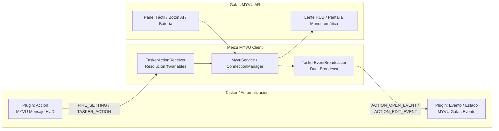

# ⚡ Integración y Automatización con Tasker (MYVU Glasses)

La aplicación Kotlin de **Meizu MYVU Client** incluye soporte nativo y bidireccional para **Tasker** y aplicaciones compatibles con el estándar **Locale / Tasker Plugin API** (Automate, MacroDroid, etc.), además de un bus de Intents directos para automatizaciones avanzadas vía ADB o scripts.

---

## 🧭 Resumen de Capacidades



---

## 1. 📥 Acciones: Tasker ➡️ Gafas MYVU (Mensaje HUD)

Permite a cualquier tarea de Tasker proyectar notificaciones y mensajes en la lente monocromática de las gafas.

### Configuración visual en Tasker
1. En Tasker, crea o edita una Tarea y añade una Acción: **Plugin ➡️ MYVU Mensaje HUD**.
2. Pulsa en el icono de lápiz para abrir la pantalla de configuración [`TaskerActionActivity`](file:///home/rcastro/Documentos/negex/Meizu-Myvu-Client/android-kotlin/app/src/main/java/com/myvu/client/plugin/tasker/action/TaskerActionActivity.kt).
3. Configura los campos del mensaje:

| Campo | Descripción |
|---|---|
| **Título (Opcional)** | Encabezado corto del aviso en el HUD (ej: `Alerta Casa`, `%caller_name`). |
| **Mensaje / Contenido (Obligatorio)** | Texto del mensaje a proyectar (ej: `Lavadora terminada`, `%antigravity_msg`). |
| **Soporte de Variables (%var)** | Admite cualquier variable local o global de Tasker (ej. `%TIME`, `%BATT`, `%asunto`, etc.). Se resuelven dinámicamente antes de enviar a las gafas. |

### 🚀 Fallback por Intent Broadcast Directo
Si prefieres no usar la UI de plugins o disparar avisos desde terminal / ADB / scripts:
- **Action:** `com.myvu.client.TASKER_ACTION`
- **Extras:**
  - `action_type`: `show_hud`
  - `title`: String (opcional)
  - `content`: String (mensaje obligatorio)

**Ejemplo vía ADB:**
```bash
adb shell am broadcast -a com.myvu.client.TASKER_ACTION --es action_type "show_hud" --es title "Alerta" --es content "Batería del móvil al 100%"
```

---

## 2. 📤 Eventos y Disparadores: Gafas MYVU ➡️ Tasker

Permite que acciones físicas en las gafas disparen flujos de automatización en tu teléfono.

### Configuración en Tasker
1. En Tasker, crea un Perfil:
   - **Evento ➡️ Plugin ➡️ MYVU Gafas Evento** *(o **Estado ➡️ Plugin ➡️ MYVU Gafas Evento**)*.
2. Pulsa en el lápiz para abrir [`TaskerEventActivity`](file:///home/rcastro/Documentos/negex/Meizu-Myvu-Client/android-kotlin/app/src/main/java/com/myvu/client/plugin/tasker/event/TaskerEventActivity.kt).
3. Selecciona el disparador deseado:

| Disparador | Filtro / Opciones | Variables Disponibles en la Tarea de Tasker |
|---|---|---|
| **Gesto Táctil / Botón** | Cualquier gesto, Toque Doble, Toque Triple, Pulsación Larga, Voz | `%myvu_event` = `touch_gesture`<br>`%myvu_gesture` = `double_tap` \| `long_press` \| etc. |
| **Botón Asistente AI** | Pulsación botón patilla izquierda o wake-word | `%myvu_event` = `ai_button` |
| **Gafas Conectadas** | Enlace BLE + Relay RFCOMM listo | `%myvu_event` = `glasses_connected`<br>`%myvu_state` = `READY` |
| **Gafas Desconectadas** | Pérdida de enlace Bluetooth | `%myvu_event` = `glasses_disconnected`<br>`%myvu_state` = `DISCONNECTED` |
| **Nivel de Batería** | Filtro de umbral (%) y filtro de solo si está cargando | `%myvu_event` = `battery_changed`<br>`%myvu_battery` = Nivel 0-100<br>`%myvu_charging` = `true` \| `false` |

### 💡 Ejemplo de Perfil en Tasker: Asignar Pulsación Larga a Acción Personalizada
1. En la app Android, ve a **Ajustes ➡️ Gestos táctiles** y selecciona **"Evento Tasker"** (o déjalo en automático).
2. En Tasker, crea un Perfil con Evento: `MYVU Gafas Evento` (Gesto: *Pulsación Larga*).
3. En la Tarea asociada, añade:
   - *Acción en móvil*: Encender luces inteligentes o abrir portón.
   - *Mensaje HUD de respuesta*: Acción Plugin MYVU con Contenido: *"Luces encendidas"*.

### 🚀 Fallback por Intent Broadcast Directo
Tasker puede escuchar eventos mediante un receptor de intención estándar:
- **Action:** `com.myvu.client.TASKER_EVENT`
- **Extras incluidos:**
  - `event_type`: `touch_gesture` | `ai_button` | `glasses_connected` | `glasses_disconnected` | `battery_changed`
  - `gesture_code`: Int
  - `gesture_name`: String
  - `connection_state`: String
  - `battery_level`: Int
  - `is_charging`: Boolean
  - `%myvu_event`, `%myvu_gesture`, `%myvu_battery`, `%myvu_state`, `%myvu_charging`

---

## 🛠️ Arquitectura Interna

- **[`TaskerConstants`](file:///home/rcastro/Documentos/negex/Meizu-Myvu-Client/android-kotlin/app/src/main/java/com/myvu/client/plugin/tasker/TaskerConstants.kt)**: Contratos de intención (`ACTION_EDIT_EVENT`, `EDIT_EVENT`, `EDIT_CONDITION`, `EDIT_SETTING`, `FIRE_SETTING`).
- **[`TaskerBundleManager`](file:///home/rcastro/Documentos/negex/Meizu-Myvu-Client/android-kotlin/app/src/main/java/com/myvu/client/plugin/tasker/TaskerBundleManager.kt)**: Serialización tipada e inmutable de bundles de configuración con soporte para `EXTRA_VARIABLE_REPLACE_KEYS`.
- **[`TaskerActionActivity`](file:///home/rcastro/Documentos/negex/Meizu-Myvu-Client/android-kotlin/app/src/main/java/com/myvu/client/plugin/tasker/action/TaskerActionActivity.kt)**: Interfaz simplificada y enfocada exclusivamente en proyección de mensajes HUD.
- **[`TaskerActionReceiver`](file:///home/rcastro/Documentos/negex/Meizu-Myvu-Client/android-kotlin/app/src/main/java/com/myvu/client/plugin/tasker/action/TaskerActionReceiver.kt)**: Procesa `FIRE_SETTING`, resuelve variables dinámicas y proyecta en el lente vía `MyvuService`.
- **[`TaskerEventBroadcaster`](file:///home/rcastro/Documentos/negex/Meizu-Myvu-Client/android-kotlin/app/src/main/java/com/myvu/client/plugin/tasker/event/TaskerEventBroadcaster.kt)**: Emite eventos concurrentes hacia el bus de Tasker garantizando seguridad en hilos de background.
