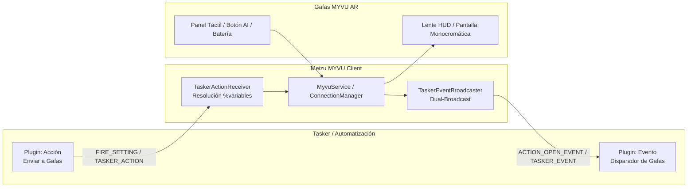

# ⚡ Integración y Automatización con Tasker (MYVU Glasses)

La aplicación Kotlin de **Meizu MYVU Client** incluye soporte nativo y bidireccional para **Tasker** y aplicaciones compatibles con el estándar **Locale Plugin API** (Automate, MacroDroid, etc.), además de un bus de Intents directos para automatizaciones avanzadas vía ADB o scripts.

---

## 🧭 Resumen de Capacidades



---

## 1. 📥 Acciones: Tasker ➡️ Gafas MYVU

Permite a cualquier tarea o perfil de Tasker enviar comandos visuales o cambiar parámetros de hardware de las gafas.

### Configuración visual en Tasker
1. En Tasker, crea una Tarea y añade una Acción: **Plugin ➡️ MYVU Gafas Acción**.
2. Pulsa en el icono de lápiz para abrir la pantalla de configuración [`TaskerActionActivity`](file:///home/rcastro/Documentos/negex/Meizu-Myvu-Client/android-kotlin/app/src/main/java/com/myvu/client/plugin/tasker/action/TaskerActionActivity.kt).
3. Selecciona el tipo de acción deseado:

| Tipo de Acción | Parámetros Disponibles | Descripción |
|---|---|---|
| **Mostrar Mensaje HUD** | Título, Mensaje | Proyecta una notificación flotante en el lente con sanitización y truncamiento seguro. Soporta variables de Tasker (`%antigravity_msg`). |
| **Teleprompter (Guion)** | Texto completo | Lanza la aplicación de teleprompter en las gafas con el texto especificado. |
| **Ajustar Brillo** | Nivel de brillo (0 - 10) | Modifica la intensidad del proyector MicroLED. |
| **Ajustar Volumen** | Nivel de volumen (0 - 15) | Modifica el volumen de los altavoces estéreo de las patillas. |
| **Ajustes de Sistema** | Interruptores On/Off y Dropdowns | Controla: **WiFi de las gafas**, **Modo Zen (No molestar)**, **Modo Air**, y **Posición Standby FOV** (Centro, Superior, Inferior, Lateral). |
| **Comando JSON Raw** | JSON arbitrario | Envía cualquier payload directo del protocolo Meizu StarryNet (ej: `{"action":"system", ...}`). |

### Soporte de Variables Dinámicas de Tasker
Puedes usar cualquier variable local o global de Tasker en los campos de texto (ej. `%TIME`, `%BATT`, `%caller_name`, `%my_custom_var`). El plugin las resolverá automáticamente en tiempo de ejecución antes de transmitir el paquete a las gafas.

### 🚀 Fallback por Intent Broadcast Directo
Si prefieres no usar la UI de plugins o ejecutar comandos desde terminal/ADB/scripts:
- **Action:** `com.myvu.client.TASKER_ACTION`
- **Extras:**
  - `action_type`: `show_hud` | `show_teleprompter` | `set_brightness` | `set_volume` | `toggle_wifi` | `set_zen_mode` | `set_air_mode` | `set_standby_pos` | `send_raw`
  - `title`: String (para HUD)
  - `content`: String (para HUD o Teleprompter)
  - `brightness_value`: Int 0-10
  - `volume_value`: Int 0-15
  - `wifi_enabled`: Boolean
  - `zen_mode_enabled`: Boolean
  - `air_mode_enabled`: Boolean
  - `standby_position`: Int 0-3
  - `raw_json`: String (JSON)

**Ejemplo vía ADB:**
```bash
adb shell am broadcast -a com.myvu.client.TASKER_ACTION --es action_type "show_hud" --es title "Alerta" --es content "Lavadora terminada"
```

---

## 2. 📤 Eventos y Disparadores: Gafas MYVU ➡️ Tasker

Permite que acciones físicas en las gafas disparen flujos de automatización en tu teléfono.

### Configuración en Tasker
1. En Tasker, crea un Perfil: **Evento ➡️ Plugin ➡️ MYVU Gafas Evento**.
2. Pulsa en el lápiz para abrir [`TaskerEventActivity`](file:///home/rcastro/Documentos/negex/Meizu-Myvu-Client/android-kotlin/app/src/main/java/com/myvu/client/plugin/tasker/event/TaskerEventActivity.kt).
3. Selecciona el disparador:

| Disparador | Filtro / Opciones | Variables Generadas en Tasker |
|---|---|---|
| **Gesto Táctil / Botón** | Cualquier gesto, Toque Doble, Toque Triple, Pulsación Larga, Voz | `%myvu_event` = `touch_gesture`<br>`%myvu_gesture` = `double_tap` \| `long_press` \| etc. |
| **Botón Asistente AI** | Pulsación botón patilla izquierda o wake-word | `%myvu_event` = `ai_button` |
| **Gafas Conectadas** | Enlace BLE + Relay RFCOMM listo | `%myvu_event` = `glasses_connected`<br>`%myvu_state` = `READY` |
| **Gafas Desconectadas** | Pérdida de enlace Bluetooth | `%myvu_event` = `glasses_disconnected`<br>`%myvu_state` = `DISCONNECTED` |
| **Nivel de Batería** | Filtro de umbral (%) y filtro de solo si está cargando | `%myvu_event` = `battery_changed`<br>`%myvu_battery` = Nivel 0-100<br>`%myvu_charging` = `true` \| `false` |

### 💡 Ejemplo de Perfil en Tasker: Asignar Pulsación Larga a Acción Personalizada
1. En la app Android, ve a **Ajustes ➡️ Gestos táctiles** y selecciona **"Evento Tasker"** (o déjalo por defecto).
2. En Tasker, crea un Perfil con Evento: `MYVU Gafas Evento` (Gesto: *Pulsación Larga*).
3. En la Tarea asociada, añade:
   - *Hogar inteligente*: Encender luces de la habitación.
   - *Mensaje HUD de respuesta*: Usar plugin MYVU para mostrar en el lente: *"Luces encendidas"*.

### 🚀 Fallback por Intent Broadcast Directo
Tasker puede escuchar eventos mediante un receptor de intención estándar:
- **Action:** `com.myvu.client.TASKER_EVENT`
- **Extras incluidos:**
  - `event_type`: `touch_gesture` | `ai_button` | `glasses_connected` | `glasses_disconnected` | `battery_changed`
  - `gesture_code`: Int
  - `gesture_name`: String
  - `connection_state`: String
  - `battery_level`: Int
  - `is_charging`: Boolean
  - `%myvu_event`, `%myvu_gesture`, `%myvu_battery`, `%myvu_state`, `%myvu_charging`

---

## 🛠️ Arquitectura Interna

- **[`TaskerConstants`](file:///home/rcastro/Documentos/negex/Meizu-Myvu-Client/android-kotlin/app/src/main/java/com/myvu/client/plugin/tasker/TaskerConstants.kt)**: Define los contratos de intención y esquemas de extras.
- **[`TaskerBundleManager`](file:///home/rcastro/Documentos/negex/Meizu-Myvu-Client/android-kotlin/app/src/main/java/com/myvu/client/plugin/tasker/TaskerBundleManager.kt)**: Serialización tipada e inmutable de bundles de configuración con soporte para `EXTRA_VARIABLE_REPLACE_KEYS`.
- **[`TaskerActionReceiver`](file:///home/rcastro/Documentos/negex/Meizu-Myvu-Client/android-kotlin/app/src/main/java/com/myvu/client/plugin/tasker/action/TaskerActionReceiver.kt)**: Procesa `FIRE_SETTING`, actualiza `GlassesConfig` y envía el comando a la conexión viva a través de `MyvuService`.
- **[`TaskerEventBroadcaster`](file:///home/rcastro/Documentos/negex/Meizu-Myvu-Client/android-kotlin/app/src/main/java/com/myvu/client/plugin/tasker/event/TaskerEventBroadcaster.kt)**: Emite eventos concurrentes hacia el bus de Tasker garantizando seguridad en hilos de background.
