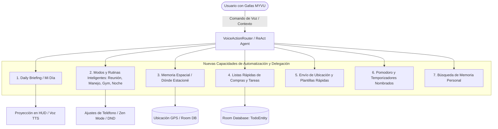
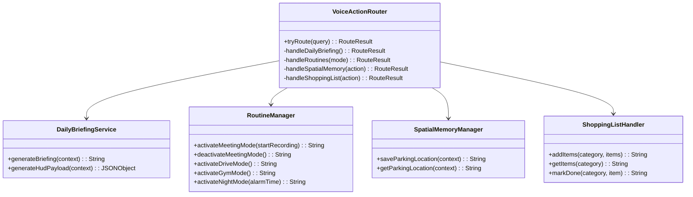

# Plan Arquitectónico: Nuevas Capacidades Agénticas, Automatización Cotidiana y Delegación de Tareas

## 1. Visión y Propósito

Transformar el asistente de las gafas Meizu Myvu de un ejecutor pasivo de comandos a un **asistente ejecutivo cotidiano y proactivo ("Segundo Cerebro")**. 

El usuario de gafas de realidad aumentada necesita:
1. **Mínima fricción visual y táctil**: Resolver tareas con la voz sin sacar el teléfono del bolsillo.
2. **Delegación real de tareas cotidianas**: Delegar mandados, compras, memoria espacial, recordatorios y comunicación frecuente.
3. **Automatización de rutinas**: Ejecutar flujos de varios pasos con una sola orden verbal ("Buenos días", "Modo reunión", "Voy a manejar", "A entrenar").
4. **Respuesta ultrarrápida (<5ms en comandos frecuentes)**: Mantener fast-paths deterministas en el dispositivo combinados con el bucle ReAct multi-herramienta en la nube.

---

## 2. Catálogo de Nuevas Funcionalidades y Habilidades

---

### Módulo 1: Daily Briefing Ejecutivo ("Buenos días" / "Mi Día")
- **Comandos de Activación**:
  - *"Buenos días"*, *"¿Qué tengo para hoy?"*, *"Dame mi resumen del día"*, *"Mi día"*.
- **Comportamiento**:
  - Agrupa y sintetiza de manera ordenada:
    1. Saludo y hora actual.
    2. Clima local actual y pronóstico (e.g. *"Barranquilla, 31°C, parcialmente nublado"*).
    3. Próximos eventos o reuniones del calendario para el día.
    4. Tareas pendientes prioritarias en la lista ToDo.
    5. Avisos urgentes sin leer (WhatsApp / Telegram / Correos).
    6. Nivel de batería del teléfono y de las gafas.
- **Proyección HUD**: Formato paginado o condensado de 3 líneas clave para lectura instantánea en la lente.

---

### Módulo 2: Automatización de Rutinas y Modos de Contexto (Macros de una Frase)

#### A. Modo Reunión / Concentración ("Entrando a reunión", "Modo concentración")
- **Acciones Automáticas**:
  1. Activa **Zen Mode** en las gafas (pantalla HUD apagada, bloquea alertas irrelevantes).
  2. Silencia notificaciones del teléfono (Modo No Molestar / Silencio).
  3. Ofrece iniciar grabación y transcripción inteligente de la reunión (`VoiceRecorder`).
- **Cierre de Reunión ("Terminé la reunión", "Salir de reunión")**:
  - Restaura volumen y desactiva Zen Mode.
  - Procesa la grabación con IA local o remota, genera minuta con acuerdos y extrae tareas automáticas a Room DB.

#### B. Modo Conducción / Manos Libres ("Voy a manejar", "Modo coche")
- **Acciones Automáticas**:
  1. Aumenta brillo del HUD para visibilidad en carretera (`setBrightness(3)`).
  2. Activa lectura en voz alta automática (TTS) de mensajes entrantes de contactos prioritarios sin requerir tocar la patilla.
  3. Habilita respuestas automáticas rápidas por voz con un toque de confirmación.

#### C. Modo Entrenamiento / Gimnasio ("A entrenar", "Modo gimnasio")
- **Acciones Automáticas**:
  1. Inicia reproducción en segundo plano de música de entrenamiento (NewPipe / OpenTune / Spotify).
  2. Muestra contador de pasos y tiempo en el HUD.
  3. Habilita temporizador rápido de descanso entre series ("Descanso de 90 segundos").

#### D. Modo Descanso / Noche ("A dormir", "Buenas noches")
- **Acciones Automáticas**:
  1. Brillo mínimo en las gafas (`setBrightness(1)`).
  2. Verifica alarmas activas para la mañana siguiente; si no hay, pregunta la hora deseada.
  3. Activa silencio en el teléfono.
  4. Alerta si la batería de las gafas o teléfono está por debajo del 20% para poner a cargar.

---

### Módulo 3: Memoria Espacial ("¿Dónde estacioné el carro?" / "Guardar ubicación")
- **Comandos**:
  - *"Guardé el carro aquí"*, *"Estacioné aquí"*, *"Acuérdate dónde dejé el carro"*.
  - *"¿Dónde estacioné?"*, *"¿Dónde dejé el carro?"*.
- **Comportamiento**:
  - Al guardar: Consulta `FusedLocationProviderClient` y almacena coordenadas (latitud, longitud, altitud, timestamp, nota opcional).
  - Al consultar: Calcula distancia en metros y dirección cardinal (e.g. *"A 120 metros al Noroeste"*). Opción de proyectar flecha de guiado en HUD o enviar enlace de Google Maps al teléfono.

---

### Módulo 4: Listas Rápidas de Compras y Tareas Cotidianas
- **Comandos**:
  - *"Añade café, azúcar y pan a la lista de compras"*.
  - *"¿Qué tengo en la lista de compras?"*.
  - *"Tacha el café de las compras"* / *"Compré el café"*.
  - *"Borra la lista de compras"*.
- **Comportamiento**:
  - Expansión de `TodoRepository` y `TodoEntity` con categorías (`SHOPPING`, `WORK`, `PERSONAL`).
  - Proyección en HUD de la lista como checklist mientras el usuario camina en el supermercado.

---

### Módulo 5: Envío Rápido de Ubicación y Plantillas Asistidas
- **Comandos**:
  - *"Mándale mi ubicación a [Contacto] por WhatsApp"*.
  - *"Dile a [Contacto] que voy en camino"*.
  - *"Avísale a [Contacto] que llego en 10 minutos"*.
- **Comportamiento**:
  - Genera automáticamente mensaje con enlace `https://maps.google.com/?q=lat,lon` o texto de plantilla y lo despacha mediante `SendTrampolineActivity` y `AutoSendAccessibilityService`.

---

### Módulo 6: Temporizadores Nombrados y Pomodoro
- **Comandos**:
  - *"Pon un temporizador de pasta de 8 minutos"*.
  - *"Inicia Pomodoro de 25 minutos"*.
  - *"¿Cuánto le queda al temporizador?"*.
- **Comportamiento**:
  - Notificación y alerta en HUD con cuenta regresiva.

---

### Módulo 7: Segundo Cerebro y Búsqueda Contextual ("Recuerda que...")
- **Comandos**:
  - *"Recuerda que el código de la puerta es 4589"*.
  - *"Recuerda que dejé el pasaporte en el cajón superior"*.
  - *"¿Cuál es el código de la puerta?"*, *"¿Dónde dejé el pasaporte?"*.
- **Comportamiento**:
  - Búsqueda difusa semántica en `NoteRepository` para recuperar fragmentos de información instantáneamente.

---

## 3. Arquitectura Técnica de Integración

---

## 4. Fases de Implementación Propuestas

### Fase 1: Servicio de Daily Briefing Ejecutivo ("Mi Día")
1. Crear `DailyBriefingService.kt` que consulte en paralelo (`async`/coroutines):
   - Clima (`Weather.lastWeatherCache` o API Open-Meteo).
   - Próximos eventos de hoy (`CalendarService.getUpcomingEvents`).
   - Tareas prioritarias pendientes (`TodoRepository`).
   - Notificaciones activas sin leer (`MirrorNotificationListener.getUnreadSummary`).
   - Batería de gafas y celular (`ConnectionManager`).
2. Diseñar formato de salida compacto para texto de voz (TTS) y proyección en HUD (pantalla de 2 a 3 líneas).
3. Añadir fast-paths deterministas en `VoiceActionRouter.kt`.
4. Registrar habilidad `daily-briefing` en `assets/skills/built-in/` y `SkillRegistry.kt`.

### Fase 2: Gestor de Rutinas y Modos Contextuales (`RoutineManager`)
1. Crear `RoutineManager.kt`:
   - `setMeetingMode(enable: Boolean, recordAudio: Boolean)`: Control de Zen Mode en gafas (`SystemSettings.setZenMode`), silenciar audio en celular y disparar grabadora.
   - `setDriveMode(enable: Boolean)`: HUD a brillo alto, lectura de mensajes activos en TTS sin desbloquear.
   - `setGymMode(enable: Boolean)`: Lanzar música NewPipe/OpenTune/Spotify, HUD con pasos y temporizador de descanso.
   - `setNightMode(enable: Boolean, alarmTime: String?)`: HUD a brillo 1, programar alarma, silenciar notificaciones.
2. Añadir comandos en `VoiceActionRouter.kt` y `PhoneActionExecutor.kt`.
3. Registrar habilidades correspondientes en `SkillRegistry`.

### Fase 3: Memoria Espacial ("¿Dónde estacioné?")
1. Crear `SpatialMemoryManager.kt` utilizando `LocationHelper` / `LocationManager` de Android.
2. Almacenar puntos de interés frecuentes en SharedPreferences (`Prefs.kt`) o tabla Room (`SpatialLocationEntity`):
   - Estacionamiento (coordenadas, piso/nota, hora de guardado).
3. Añadir cálculo de distancia euclidiana/geodésica y orientación cardinal (N, NE, E, SE, S, SO, O, NO).
4. Proyectar indicación en HUD (*"Estacionamiento a 85m al Noroeste"*) y acción para abrir navegación.

### Fase 4: Listas de Compras y Tareas Cotidianas
1. Ampliar `TodoEntity` en `com.myvu.client.database` para soportar `category: String = "default"` (categorías: `shopping`, `work`, `general`).
2. Parser gramatical en `VoiceActionRouter` para listas separadas por "y", comas ("compra pan, leche y huevos").
3. Métodos en `TodoRepository` para listar por categoría y tachar elementos por nombre difuso.

### Fase 5: Envío Rápido de Ubicación y Plantillas
1. Añadir acción en `PhoneActionExecutor`: `sendLocation(contact, platform)`.
2. Extraer ubicación actual y formatear enlace de Google Maps.
3. Despachar a través de WhatsApp o Telegram sin tocar la pantalla mediante el servicio de accesibilidad.

### Fase 6: Pruebas Unitarias, Integración y Compilación
1. Pruebas unitarias para:
   - `DailyBriefingServiceTest`
   - `RoutineManagerTest`
   - `SpatialMemoryManagerTest`
   - Gramática y parsing de listas en `VoiceActionRouterTest`
2. Verificación de compilación: `./gradlew testDebugUnitTest` y `./gradlew assembleDebug`.
3. Sincronización con `codegraph sync` y actualización de memoria viva (`PROJECT_MEMORY.md`).

---

## 5. Beneficios Inmediatos para el Usuario

| Función | Beneficio Cotidiano | Interacción con las Gafas |
|---|---|---|
| **Daily Briefing** | Saber todo su día en 5 segundos sin tocar el celular. | *"Buenos días"* -> HUD proyecta clima, primera cita y tareas. |
| **Modo Reunión** | Evitar interrupciones vergonzosas y registrar acuerdos. | *"Entrando a reunión"* -> Zen Mode, silencio y grabación automática. |
| **Dónde Estacioné** | No olvidar dónde se dejó el auto en centros comerciales. | *"Estacioné aquí"* -> Guarda GPS. *"¿Dónde está el carro?"* -> Guía en HUD. |
| **Lista de Compras** | Comprar con manos libres en el supermercado. | *"Añade manzanas a las compras"* / *"Ver lista de compras"* en HUD. |
| **Mandar Ubicación** | Seguridad y rapidez en trayectos. | *"Mándale mi ubicación a mamá"* -> Enlace Maps por WhatsApp en 2s. |
