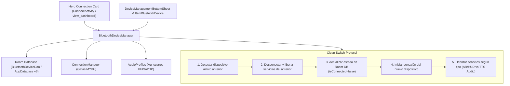

# Plan de Implementación: Mejora de Conexión de Dispositivos (Pairing, Dispositivo Principal y Conexión Limpia)

## 1. Resumen y Objetivos

Este plan implementa un sistema robusto, reactivo y universal para la gestión de conexiones Bluetooth en la aplicación:
1. **Pairing (Emparejamiento) desde la interfaz**:
   - Escaneo activo de dispositivos Bluetooth (Classic y BLE) cercanos.
   - Diferenciación clara entre dispositivos ya vinculados (Bonded) y dispositivos disponibles para emparejar (Discovered).
   - Capacidad de iniciar el emparejamiento (`createBond()`) directamente desde el área de dispositivos, escuchando los cambios de estado de vínculo (`BOND_BONDING`, `BOND_BONDED`, `BOND_NONE`).
2. **Dispositivo Principal (Primary Device)**:
   - Selección explícita de un dispositivo como "Dispositivo Principal" mediante Room DB (`isPrimary = true`) y preferencias locales (`Prefs`).
   - Prioridad de reconexión automática hacia el dispositivo principal.
   - Indicador visual destacado (insignia de corona/estrella "PRINCIPAL") tanto en la tarjeta hero de conexión como en la lista de dispositivos.
3. **Conexión según tipo principal de dispositivo**:
   - **Gafas Inteligentes (`SMART_GLASSES`)**: Conexión completa de la pila propietaria Starry (BLE GATT para handshake/bonding + RFCOMM socket relay para telemetría/HUD/IA + AudioProfiles HFP/A2DP).
   - **Auriculares / Wearables (`HEADPHONES` / `GENERIC`)**: Conexión de perfiles de audio estándar de Android (A2DP para música/TTS + HFP para micrófono/llamadas) y habilitación de lectura por voz de notificaciones y escucha activa.
4. **Desconexión Limpia y Deshabilitación de Servicios Anteriores (Clean Switch Protocol)**:
   - Al seleccionar un dispositivo para conectar desde el área de conexión:
     1. Si ya existe un dispositivo conectado o en proceso de conexión, se detiene y desconecta limpiamente dicho dispositivo antes de iniciar la nueva conexión.
     2. Se deshabilitan y liberan los servicios asociados al dispositivo anterior (cancelación de turnos de IA en vuelo, liberación de canales Bluetooth SCO, apagado de teleprompter/HUD/navegación, cierre de sockets RFCOMM/GATT y proxies de audio).
     3. Se actualiza el estado en la base de datos (marcando el anterior como desconectado).
     4. Se establece y activa la conexión hacia el nuevo dispositivo seleccionado.

---

## 2. Arquitectura de Componentes Afectados



---

## 3. Plan Detallado Paso a Paso

### Fase 1: Persistencia de Datos y Entidad `BluetoothDeviceEntity`
1. **`BluetoothDeviceEntity.kt`**:
   - Agregar propiedad `val isPrimary: Boolean = false`.
2. **`BluetoothDeviceDao.kt`**:
   - Agregar `@Query("SELECT * FROM bluetooth_devices WHERE isPrimary = 1 LIMIT 1") suspend fun getPrimaryDevice(): BluetoothDeviceEntity?`.
   - Agregar `@Query("UPDATE bluetooth_devices SET isPrimary = CASE WHEN macAddress = :mac THEN 1 ELSE 0 END") suspend fun setPrimaryDevice(mac: String)`.
   - Agregar `@Query("UPDATE bluetooth_devices SET isConnected = 0 WHERE macAddress != :mac") suspend fun markOthersDisconnected(mac: String)`.
3. **`AppDatabase.kt`**:
   - Incrementar versión de la base de datos de `5` a `6`.
4. **`Prefs.kt`**:
   - Métodos auxiliares `primaryDeviceMac(context): String` y `setPrimaryDeviceMac(context, mac: String)`.

---

### Fase 2: Lógica de Pairing y Desconexión Limpia en `BluetoothDeviceManager`
1. **Escaneo y Descubrimiento**:
   - Mantener separadas las listas de:
     - Dispositivos Vinculados (`bondedDevices` con persistencia en DB).
     - Dispositivos Disponibles (`unbondedDiscoveredDevices` detectados en vivo por `ACTION_FOUND` con `bondState == BOND_NONE`).
2. **Emparejamiento (`pairDevice`)**:
   - Método `pairDevice(device: BluetoothDevice)` que llama a `device.createBond()`.
   - Manejo en el `BroadcastReceiver` de `ACTION_BOND_STATE_CHANGED`:
     - Al pasar a `BOND_BONDED`: registrar en Room DB, clasificar dispositivo, refrescar listas y notificar a la UI.
     - Al fallar (`BOND_NONE` tras `BOND_BONDING`): notificar fallo de emparejamiento.
3. **Gestión de Dispositivo Principal (`setPrimaryDevice`)**:
   - Método `setPrimaryDevice(mac: String)`:
     - Actualiza Room DB mediante `dao.setPrimaryDevice(mac)`.
     - Actualiza `Prefs.setPrimaryDeviceMac(context, mac)`.
     - Si el dispositivo principal es unas gafas inteligentes, actualiza también `Prefs.setTargetMac(context, mac)`.
     - Emite el nuevo estado a los observadores.
4. **Protocolo de Cambio Limpio (`connectDeviceWithCleanSwitch`)**:
   - Método unificado en `BluetoothDeviceManager`:
     ```kotlin
     suspend fun connectDeviceWithCleanSwitch(targetDevice: BluetoothDeviceEntity)
     ```
   - **Paso A**: Obtener el dispositivo actualmente conectado (`dao.getActiveConnectedDevice()`).
   - **Paso B**: Si hay un dispositivo anterior y su MAC es distinta a `targetDevice.macAddress`:
     - Si el anterior era `SMART_GLASSES`:
       - Invocar `MyvuService.activeConnection()?.disconnectForSwitch()`.
       - Deshabilitar servicios de teleprompter, navegación, sync de clima, liberar canal SCO y turnos de IA en vuelo.
     - Si el anterior era `HEADPHONES` / `GENERIC`:
       - Desconectar perfiles de audio HFP/A2DP y liberar canal SCO.
     - Actualizar en DB: `dao.updateConnectionState(previousMac, false)`.
     - Esperar breve ventana de reposo (250ms) para garantizar que el stack Bluetooth de Android libere los sockets y canales ACL.
   - **Paso C**: Iniciar la conexión del nuevo dispositivo:
     - Si es `SMART_GLASSES`:
       - Establecer `Prefs.setTargetMac(context, targetDevice.macAddress)`.
       - Enviar intent `ACTION_START` a `MyvuService` con `EXTRA_MAC = targetDevice.macAddress`.
     - Si es `HEADPHONES` / `GENERIC`:
       - Iniciar conexión de perfiles de audio HFP/A2DP.
       - Marcar `dao.updateConnectionState(targetDevice.macAddress, true)` y `dao.markOthersDisconnected(targetDevice.macAddress)`.
       - Actualizar dispositivo activo.

---

### Fase 3: Soporte para Conexión/Desconexión Dinámica en `ConnectionManager`
1. **`ConnectionManager.kt`**:
   - En `start(mac: String)`:
     - Si ya se encuentra conectado o conectando a una MAC distinta, ejecutar desconexión limpia de la pila actual (`teardown()`), esperar a que el estado sea `IDLE` y proceder inmediatamente con la nueva MAC.
   - Agregar método `disconnectForSwitch()`:
     - Ejecuta `teardown()` y cierra `audioProfiles`.
     - Coloca el estado en `ConnectionState.IDLE`.
     - Asegura que el hilo `myvu-conn` permanezca listo para aceptar una nueva conexión inmediatamente.

---

### Fase 4: Modernización de Interfaz de Usuario
1. **`item_bluetooth_device.xml`**:
   - Añadir indicador visual de **Dispositivo Principal**:
     - Chip/Badge dorado o azul con icono de estrella/corona: `"PRINCIPAL"`.
   - Botón de acción directo:
     - `"Conectar"` (si está desconectado).
     - `"Desconectar"` (si está conectado actualmente).
     - Botón `"Emparejar"` si el dispositivo es descubierto pero no está vinculado.
   - Botón de opciones (menú desplegable o diálogo rápido):
     - `"Establecer como Principal"`.
     - `"Configurar gestos y notificaciones"`.
     - `"Olvidar / Desvincular"`.
2. **`DeviceManagementBottomSheet.kt`**:
   - Secciones claras:
     - **Dispositivos Vinculados**: con switches rápidos, botón de conectar con cambio limpio y marcar como principal.
     - **Dispositivos Disponibles (Cercanos)**: mostrados durante el escaneo con botón de emparejar (`Vincular`).
   - Conexión reactiva que invoca el protocolo de cambio limpio.
3. **Hero Connection Card en `ConnectActivity` (`view_dashboard.xml`)**:
   - Mostrar el nombre y tipo del dispositivo seleccionado/principal directamente en la tarjeta de conexión:
     - Por ejemplo: `"Gafas: Meizu MYVU AR (Principal)"` o `"Auriculares: Sony WH-1000XM5"`.
   - Botón rápido `"Cambiar Dispositivo"` que despliega el BottomSheet.
   - El botón `"Conectar"` conecta de inmediato al dispositivo principal seleccionado, desconectando el anterior si fuera necesario.

---

### Fase 5: Pruebas Unitarias y Verificación
1. **Pruebas en `BluetoothDeviceManagerTest.kt`**:
   - Probar nuevo campo `isPrimary` en `BluetoothDeviceEntity`.
   - Probar lógica de clasificación y modos de notificación.
   - Probar flujo de cambio de dispositivo principal y desconexión de anteriores.
2. **Compilación y verificación completa**:
   - Ejecutar `./gradlew testDebugUnitTest` mediante `rtk`.
   - Ejecutar `./gradlew assembleDebug` mediante `rtk`.
   - Ejecutar `codegraph sync`.
   - Actualizar memoria en `docs/PROJECT_MEMORY.md` y documentación en `README.md` y `docs/ARCHITECTURE.md`.

---

## 4. Criterios de Aceptación
- [ ] Escaneo muestra dispositivos cercanos no vinculados y permite emparejarlos (`createBond()`).
- [ ] Se puede seleccionar cualquier dispositivo como "Dispositivo Principal", marcándolo visualmente y dándole prioridad de reconexión.
- [ ] Al pulsar "Conectar" sobre un dispositivo, si había otro conectado, el anterior se desconecta primero, sus servicios se deshabilitan limpiamente, y luego se conecta el nuevo.
- [ ] Gafas se conectan con su protocolo completo Starry/BLE/RFCOMM; auriculares se conectan con perfiles de audio Bluetooth.
- [ ] Todos los tests unitarios pasan exitosamente y la compilación no presenta errores.
