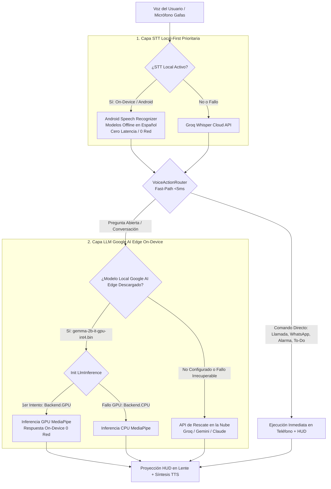

# Plan de Implementación: Modelos Locales Google AI Edge Gallery (GPU/CPU) y Priorización Local-First (LLM & STT)

> **Fecha:** 2026-08-19  
> **Objetivo:** Implementar la lógica completa para los modelos certificados de **Google AI Edge Gallery** (Gemma 2B IT GPU, Gemma 2B IT CPU, Gemma 2 2B IT GPU, Gemma 1.1 2B IT GPU), resolver de raíz el error de inicialización nativa (`MediaPipeException: modelError building tflite model`), incorporar inicialización GPU con auto-rescate a CPU, y **garantizar que el LLM local y el STT local tengan prioridad absoluta e instantánea**, eliminando latencias de red y fallos de servidores remotos caídos.

---

## 1. Análisis de Google AI Edge Gallery y Causa Raíz

### A. Ecosistema Google AI Edge Gallery
Google AI Edge (anteriormente TF Lite / MediaPipe) distribuye modelos optimizados para inferencia local móvil en Android mediante contenedores **`.bin`** (pesos cuantizados INT4/INT8 + Tokenizer SentencePiece integrado + grafo de ejecución acelerado por GPU OpenCL/Vulkan).

1. **Modelos Certificados de Google AI Edge Gallery para MediaPipe Tasks GenAI**:
   * ⭐ **Gemma 2B IT (GPU INT4)** (`gemma-2b-it-gpu-int4.bin` ~1.35GB)
   * **Gemma 2B IT (CPU INT4)** (`gemma-2b-it-cpu-int4.bin` ~1.35GB)
   * **Gemma 2 2B IT (GPU INT4)** (`gemma-2-2b-it-gpu-int4.bin` ~1.48GB)
   * **Gemma 1.1 2B IT (GPU INT4)** (`gemma-1.1-2b-it-gpu-int4.bin` ~1.35GB)
2. **Causa del Error en el Log**:
   * El log mostraba intento de carga de `gemma-4-E2B-it.litertlm`. El sufijo `.litertlm` pertenece a un formato experimental de LiteRT-LM C++ standalone que el compilador C++ de MediaPipe (`model_data.cc:329`) no puede procesar como modelo TFLite.
   * `GemmaLocalClient` no pasaba explícitamente `setPreferredBackend(LlmInference.Backend.GPU)` ni contenía rescate a CPU si los drivers de la GPU del dispositivo no soportaban los shaders de MediaPipe.

---

## 2. Diagrama de Flujo Local-First

---

## 3. Tareas de Implementación

### Tarea 1: Modelos de Google AI Edge Gallery & Motor Resiliente (`GemmaLocalClient.kt`)
- **Archivos**:
  - `android-kotlin/app/src/main/java/com/myvu/client/ai/GemmaLocalClient.kt`
  - `android-kotlin/app/src/test/java/com/myvu/client/ai/GemmaLocalClientTest.kt`
- **Cambios**:
  - Configurar los 4 modelos oficiales de **Google AI Edge Gallery**:
    - `GEMMA_2B_IT_GPU` (`gemma-2b-it-gpu-int4.bin` - Default)
    - `GEMMA_2B_IT_CPU` (`gemma-2b-it-cpu-int4.bin`)
    - `GEMMA_2_2B_IT_GPU` (`gemma-2-2b-it-gpu-int4.bin`)
    - `GEMMA_1_1_2B_IT_GPU` (`gemma-1.1-2b-it-gpu-int4.bin`)
  - En `getOrInitEngine()`:
    - Aplicar `setPreferredBackend(LlmInference.Backend.GPU)` para modelos GPU.
    - Capturar excepciones de inicialización de GPU y realizar fallback automático a `LlmInference.Backend.CPU`.
    - Ajustar `setMaxTokens(512)` para respuestas ágiles en el HUD.

### Tarea 2: Priorización Absoluta Local-First en `AiProvider.kt` y `AiConversation.kt`
- **Archivos**:
  - `android-kotlin/app/src/main/java/com/myvu/client/ai/AiProvider.kt`
  - `android-kotlin/app/src/main/java/com/myvu/client/ai/AiConversation.kt`
  - `android-kotlin/app/src/main/java/com/myvu/client/ai/WhisperLocalClient.kt`
- **Cambios**:
  - En `AiProvider.newClient`: Si `isLocalGemmaActive` y `gemmaClient.isConfigured()` (el archivo `.bin` existe y es válido), `LocalFallbackAiClient` **siempre** ejecuta primero `localClient.ask()`, sin contactar endpoints remotos (evitando el error de conexión de `omniroute.eticosweb.net`).
  - En `AiConversation`:
    - Priorizar `AndroidSpeechRecognizer` cuando STT está en `android` u `on_device`.
    - Eliminar stubs que forzaban error en `WhisperLocalClient`.

### Tarea 3: UI de Selección y Descargador en `SettingsActivity.kt` & `activity_settings.xml`
- **Archivos**:
  - `android-kotlin/app/src/main/java/com/myvu/client/ui/SettingsActivity.kt`
  - `android-kotlin/app/src/main/java/com/myvu/client/ai/GemmaModelDownloader.kt`
- **Cambios**:
  - Actualizar selector visual en Ajustes de IA para los modelos de Google AI Edge Gallery (Gemma 2B GPU, Gemma 2B CPU, Gemma 2 2B GPU).
  - Descargador con verificación de tamaño (`targetFile.length() > 1_000_000_000L`).
  - Botón de prueba rápida local on-device con log directo en UI.

### Tarea 4: Verificación Integral y Suite de Pruebas
- **Archivos**:
  - `android-kotlin/app/src/test/java/com/myvu/client/ai/*`
- **Acciones**:
  - Ejecutar `./gradlew :app:testDebugUnitTest` (100% de tests pasando).
  - Ejecutar `./gradlew :app:assembleDebug` (APK compilada con éxito).
