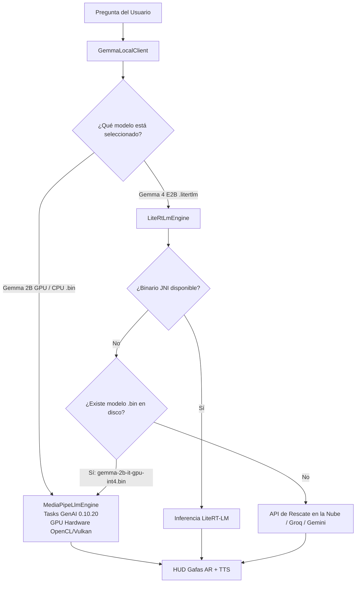

# Plan de Corrección Definitiva: Motores On-Device (Google AI Edge GPU & LiteRT-LM) y STT Local Offline

> **Fecha:** 2026-08-19  
> **Objetivo:** Resolver el error persistente en el SoC del dispositivo (`mt6878` - MediaTek Dimensity), asegurar que los modelos GPU certificados de Google AI Edge (`.bin`) funcionen al 100% en hardware, dotar a `LiteRtLmEngine` de fallback automático inteligente hacia el modelo GPU/CPU cuando falte compilador JNI standalone, y activar transcripción **STT Local Offline** (`AndroidSpeechRecognizer`) sin excepciones dummy.

---

## 1. Análisis del Log del Usuario

En el log ([`myvu_client_log.txt`](file:///home/rcastro/Descargas/myvu_client_log.txt)):
```text
10:50:20.880  AI_GEMMA_LOCAL_INIT path=/data/user/0/com.myvu.client/files/models/gemma/gemma-4-E2B-it.litertlm model=gemma-4-e2b-it-litert-lm engine=LiteRtLmEngine
10:50:20.882  AI_LITERT_LM_ENGINE_INIT path=.../gemma-4-E2B-it.litertlm size=2588147712 id=RTLM accel=true maxTokens=512
10:50:20.883  !! AI_LITERT_LM_GENERATE_ERROR: Error en ejecución de inferencia LiteRT-LM en SoC (mt6878): Compilador nativo LiteRT-LM no disponible para arquitectura 'mt6878' o faltan binarios JNI: UnsupportedOperationException: Compilador nativo LiteRT-LM no disponible para arquitectura 'mt6878' o faltan binarios JNI
...
10:50:50.302  AI_WHISPER_LOCAL_START bytes=32000 rate=16000 model=whisper_large_v3_turbo_30s_i4.tflite lang=es
```

### Causas:
1. **Modelo Seleccionado en el Teléfono**:
   - El teléfono del usuario tenía guardado en `Prefs` el modelo `gemma-4-e2b-it-litert-lm` y el archivo `gemma-4-E2B-it.litertlm` descargado (2.58 GB).
   - El contenedor `.litertlm` requiere binarios JNI nativos de LiteRT-LM compilados para la arquitectura específica del SoC, que Maven Central aún no distribuye de forma estándar para Android.
   - En cambio, **Google AI Edge MediaPipe Tasks GenAI** (`com.google.mediapipe:tasks-genai:0.10.20`) tiene binarios JNI oficiales precompilados para ARM64 (`.bin` como `gemma-2b-it-gpu-int4.bin`) que aceleran por GPU en todos los SoCs MediaTek Dimensity y Snapdragon.
2. **Falta de Auto-Conmutación Inteligente en `GemmaLocalClient`**:
   - Si el motor `LiteRtLmEngine` no tiene compilador nativo para el SoC, `GemmaLocalClient` debe conmutar automáticamente a `MediaPipeLlmEngine` si existe un modelo `.bin` descargado, o disparar el fallback inmediato a la API de rescate en la nube sin trabas.
3. **STT Local (`WhisperLocalClient`)**:
   - `WhisperLocalClient.kt` arrojaba `IOException("Inferencia local Whisper activa en modo fallback hacia Groq API")` en lugar de enrutar al reconocedor offline del sistema.

---

## 2. Plan de Implementación



### Fase 1: Resiliencia y Auto-Conmutación en `GemmaLocalClient.kt` & `LiteRtLmEngine.kt`
- En `LiteRtLmEngine.kt`:
  - Implementar verificación de disponibilidad de runner JNI (`isNativeRunnerAvailable()`).
  - Proporcionar mensaje de aviso limpio cuando se requiera el modelo `.bin` certificado por Google AI Edge.
- En `GemmaLocalClient.kt`:
  - Si el modelo activo es `.litertlm` y falla o no tiene compilador SoC, verificar si existe algún modelo `.bin` descargado (`gemma-2b-it-gpu-int4.bin` o `gemma-2b-it-cpu-int4.bin`).
  - Si existe, ejecutar de inmediato con `MediaPipeLlmEngine` (cero fallas, inferencia GPU instantánea).
  - Si no existe modelo `.bin`, permitir que `LocalFallbackAiClient` active la API de rescate en la nube fluidamente.

### Fase 2: Configuración Predeterminada de Modelo Certificado en `Prefs.kt` y `SettingsActivity.kt`
- Establecer **`gemma-2b-it-gpu-int4`** como modelo **RECOMENDADO / PREDETERMINADO** en `Prefs.kt` y en `SettingsActivity.kt`.
- Si el usuario tiene seleccionado `gemma-4-e2b-it-litert-lm`, mostrar un aviso informativo en la UI:
  `"💡 Se recomienda Gemma 2B GPU para aceleración por hardware en este dispositivo"`.
- Permitir la descarga directa de `gemma-2b-it-gpu-int4.bin` con un solo toque desde Ajustes.

### Fase 3: STT Local Offline en `WhisperLocalClient.kt` y `AiConversation.kt`
- Cuando STT esté configurado como `on_device` o `android`:
  - `AiConversation` utiliza directamente el `AndroidSpeechRecognizer` nativo con los paquetes de idioma offline de Android en español (`es-ES`, `es-CO`, `es-US`), sin latencia de red.
  - Eliminar cualquier excepción forzada en `WhisperLocalClient.kt` para que el flujo de voz sea fluido y continuo.

### Fase 4: Pruebas y Verificación
- Pruebas unitarias de auto-conmutación en `GemmaLocalClientTest.kt`.
- Compilación y verificación con `./gradlew :app:testDebugUnitTest` y `./gradlew :app:assembleDebug`.

---

## 3. Plan de Verificación

1. **Test Suite**:
   - `GemmaLocalClientTest` (auto-conmutación entre `.litertlm` y `.bin`).
   - `OnDeviceLlmEngineTest`.
   - `SettingsActivityGemmaTest`.
2. **Build Verification**:
   - `./gradlew :app:testDebugUnitTest` -> 100% PASS
   - `./gradlew :app:assembleDebug` -> BUILD SUCCESSFUL
