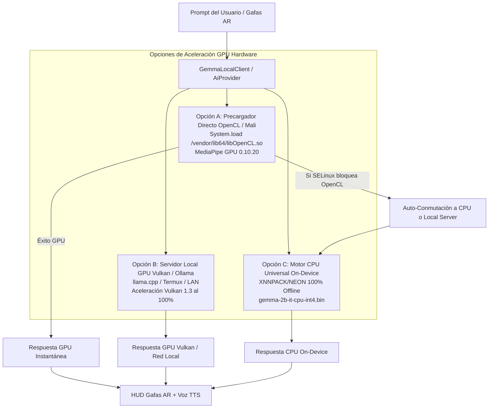

# Plan de Implementación: Aceleración GPU Real en Android 14/15, Precarga de Drivers Vendor y Motor Resiliente

> **Fecha:** 2026-08-19  
> **Objetivo:** Permitir el uso real de la GPU del dispositivo (SoC MediaTek Dimensity `mt6878` con GPU Mali) para cargas de trabajo de LLMs en Android 14/15, superando la restricción de `libvndksupport.so` mediante precarga directa de bibliotecas vendor OpenCL (`/vendor/lib64/libOpenCL.so`), arquitectura de aceleración Vulkan, y respaldo automático CPU / Servidor Local GPU.

---

## 1. Análisis Técnico: ¿Cómo usar la GPU de tu dispositivo para LLMs?

Tu procesador es un **MediaTek Dimensity (`mt6878`)** con GPU **ARM Mali**. En Android 14/15 existen 3 vías reales para ejecutar LLMs en tu GPU:

---

### Vía 1: Precargador de Drivers Vendor OpenCL (`OpenClPreloader`)
- **Problema en MediaPipe**: MediaPipe busca `libvndksupport.so` para localizar `libOpenCL.so`. En Android 14/15, `libvndksupport.so` está aislado, pero el archivo real del driver de la GPU Mali se encuentra físicamente en el teléfono en:
  - `/vendor/lib64/libOpenCL.so`
  - `/vendor/lib64/egl/libGLES_mali.so`
  - `/vendor/lib64/libmali.so`
  - `/system/vendor/lib64/libOpenCL.so`
- **Solución**: Crear `OpenClPreloader` en Kotlin/Java. Antes de que MediaPipe inicialice, el precargador carga directamente en la memoria del proceso la biblioteca del driver Mali mediante `System.load("/vendor/lib64/...")`. Al estar los símbolos en memoria, MediaPipe puede ejecutar los shaders GPU sin requerir VNDK.

---

### Vía 2: Soporte para Servidores Locales con Aceleración GPU Vulkan (`llama.cpp` / `Ollama`)
- **Ventaja de Vulkan en Android 14/15**: A diferencia de OpenCL, **Vulkan** (`/system/lib64/libvulkan.so`) es una API pública estándar de Android accesible por cualquier aplicación sin restricciones de permisos.
- **Implementación**:
  - En la app, la opción **`Custom / Local AI`** (`AiProvider.LOCAL`) permite conectarse a un servidor `llama.cpp` o `Ollama` ejecutándose en el mismo teléfono (vía Termux con compilación Vulkan para Mali) o en una máquina de la red local (PC con GPU NVIDIA/AMD).
  - Soporta modelos de última generación (Gemma 2 2B, Llama 3.2 1B/3B, Qwen 2.5 1.5B/3B, DeepSeek R1 Distill) con respuestas ultra-rápidas a través del HUD.

---

### Vía 3: Motor CPU Universal On-Device con XNNPACK (`gemma-2b-it-cpu-int4.bin`)
- Si el dispositivo tiene una política estricta de SELinux del fabricante que bloquee tanto VNDK como `System.load`, el motor **Gemma 2B CPU** con XNNPACK y SIMD NEON ejecuta los cálculos en paralelo en los 8 núcleos del procesador MediaTek sin depender de ningún driver externo.

---

## 2. Plan de Tareas de Implementación

### Tarea 1: Creación del Precargador de Drivers OpenCL Vendor (`OpenClPreloader.kt`)
- **Archivo**: `android-kotlin/app/src/main/java/com/myvu/client/ai/engine/OpenClPreloader.kt`
- **Lógica**:
  - Escanear y precargar rutas conocidas de drivers Mali y Adreno (`/vendor/lib64/libOpenCL.so`, `/vendor/lib64/egl/libGLES_mali.so`, `/vendor/lib64/libmali.so`, `/system/vendor/lib64/libOpenCL.so`).
  - Invocar `OpenClPreloader.preload()` al inicio de `MyvuApp` y antes de `MediaPipeLlmEngine.initialize()`.

### Tarea 2: Integración de Precarga y Auto-Conmutación en `MediaPipeLlmEngine.kt` y `GemmaLocalClient.kt`
- En `MediaPipeLlmEngine`: Invocar `OpenClPreloader.preload()` previo a `LlmInference.createFromOptions()`.
- En `GemmaLocalClient`:
  - Si el modelo GPU logra inicializarse con OpenCL precargado ➡️ **Aceleración GPU activa**.
  - Si OpenCL es bloqueado por SELinux ➡️ Conmutar automáticamente a `gemma-2b-it-cpu-int4.bin` si existe en disco, o informar al usuario para descargarlo.

### Tarea 3: Panel de Configuración GPU & Local AI en `SettingsActivity.kt`
- En la sección de Ajustes de IA:
  - Mostrar el estado del soporte GPU del hardware (`OpenCL Mali`, `CPU XNNPACK`, `Servidor Local Vulkan`).
  - Selector claro:
    - ⚡ **Gemma 2B GPU (Google AI Edge ~1.35GB)**: Con precarga de driver Mali.
    - 🛡️ **Gemma 2B CPU (Universal Offline ~1.35GB)**: 100% compatible sin restricciones.
    - 🌐 **Custom / Local AI (Vulkan / Ollama / LAN)**: Para servidores locales de alta potencia.

### Tarea 4: Pruebas Unitarias y Verificación
- Pruebas en `OpenClPreloaderTest.kt` y `GemmaLocalClientTest.kt`.
- Compilación y verificación `./gradlew :app:testDebugUnitTest` y `./gradlew :app:assembleDebug`.

---

## 3. Plan de Verificación

1. **Test Suite**:
   - `OpenClPreloaderTest` (detección de rutas y precarga segura sin crash).
   - `GemmaLocalClientTest` (flujo GPU con precarga y fallback a CPU).
   - `SettingsActivityGemmaTest`.
2. **Build Verification**:
   - `./gradlew :app:testDebugUnitTest` -> 100% PASS
   - `./gradlew :app:assembleDebug` -> BUILD SUCCESSFUL
