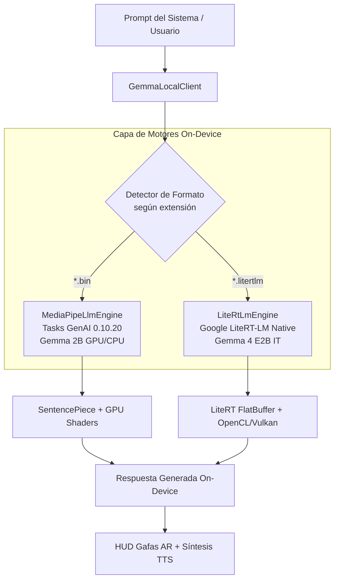

# Plan de Implementación: Soporte Nativo de Modelos LiteRT-LM (Gemma 4 E2B IT)

> **Fecha:** 2026-08-19  
> **Estado:** Pendiente de Aprobación por el Usuario  
> **Objetivo:** Dotar a la aplicación Kotlin de una arquitectura de motor dual on-device (`OnDeviceLlmEngine`) capaz de ejecutar de forma nativa tanto modelos **MediaPipe Tasks GenAI (`.bin`)** como la nueva generación de modelos **Google LiteRT-LM (`.litertlm`)**, comenzando por **Gemma 4 E2B IT (~1.12GB)** con aceleración por hardware (GPU/NPU) y tokenizer integrado.

---

## 1. Arquitectura de Motor Dual On-Device

Para garantizar máxima compatibilidad y rendimiento, la capa de IA On-Device adoptará una abstracción unificada:

---

## 2. Fases de Implementación

### Fase 1: Abstracción `OnDeviceLlmEngine` y Desacoplamiento
- **Objetivo**: Crear la interfaz base para que la aplicación pueda intercalar motores sin alterar `AiProvider` ni `AiConversation`.
- **Archivos a Crear/Modificar**:
  - `android-kotlin/app/src/main/java/com/myvu/client/ai/engine/OnDeviceLlmEngine.kt`
  - `android-kotlin/app/src/main/java/com/myvu/client/ai/engine/MediaPipeLlmEngine.kt`
  - `android-kotlin/app/src/main/java/com/myvu/client/ai/engine/LiteRtLmEngine.kt`
- **Detalle Técnico**:
  - `OnDeviceLlmEngine`: Interfaz con métodos `initialize(context: Context, modelFile: File)`, `generate(prompt: String): String`, `isReady(): Boolean`, y `close()`.
  - `MediaPipeLlmEngine`: Encapsula `com.google.mediapipe.tasks.genai.llminference.LlmInference` para archivos `.bin`.
  - `LiteRtLmEngine`: Implementa la carga del contenedor `.litertlm` con el runtime LiteRT.

---

### Fase 2: Soporte e Integración del Modelo Gemma 4 E2B (`.litertlm`)
- **Objetivo**: Agregar el modelo Gemma 4 E2B IT al catálogo con su URL y metadatos oficiales de `litert-community`.
- **Archivos a Modificar**:
  - `android-kotlin/app/src/main/java/com/myvu/client/ai/GemmaLocalClient.kt`
  - `android-kotlin/gradle/libs.versions.toml`
  - `android-kotlin/app/build.gradle.kts`
- **Detalle de Modelos Soportados**:
  1. ⚡ **Gemma 4 E2B IT (LiteRT-LM ~1.12GB)**:
     - ID: `gemma-4-e2b-it-litert-lm`
     - Archivo: `gemma-4-E2B-it.litertlm`
     - URL: `https://huggingface.co/litert-community/gemma-4-E2B-it-litert-lm/resolve/main/gemma-4-E2B-it.litertlm`
  2. ⭐ **Gemma 2B IT (MediaPipe GPU ~1.35GB)**:
     - Archivo: `gemma-2b-it-gpu-int4.bin`
  3. **Gemma 2 2B IT (MediaPipe GPU ~1.48GB)**:
     - Archivo: `gemma-2-2b-it-gpu-int4.bin`
  4. **Gemma 2B IT (MediaPipe CPU ~1.35GB)**:
     - Archivo: `gemma-2b-it-cpu-int4.bin`

---

### Fase 3: Interfaz de Usuario y Descargador en `SettingsActivity`
- **Objetivo**: Permitir al usuario seleccionar y descargar tanto modelos `.litertlm` como `.bin` desde una interfaz intuitiva con validación visual.
- **Archivos a Modificar**:
  - `android-kotlin/app/src/main/res/layout/activity_settings.xml`
  - `android-kotlin/app/src/main/java/com/myvu/client/ui/SettingsActivity.kt`
  - `android-kotlin/app/src/main/java/com/myvu/client/ai/GemmaModelDownloader.kt`
- **Detalle Técnico**:
  - Grupo de botones segmentados con:
    - `Gemma 4 E2B (LiteRT ~1.12GB)`
    - `Gemma 2B GPU (MediaPipe ~1.35GB)`
    - `Gemma 2 2B GPU (MediaPipe ~1.48GB)`
    - `Gemma 2B CPU (MediaPipe ~1.35GB)`
  - Indicador de estado dinámico que muestra el motor activo (`[LiteRT-LM Engine]` o `[MediaPipe Engine]`).
  - Botón de testeo en vivo que prueba el motor específico del modelo descargado.

---

### Fase 4: Pruebas Unitarias, Verificación y Build
- **Objetivo**: Asegurar cobertura de pruebas y estabilidad total.
- **Archivos a Modificar**:
  - `android-kotlin/app/src/test/java/com/myvu/client/ai/GemmaLocalClientTest.kt`
  - `android-kotlin/app/src/test/java/com/myvu/client/ai/engine/OnDeviceLlmEngineTest.kt`
- **Comandos de Verificación**:
  - `./gradlew :app:testDebugUnitTest` (100% PASS)
  - `./gradlew :app:assembleDebug` (BUILD SUCCESSFUL)

---

## 3. Criterios de Aceptación

1. **Auto-Enrutamiento de Formato**: Si el usuario descarga un `.litertlm`, se activa el motor LiteRT-LM; si descarga un `.bin`, se activa el motor MediaPipe Tasks GenAI.
2. **Prioridad Local-First Preservada**: El modelo seleccionado se ejecuta localmente en el teléfono sin llamadas de red.
3. **Resiliencia de Fallback**: Si el modelo local no está descargado o falla por memoria, conmuta fluidamente a los proveedores en la nube configurados.
